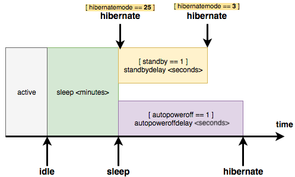

# Modifying Power Management Settings

**INDEX**

- [Understanding Power States](#understanding-power-states)
- [Prerequisites for enabling Hibernation on Hackintosh systems](#prerequisites-for-enabling-hibernation-on-hackintosh-systems)
- [Changing Hibernation modes in macOS](#changing-hibernation-modes-in-macos)
  - [hibernatemode 0: Suspend to RAM only](#hibernatemode-0-suspend-to-ram-only)
  - [hibernatemode 3: Suspend to disk and RAM](#hibernatemode-3-suspend-to-disk-and-ram)
  - [hibernatemode 25: Suspend to disk and RAM (reduced power consumption)](#hibernatemode-25-suspend-to-disk-and-ram-reduced-power-consumption)
- [Configuring Hibernation](#configuring-hibernation)
  - [About `autopoweroff`](#about-autopoweroff)
  - [Understanding Power State Transitions and Timers](#understanding-power-state-transitions-and-timers)
  - [Getting the currently set parameters](#getting-the-currently-set-parameters)
  - [Testing Hibernation](#testing-hibernation)
- [More `pmset` parameters](#more-pmset-parameters)
- [Notes and further Resources](#notes-and-further-resources)

## Understanding Power States

PC Power States (S-States) define different levels of system power consumption and functionality. These states range from `S0` (fully operational) to `S5` (soft-off), providing various levels of power saving and system responsiveness.

| State | Name | Description | Power Consumption | System Functionality |
|:-----:|------|-------------|:-----------------:|----------------------|
| `S0` | Working State | Fully operational system | Highest | Full CPU and hardware operation |
| `S1` | Standby | Minimal power saving | Very Low | Context preserved, quick resume |
| `S2` | Standby | More power saving | Low | Processor stopped, context saved |
| `S3` | Sleep | Suspend to RAM | Minimal | Most components powered down |
| `S4` | Hibernate | Suspend to Disk | Near Zero | System state saved to hard drive |
| `S5` | Soft Off | Complete shutdown | Zero | No system state maintained |

**Key characteristics**:

- Lower S-States provide increased power savings
- Higher states progressively reduce power consumption
- Each state involves different levels of system context preservation
- Transition between states managed by operating system and ACPI (Advanced Configuration and Power Interface)

## Prerequisites for enabling Hibernation on Hackintosh systems

For hibernation to work successfully, there are a few prerequisites that *must* be met first:

- **Config adjustments**:

  - Storage must be detected as `built-in` or `internal` (verify in System Profiler or Hackintool). If the SSD/NVMe is not recognized as built-in, get the PCI device path of the SATA/NVMe Controller from Hackintool, open the `config.plist` and add the DeviceProperty `built-in` with a value of `01000000` (Data) for it.
 
  - Many devices will likely need to set `UEFI/ReservedMemory` for region `0x8B000` (size `0x1000`) to fix black screens on wake on Intel laptops. This is an entry that comes as part of the `sample.plist` for OpenCore. No clue with AMD/Intel Desktops.
  
  - Block writes to RTC regions `0x80`-`0xAB` and possibly `0xB0`-`0xB4` (refer to [**RTCMemoryFixup**](https://github.com/acidanthera/RTCMemoryFixup)).
  
  - By blocking RTC writes to those regions, you prevent hibernation data being written to the RTC. Make sure to allow OC to read hibernation data from NVRAM instead (`Misc/Boot/HibernateMode` = `Auto`) and that you have HibernationFixup so that the data does get written into NVRAM.
 
  - Changing `Misc/Boot/HibernationSkipsPicker` to `true` in the `config.plist` is highly recommended. That way, you do not inadvertently boot into another OS and change the environment/whatever assumptions the hibernated OS makes. It's generally a really dumb idea to change BIOS settings in the middle of hibernation so please don't.

- **Required Kexts**:
  
  - [**HibernationFixup**](https://github.com/acidanthera/HibernationFixup) kext is required when changing HibernationMode to anything but `0`
  
  - [**RTCMemoryFixup**](https://github.com/acidanthera/RTCMemoryFixup) in order to block writes to specific RTC regions

## Changing Hibernation modes in macOS

> [!CAUTION]
> Don't fiddle around with these settings unless you know what you are doing!

Open Terminal. Enter `man pmset` &rarr; Lists all available `pmset` parameters to modify System Power Management!

To check the currently selected Hibernation mode, enter:

```
pmset -g | grep hibernatemode
```

### hibernatemode 0: Suspend to RAM only
Default for desktops. The system will not back memory up to persistent storage. The system must wake from the contents of memory; the system will lose context on power loss. This is, historically, plain old sleep. 

To enable hibernatemode 0, enter in Terminal:

```
sudo pmset -a hibernatemode 0
```

### hibernatemode 3: Suspend to disk and RAM
Default on portables. Hibernation mode 3 will transition from `S3` to `S4` depending on the timeout and battery thresholds set in `pmset` (mor on this laster).  The system will store a copy of memory to persistent storage (the disk), and will power memory during sleep. The system will wake from memory, unless a power loss forces it to restore from hibernate image.

Benefit of this mode is that is does quicken the wakeup time when the device is being used quickly while still providing the benefits of hibernation when the device is not in use overnight. 

To enable hibernatemode 3, enter in Terminal:

```bash
sudo pmset -a hibernatemode 3
```

This mode (as well as hibernatemode 25) does require [**HibernationFixup**](https://github.com/acidanthera/HibernationFixup) kext to work – otherwise the device stays in `S3` and never transitions to `S4`. You do also need to set a value to boot-arg `hbfx-ahbm=`, representing the parameters/features of HibernationFixup. For example `hbfx-ahbm=55`, which contains the following 4 settings:

- `EnableAutoHibernation` (1)
- `WhenLidIsClosed` (2)
- `WhenExternalPowerIsDisconnected` (4)
- `WhenBatteryIsAtWarnLevel` (16)
- `WhenBatteryAtCriticalLevel` (32)

For more settings, please refer to the boot-args settings of the  [**HibernationFixup**](https://github.com/acidanthera/HibernationFixup) repo!

### hibernatemode 25: Suspend to disk and RAM (reduced power consumption)
For portables as well. Mode 25 is only settable via `pmset`. Same as mode 3, but will remove power to memory. The system will restore from disk image. If you want "hibernation" - slower sleeps, slower wakes, and better battery life, you should use this setting. Hibernatemode 25 will always go directly from `S0` to `S4`.
When using this mode, entering the hibernation state takes a bit longer than using mode 0 using this mode. Please note that hibernatefile may only point to a file located on the root volume.

To enable it, enter in Terminal:

```bash
sudo pmset -a hibernatemode 25
```

This mode (as well as hibernatemode 3) does require [**HibernationFixup**](https://github.com/acidanthera/HibernationFixup) kext to work – otherwise the device stays in `S3` and never transitions to `S4`. You do also need to set a value to boot-arg `hbfx-ahbm=`, representing the parameters/features of HibernationFixup. For example `hbfx-ahbm=55`, which contains the following 4 settings:

- `EnableAutoHibernation` (1)
- `WhenLidIsClosed` (2)
- `WhenExternalPowerIsDisconnected` (4)
- `WhenBatteryIsAtWarnLevel` (16)
- `WhenBatteryAtCriticalLevel` (32)

For more settings, please refer to the boot-args section of the  [**HibernationFixup**](https://github.com/acidanthera/HibernationFixup) repo!

## Configuring Hibernation

Picking a hibernation mode is only the first step. In order for hibernation to work properly, it must be configured as well by applying standby arguments via `pmset` in Terminal or Hackintool.

The configuration primarily involves setting timers that control state transitions – for example, how long the system should remain in sleep (`S3`) before transitioning to hibernation (`S4`). On battery-powered devices, the system also takes the current battery level into account when determining these transitions, represented by the parameters `standbydelayhigh`, `standbydelaylow`, `highstandbythreshold`.

**The following parameters have to be set**:

Argument | Description 
---------|-------------
`sleep` | System sleep timer (value in minutes, or `0` to disable). Time in minutes before the system enters sleep mode (not hibernation). This is the initial entry into `S3` state that triggers hibernation after all the delay timers have counted down.
`standby` | Causes kernel power management to automatically hibernate a machine after it has slept for a specified time period. This saves power while asleep. This setting defaults to ON for supported hardware. The setting standby will be visible in `pmset -g` if the feature is supported on this machine. Default: `ON` for supported hardware. 
`standbydelayhigh` | Time in seconds before hibernation when battery is *above* the `highstandbythreshold`.
`standbydelaylow` | Time in seconds before hibernation when battery is *below* the `highstandbythreshold`.
`highstandbythreshold` | Battery percentage threshold (default 50%) that determines whether to use the *high* or *low* delay. 
`autopoweroff` | European Energy directive feature that enables deeper sleep state after specified delay. Default: ON. After sleeping for `<autopoweroffdelay>` amount of seconds, the system will write a hibernation image and go into a lower power chipset sleep. Wakeups from this state will take longer than wakeups from regular sleep. Only available when the system is connected to AC power. 
`autopoweroffdelay` | Delay in seconds before the system enters `autopoweroff` mode.

### About `autopoweroff`
The autopoweroff state is distinct from standard S4 hibernation - while both write a hibernation image, autopoweroff maintains certain chipset functions in a low-power state instead of powering off completely. This results in wake times that are slower than `S3` sleep but faster than full `S4` hibernation. It seems to be a hybrid state **optimized specifically for EU energy regulations** - using the safety of having a hibernation image but keeping critical chipset components in a deep sleep rather than fully powered down. The autopoweroff feature in macOS is designed to work ***only when the system is connected to AC power***!

**How autopoweroff Works**:

- **Purpose**: The feature is meant to save energy by powering down the system more deeply after an extended period of standby.
- **Condition**: Since autopoweroff involves fully powering off certain components (and possibly the entire system), it only activates when the system is on AC power. **This ensures the system can reliably resume without risking data loss or hardware issues caused by insufficient battery charge.**

**Behavior on Battery**:

- When running on battery, macOS relies on *standby* and *standbydelay* to manage power consumption. These modes keep the system in a low-power state but avoid deeper shutdowns like autopoweroff.

**Why It Doesn't Work on Battery**:

- Resuming from autopoweroff requires a reboot-like process, which consumes more power than resuming from sleep or standby. 
- macOS prioritizes preserving battery life and maintaining faster wake times when on battery.

I have two Lenovo Thinkpads but autopoweroff is only available on the older one. I don't know exactly if this depends on the region the laptop was manufactured for or if the availability of autopoweroff is based on the used SMBIOS.

### Understanding Power State Transitions and Timers
The system uses four distinct timers to manage power state transitions:

- The initial `sleep` timer that triggers entry into `S3` sleep
- `standbydelayhigh` for hibernation when battery is above the threshold
- `standbydelaylow` for hibernation when battery is below the threshold
- `autopoweroffdelay` for entering the special chipset sleep state

**These timers create two possible power transition paths**:

1. **"Standard" hibernation path**:
   - S0 (awake) → S3 (sleep) → [standbydelay based on battery] → S4 (hibernation)

2. **"Autopoweroff" path**:
   - S0 (awake) → S3 (sleep) → [autopoweroffdelay] → writes hibernation image → chipset sleep state

Here's a visualization of how these timers working:



**Explanation**:

1. **Active**:
   - The system is fully operational, with no power-saving features active (S0 state).

2. **Sleep**:
   - The system enters a low-power state, keeping the contents of RAM active for quick wake-up.
   - This is typical for `hibernatemode = 3` (default for most Macs), where:
     - RAM stays powered.
     - The `sleepimage` is also written to disk as a backup.

3. **Hibernate**:
   - For `hibernatemode = 25`, the system powers off RAM and writes the contents entirely to the `sleepimage` file on disk.
   - This is a full hibernation mode, ideal for saving battery but slower to wake up.

4. **Standby and Autopoweroff**:
   - These states are additional layers of power management:
     - **Standby (`standby = 1`)**: After a specified delay (`standbydelay`), the system transitions from sleep to a hibernation-like state to save more power.
     - **Autopoweroff (`autopoweroff = 1`)**: After a ***further*** delay (`autopoweroffdelay`), the system can power down more deeply, saving even more energy.

### Getting the currently set parameters

- First, you have to check the current pm settings. To do so, you can enter `pmset -g` in Terminal (or use Hackintool). This example is from my Lenovo T530:<br>
- As you can see, the `autopoweroffdelay` is set to the ridiculously high value of 259200 seconds, which equals to 72 hours (or 3 days) before entering the `autopoweroff` state.
- `standby` is enabled, which is good
- `sleep` is enabled and set to 10 minutes. That's the time before the system enters `S3` state.
- The sleepimage (`hibernatefile`)is present
- `stanbydelaylow` and `standbydelayhigh` are booth set to 4200 seconds (= 70 minutes)

###  Testing Hibernation

1. In order for hibernation modes 3 or 25 to work, we have to ensure that the sleepimage is *not* write-protected. Deleting and creating a new, write-protected 0 byte sleepimage is the usual procedure when using hibernatemode 0. This is what happens if you click the screwdriver icon in Hackintool ("Power" Tab). But we *don't* want that. So open Terminal and enter: 
    
    ```bash
    ls -lO /private/var/vm/sleepimage
    ```
    
    The default output should be: 
    
    ```bash
    -rw------  1 root  wheel  <size> <date> /private/var/vm/sleepimage
    ```
  
    If the file is write-read-only, you can use the following commands to restore the default value:

    ```bash
    sudo chmod 600 /private/var/vm/sleepimage
    sudo chown root:wheel /private/var/vm/sleepimage
    ```
2. Next, you need to set short timer values to test hibernation:

    ```bash
    sudo pmset -a hibernatemode 25
    sudo pmset -a standby 1
    sudo pmset -a standbydelaylow 60      # 1 minute before entering standby on low battery
    sudo pmset -a standbydelayhigh 120    # 2 minutes before entering standby on AC power
    sudo pmset -a powernap 0
    sudo pmset -a autopoweroff 1
    sudo pmset -a autopoweroffdelay 300   # 5 minutes before full shutdown (if supported)
    sudo pmset -a disksleep 10
    sudo pmset -a sleep 1
    sudo pmset -a displaysleep 2
  ```
3. Reboot the system, login and just leave the system at idle until it enters sleep. If your system is a laptop, supports autopoweroff and is connected to AC, it should enter autopoweroff after 5 minutes – indicated by the sleep indicator (pulsing light) should stop. 

4. To resume from autopoweroff, press the power button. The system should resume to the login screen but it will take longer since it restors from the hibernation image from disk. It will feel similar to booting the system – just without a bootmenu.

5. Once hibernation is working as expected, change the timer values above to more reasonable values that make sense for your system/working habits.

## More `pmset` parameters

Listed below are power managements settings you can configure in Terminal via **`pmset`**

 Setting       | Description | Value |
---------------|-------------|:-------:|
`displaysleep`| Display sleep timer; replaces `dim` argument in 10.4.| Minutes, or 0 to disable 
`disksleep`   | Disk spindown timer; replaces `spindown` argument in 10.4.| Minutes, or `0` to disable 
`sleep`       | System sleep timer.| Minutes, or `0` to disable 
`womp`        | Wake on Ethernet magic packet. Same as "Wake for network access" in the Energy Saver preferences. | `0`/`1`
`ring`| Wake on modem ring.| `0`/`1`
`powernap`   | Enable/disable Power Nap on supported machines.| `0`/`1`
`proximitywake`          | Controls system wake from sleep based on proximity of devices using the same iCloud ID on supported systems.| `0`/`1`
`autorestart`| Automatic restart on power loss.| `0`/`1`
`lidwake`| Wake the machine when the laptop lid (or clamshell) is opened.| `0`/`1`
`acwake`| Wake the machine when power source (AC/battery) is changed.| `0`/`1`
`lessbright`| Slightly turn down display brightness when switching to this power source.| `0`/`1`
`halfdim`| Display sleep will use an intermediate half-brightness state between full brightness and fully off.| `0`/`1`
`sms` | Use Sudden Motion Sensor to park disk heads on sudden changes in G force.| `0`/`1`
`hibernatemode`| Change hibernation mode. Use with caution. | Integer 
`hibernatefile`| Change hibernation image file location. Image may only be located on the root volume. Please use with caution.| Path
`ttyskeepawake` | Prevent idle system sleep when any tty (e.g., remote login session) is active. A tty is inactive only when its idle time exceeds the system sleep timer.| `0`/`1`
`networkoversleep` | Affects how OS X networking presents shared network services during system sleep. Not used by all platforms; changing its value is unsupported. | Unsupported 
`destroyfvkeyonstandby`  | Destroy File Vault Key when going to standby mode. If the keys are destroyed, the user will be prompted to enter the password while coming out of standby mode. | `1` - Destroy, <br> `0` - Retain

**Source**: [Insanelymac](https://www.insanelymac.com/forum/topic/342002-darkwake-on-macos-catalina-boot-args-darkwake8-darkwake10-are-obsolete/)

## Notes and further Resources
- Thanks to Avery Black (`1Rvenger1`) for additional input about Hibernation!
- If you feel uncomfortable using Terminal, you can also use Hackintool to check and change the `hibernatemode`. Simply click on the "Power" Tab and there you find all the currently set parameters.
- For a more in-depth look into the subject matter, I recommend this article: [Power Management in detail using pmset](https://eclecticlight.co/2017/01/20/power-management-in-detail-using-pmset/)
- For Sleep and wake issue in general, refer to [this article](https://eclecticlight.co/2019/05/09/tackling-sleep-and-wake-problems/)
- [Sleepwatcher](https://www.bernhard-baehr.de/) by Bernhard Baehr. A command line tool for prohibiting the system from waking involuntarily.
