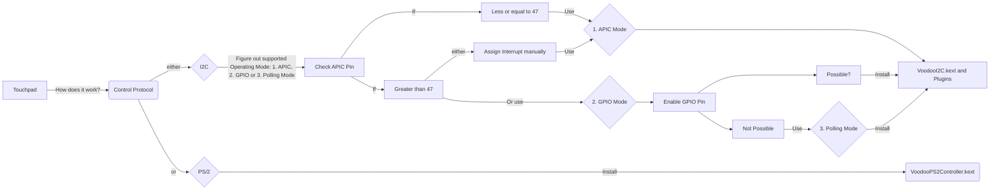
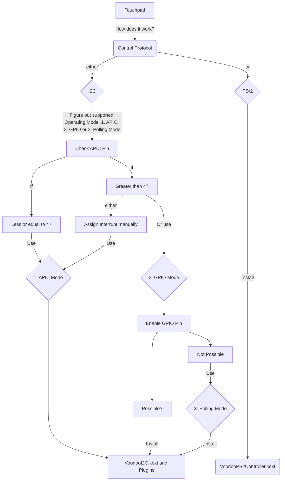

Enabling I2C Touchpads

TABLE of CONTENTS
- [Foreword: the crux with I2C Touchpads](#foreword-the-crux-with-i2c-touchpads)
- [Preparations](#preparations)
  - [System Requirements](#system-requirements)
  - [Required Tools](#required-tools)
  - [Terminology](#terminology)
- [VoodooI2C Decision Making](#voodooi2c-decision-making)
- [Instructions](#instructions)
  - [1. Checking your I2C Controller for compatibility (macOS)](#1-checking-your-i2c-controller-for-compatibility-macos)
  - [2. Detecting the operating mode of the I2C Controller](#2-detecting-the-operating-mode-of-the-i2c-controller)
  - [Polling vs GPIO Interrupts](#polling-vs-gpio-interrupts)
- [Resources](#resources)
## Foreword: the crux with I2C Touchpads

Enabling I2C Touchpads in Hackintoshes is no easy task. In most cases, simply injecting the **VoodooI2C.kext** won't cut it. Only in rare cases this will actually work. Here`s why…

As you may know, **VoodooI2C** supports three operating modes:

1. **APIC interrupt** mode,
2. **GPIO interrupt** mode and
3. **Polling mode**

These 3 modes have **different characteristics**:

- **APIC** and **GPIO** are **hardware-driven** interrupt modes, while **polling** is **software-driven** only.  Naturally, polling uses more system resources (such as CPU and RAM) so the optimal mode that VoodooI2C should run in is interrupt mode.
- **APIC interrupt mode** basically does not need to be modified and works perfectly fine oob. Unfortunately, only a few I2C controllers and devices (less than 10%) support it. Whether or not your Touchpad can use this mode depends on the used **APIC Pin** (not ACPI!) of your Touchpad. More on that later…
- **GPIO interrupt mode** support is relatively complete, but the amount of modifications required to enable the **GPIO Pin** is usually relatively high, requires more resources but is still preferred over Polling Mode.
- **Polling Mode** is a very inefficient mode, but it is more applicable than the interrupt modes. You can think of polling mode as the "safe boot" mode of VoodooI2C. As such, it is a suitable mode for use during installing macOS. If you wish to run VoodooI2C in polling mode, you do not need to apply any GPIO patches. It is also suitable for people who have Skylake or newer machines with buggy GPIO implementation (such as various ASUS laptops). 

To make a long story short: you have 3 choices, one of which is practically non-existing, one which is complicated to implement and one you have to settle with if you don't have the know-how nor the patience to enable one of the other modes.

## Preparations

### System Requirements
- 4th Gen Intel Core CPU (Haswell) or newer (anything older uses PS/2 Touchpads).
- macOS 10.10 or newer
- Supported I2C Controller
- At least one supported I2C Device. For the vast majority of users, this will be an `I2C-HID` device.

### Required Tools
- [**Hackintool**](https://github.com/headkaze/Hackintool/releases) – for checking if your system has a compatible I2C Controller
- [**MaciASL**](https://github.com/acidanthera/MaciASL/releases) – for viewing/editing on ACPI Tables
- [**IORegisteryExplorer 2.1**](https://github.com/utopia-team/IORegistryExplorer/releases) (**do not use other versions**) – for viewing data/troubleshooting
- [**FingerMgmt**](https://github.com/jnordberg/FingerMgmt/releases) – For monitoring if your fingers are recognized by the Touchpad
- [**Maclog**](https://github.com/syscl/maclog/releases) – for viewing logs and troubleshooting

### Terminology

Term    | Description
:------:|-----------
**HID** | Human Interface Device. Allows humans to interact with the computer, usually by touching it with the hands.
**PS/2** | No, not a PlayStation 2. It's for touchpad controlled via the PS/2 protocol and requires `VoodooPS2Controller.kext`.
**I2C** | Touchpad for I2C (pronounced I-squared-C) channel, please use VoodooI2C.
**ELAN**| Touchpads produced by ElanTech are referred to as ELAN. Commonly found in ASUS Laptops.
**SYNA**| Touchpad manufactured by Synaptics
**CRS** | "Method" in DSDT to return a value

## VoodooI2C Decision Making
The flowchart below outlines the general approach and decision making process for enabling I2C Touchpads without going into detail. This guide basically follows this workflow.

## Instructions

### 1. Checking your I2C Controller for compatibility (macOS)
- Run Hackintool
- Click on the "PCIe" Tab &rarr; it lists all the devices macOS detected.
- Find the I2C Controller(s) and its device-id (listed in the "Device" column).
- Check if the IDs you found In the table below, you find compatible I2C Controllers for various Intel CPU families ([**Source**](https://github.com/VoodooI2C/VoodooI2C/blob/master/Documentation/Installation.md#system-requirements)):

CPU Family | Supported Controller(s).
:---------:|----------------------
**Haswell** |`INT33C2` and `INT33C3`
**Broadwell** |`INT3432` and `INT3433`
**Skylake** | `pci8086,9d60`, `pci8086,9d61`, `pci8086,9d62`, `pci8086,9d63`
**Kaby Lake** |`pci8086,a160`, `pci8086,a161`, `pci8086,a162`, `pci8086,a163` 
**Cannon Lake Whiskey Lake**| `pci8086,9de8`, `pci8086,9de9`, `pci8086,9dea`, `pci8086,9deb`
**Coffee Lake** | `pci8086,a368`, `pci8086,a369`, `pci8086,a36a`, `pci8086,a36b`
**Comet Lake** | `pci8086,2e8`, `pci8086,2e9`, `pci8086,2ea`, `pci8086,2eb`, `pci8086,6e8`, `pci8086,6e9`, `pci8086,6ea`, `pci8086,6eb`
**Ice Lake** | `pci8086,34e8`, `pci8086,34e9`, `pci8086,34ea`, `pci8086,34eb`

- :bulb: **Controller names explained**: 
- Take for example `pci8086,9d60`:
  - `8086` stands for the Vendor (Intel) 
  - `9d60` is the actual device-id. 
- So if you find it in the list of PCI devices in hackintool, you can continue.

### 2. Detecting the operating mode of the I2C Controller

- **APIC Interrupt**: In IORegistryExplorer,
	- if your `IOInterruptSpecifiers`value is less or equal to `2F` (47), then the Touchpad is supported by macOS. If it's >`2F` it's getting complicated…
- **GPIO Interrupt**: In DSDT, search for
	- `SBFG`, present in a valid `GPIO` Pin
	- `CRS` return in methods (SBFB, SBFG)
	- GPIO requires VoodooGPIO (included in VoodooI2C as a plugin) to enable the GPIO controller, and also requires relatively complex modifications to the DSDT (which is actually quite simple)
- **Polling**: In DSDT, search for
	- `SBFB` or in `CRS` method (SBFB, SBFI) is present
	- SSDT-XOSI

### Polling vs GPIO Interrupts

Due to incompatibilities with Apple's core kexts, it is often necessary to manually edit your DSDT to enable GPIO interrupts. This is only the case for systems that are Skylake or newer (Haswell and Broadwell can safely skip down to the patches below). The process of GPIO patching is fairly involved and because of this, certain satellite kexts (currently only VoodooI2CHID) support running in two different modes:

1. Polling
2. Interrupts (either APIC or GPIO)

The exact definitions of polling and interrupts are outside the scope of this guide. However you can consider polling as software-driven and interrupts as hardware-driven. Naturally, polling uses more system resources (such as CPU and RAM) so the optimal mode that VoodooI2C should run in is interrupt mode. The type of interrupts you need (i.e APIC vs GPIO) is determined later on in the GPIO pinning guide below.

You can think of polling mode as the "safe boot" mode of VoodooI2C. As such it is a suitable mode for use during the installation of macOS. Polling mode is also suitable for people who have Skylake or newer machines with buggy GPIO implementation (such as various ASUS laptops). If you wish to run VoodooI2C in polling mode, you do not need to apply any of the GPIO patches below but you must visit the <Polling Mode> page for further instructions.

However, it is highly recommended that once your system is up and running, you should apply all the GPIO patches (except Haswell and Broadwell users) to ensure optimal performance. If you find that you cannot get your Touchpad to work in interrupts mode or that interrupts mode leads to high CPU usage then it is likely you have a system with a buggy implementation of GPIO. In this case you will have to switch back to polling mode. In any case, you should still go through the troubleshooting process as outlined on the <Troubleshooting> page to make sure that you have not made a mistake.

Staring from 2.5.3, VooodooI2C will try to extract GPIO pin information on compatible machine if APIC interrupt is unavailable. In case it's not working, you can force polling mode by adding `-vi2c-force-polling` to `boot-arg` or adding `force-polling` to specific I2C controller in `Devices`-`Properties` section for Clover or `DeviceProperties` section for OpenCore.

## Resources
- https://github.com/VoodooI2C/VoodooI2C/blob/master/Documentation/Installation.md
- [VoodooI2C touch device driver tutorial supplement](https://www-penghubingzhou-cn.translate.goog/2019/07/24/VoodooI2C%20DSDT%20Edit%20FAQ/?_x_tr_sl=auto&_x_tr_tl=en&_x_tr_hl=de&_x_tr_pto=wapp)
- https://github-com.translate.goog/ettingshausen/VoodooI2C-PreRelease?_x_tr_sl=auto&_x_tr_tl=en&_x_tr_hl=de&_x_tr_pto=wapp
https://github.com/VoodooI2C/VoodooI2C/blob/master/Documentation/Installation.md#system-requirements
- https://hackintosh-vn.translate.goog/trackpad-on-hackintosh-voi-giao-thu-i2c?_x_tr_sl=auto&_x_tr_tl=en&_x_tr_hl=de&_x_tr_pto=wapp