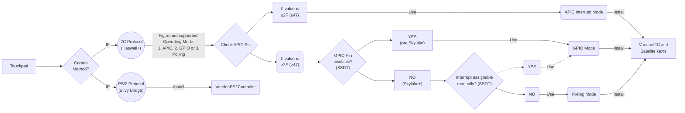

# Enabling Touchpad Support on Laptops

**TABLE of CONTENTS**

- [Introduction](#introduction)
- [Touchpad Types, Protocols and Kexts](#touchpad-types-protocols-and-kexts)
	- [Terminology](#terminology)
	- [About PS/2 Touchpads](#about-ps2-touchpads)
		- [Required Kexts](#required-kexts)
	- [About SMBus Touchpads](#about-smbus-touchpads)
		- [Windows (easiest way)](#windows-easiest-way)
		- [Linux](#linux)
		- [macOS](#macos)
		- [Required Kexts](#required-kexts-1)
	- [About I2C and USB Touchpads (Haswell and newer)](#about-i2c-and-usb-touchpads-haswell-and-newer)
		- [Required Kexts](#required-kexts-2)
- [Enabling I2C Touchpads](#enabling-i2c-touchpads)
	- [System Requirements](#system-requirements)
	- [About I2C operating modes](#about-i2c-operating-modes)
	- [Required Tools](#required-tools)
	- [General Workflow for enabling I2C Touchpads](#general-workflow-for-enabling-i2c-touchpads)
- [Instructions](#instructions)
	- [1. Checking the I2C Controller for Compatibility](#1-checking-the-i2c-controller-for-compatibility)
	- [2. Detecting the control protocol of the Touchpad (PS/2, SMBUS or I2C):](#2-detecting-the-control-protocol-of-the-touchpad-ps2-smbus-or-i2c)
	- [3. Finding the operating mode of the I2C Controller (macOS)](#3-finding-the-operating-mode-of-the-i2c-controller-macos)
	- [4. Enabling a Touchpad's GPIO Pin](#4-enabling-a-touchpads-gpio-pin)
- [Resources and Credits](#resources-and-credits)
	- [Documentation and Support](#documentation-and-support)
	- [Guides and Patches](#guides-and-patches)

---

## Introduction
PC-based Notebook Touchpads are not supported natively by macOS. Depending on the type of controller and protocol that is used to communicate with the Touchpad, you may need to combine kexts, binary renames as well as SSDT Hotfixes to enable it in macOS.

Getting Touchpads to work *smoothly* though, can be a tedious task. The wrong combination of kexts, renames and SSDTs can cause Kernel Panics if they are not loaded in the correct order or if binary renames or device paths in SSDTs are incorrect.

## Touchpad Types, Protocols and Kexts
Four main protocols are used to communicate with a Touchpad: 

- [**PS/2**](#about-ps2-touchpads)
- [**SMBus**](#about-smbus-touchpads)
- [**I2C and USB**](#about-i2c-and-usb-touchpads-haswell-and-newer) 
 
Some Touchpads support both PS/2 and I2C protocols (mostly Synaptics). In this case, you should switch to **I2C**. There should be an option in the BIOS to switch the mode from "Basic" (PS/2) to "Advanced" (I2C).

:bulb: Most Laptops that come with **I2C** Touchpads also have a **PS/2** Controller which is used to control the Keyboard – so you have to use *both*, **VoodooI2C** for the Touchpad and **VoodooPS2Controller** for the keyboard!

### Terminology
Term    | Description
:------:|-----------
**HID** | Human Interface Device. Allows humans to interact with the computer, usually by touching it with the hands.
**PS/2** | No, not a PlayStation 2. It's for touchpad controlled via the PS/2 protocol and requires `VoodooPS2Controller.kext`.
**I2C** | Touchpad for I2C (pronounced I-squared-C) channel, requires VoodooI2C kext.
**SMBus** | System Management Bus. Provides a higher data bandwidth than PS/2 and  can therefore support more complex multitouch gestures. It is very similar to I2C, but uses a different controller. Requires either VoodooSMBus or VoodooRMI.
**SYNAPTICS**| Touchpad manufactured by Synaptics
**ELAN**| Touchpads produced by ELAN Microelectronics. Commonly found in Laptops by Asus.
**CRS** | Method in DSDT to return a value
**ConcatenateResTemplate**| Used in Touchpad-related SSDT Fixes. The resource descriptors from Source2 are appended to the resource descriptors from Source1. Then a new end tag and checksum are appended and the result is stored in Result, if specified. If either Source1 or Source2 is exactly 1 byte in length, a run-time error occurs. An empty buffer is treated as a resource template with only an end tag.

### About PS/2 Touchpads
**PS/2** TouchPads are pretty much obsolete nowadays. They may support multitouch, but the implementation is not as refined as with I2C/SMBus due to the limited bandwidth of PS/2. PS/2 Touchpads are usually found on Laptops with Ivy Bridge or older CPUs, though can be somewhat common up to Skylake. VoodooPS2 supports Alps, Elans, and Synaptics PS/2 touchpads out of the box.

#### Required Kexts

- **Necessary base kext**: [**VoodooPS2Controller**](https://github.com/acidanthera/VoodooPS2). Contains 4 additional Kexts as PlugIns:
	- **VoodooInput** &rarr; is used to emulate a Magic Trackpad 2
	- **VoodooPS2Keyboard** &rarr; for Keyboards
	- **VoodooPS2Mouse** &rarr; for Mouse Buttons
	- **VoodooPS2Trackpad** &rarr; for PS/2 Trackpads
- Deprecated Kexts:	
	|Device/Protocol|Kext|Notes|
	|:-------------:|------|-----|
	PS/2|[**~~VoodooPS2-ALPS~~**](https://github.com/SkyrilHD/VoodooPS2-ALPS)|For ALPS 	Touchpads. Adds support for Magic Touchpad 2 emulation in order to use macOS native 	driver instead of handling all gestures itself. **NOTE**: Now fully integrated into **VoodooPS2Controller**.

### About SMBus Touchpads
**SMBus** Touchpads can be found on Laptops with Haswell and newer CPUs (although some Ivy Bridge Laptops have them as well). Detecting if your Touchpad can be controlled via SMBus can be tricky. Here's how you can do it:

#### Windows (easiest way)
- Open Device Manager
- Change view to "**Devices by Connection**"
- Find the HID Devices located inside the "**PCI Express Root Complex**" tree.
- The Touchpad should be attached as "**HID-compliant touch pad**" via PS/2
- If the Touchpad can use the SMBus, there should be an additional Driver, either "**Elan SMBus Driver**" or "**Synaptics SMBus Driver**" (depending on the vendor) which replaces the generic **"Intel SMBus Driver**":  

#### Linux
In Linux, enter `sudo dmesg` and search for `RMI4` or `Intertouch` in the results. If `RMI4` appears, then it's an SMBus touchpad. The Linux method though is not that accurate, as many touchpad have to be added manually to a list in the PS/2 Synaptics driver for SMBus support.

#### macOS
In macOS, Acidanthera's VoodooPS2Trackpad kext will put a property in IORegistry named `Intertouch Support`. 

#### Required Kexts
- [**VoodooPS2Controller**](https://github.com/acidanthera/VoodooPS2).
- Additional Kexts (depending on the hardware):
	|Device Manufacturer|Kext|Notes|
	|---------------|------|-----|
	|Synaptics|[**VoodooRMI**](https://github.com/VoodooSMBus/VoodooRMI)|macOS port of Synaptics' RMI Touchpad driver from Linux. Supports I2C HID and SMBus Touchpads by Synaptics. Also contains a copy of VoodooSMBus, which is needed for VoodooRMI to work.|
	|ELAN|[**VoodooSMBus**](https://github.com/VoodooSMBus/VoodooSMBus)|Port of the Linux i801 SMBus driver, as well as the Linux Elans SMBus driver.|

More [info](https://github.com/5T33Z0/OC-Little-Translated/issues/57#issuecomment-1270539069) about SMBus Touchpads.

Known Synaptics SMBus Touchpads

Touchpad ID | Laptop Model
------------|-------------
LEN0017 |
LEN0018 |
LEN0019 |
LEN0023 |
LEN002A |
LEN002B |
LEN002C |
LEN002D |
LEN002E |
LEN0033 | Helix 
LEN0034 | T431s L440 L540 T540 W540 X1 Carbon 2nd 
LEN0035 | X240 
LEN0036 | T440 
LEN0037 | X1 Carbon 2nd 
LEN0038 |
LEN0039 | T440s 
LEN0041 |
LEN0042 | Yoga 
LEN0045 |
LEN0047 |
LEN2000 | S540 
LEN2001 | Edge E431 
LEN2002 | Edge E531 
LEN2003 |
LEN2004 | L440 
LEN2005 |
LEN2006 | Edge E440/E540 
LEN2007 |
LEN2008 |
LEN2009 |
LEN200A | 
LEN200B |
LEN0048 | X1 Carbon 3 
LEN0046 | X250 
LEN0049 | Yoga 11e 
LEN004a | W541 
LEN005b | P50 
LEN005e | T560 
LEN006c | T470s 
LEN007a | T470s 
LEN0071 | T480 
LEN0072 | X1 Carbon Gen 5 (2017) - Elan/ALPS Trackpoint 
LEN0073 | X1 Carbon G5 (ELAN)
LEN0091 | X1 Carbon 6 
LEN0092 | X1 Carbon 6 
LEN0093 | T480 
LEN0096 | X280 
LEN0097 | X280 -> ALPS Trackpoint 
LEN0099 | X1 Extreme Gen 1 / P1 Gen 1 
LEN009b | T580 
LEN0402 | X1 Extreme Gen 2 / P1 Gen 2 
LEN200f | T450s 
LEN2044 | L470  
LEN2054 | E480 
LEN2055 | E580 
LEN2068 | T14 Gen 1 
SYN3052 | HP EliteBook 840 G4 
SYN3221 | HP 15-ay000 
SYN323d | HP Spectre X360 13-w013dx
SYN3257 | HP Envy 13-ad105ng

**Source**: [**Linux**](https://github.com/torvalds/linux/blob/master/drivers/input/mouse/synaptics.c#L128-L194)

### About I2C and USB Touchpads (Haswell and newer)
**I2C** (Inter-Integrated Circuit or eye-squared-C) is a synchronous, multi-master, multi-slave, packet-switched, single-ended, serial communication bus invented in 1982 by Philips Semiconductors. It has gained widespread adoption due to Microsoft's Precision Touchpad requirements. Touchpads will usually be controlled via I2C, while touchscreens will usually be controlled via USB protocol. VoodooI2C and its satellite kexts can be used for both I2C and USB devices, though I2C devices will usually require additional ACPI patching, which makes it much more difficult to get it working properly.

#### Required Kexts
- **Necessary base kext**: [**VoodooI2C**](https://github.com/VoodooI2C)
- Depending on the Touchpad model (vendor and used protocol), you need additional [**Satellite kexts**](https://voodooi2c.github.io/#Satellite%20Kexts/Satellite%20Kexts):
	|Device/Protocol|Kext|Notes|
	|---------------|------|-----|
	|I2C/USB HID|**VoodooI2CHID** (included in VoodooI2C)|Implements support for I2C HID using Microsoft's HID over I2C protocol. Can be used with I2C/USB Touchscreens and Touchpads. I2C devices requires a device id of `PNP0C50` (check ACPI device ID in IORegistryExplorer).|
	|Atmel Multitouch Protocol|**VoodooI2CAtmelMXT** (included in VoodooI2C)|Implements support for the propriety Atmel Multitouch Protocol.|
	|ELAN Proprietary|**VoodooI2CElan** (included in VoodooI2C)|Implements support for the Elan protocol for Elan Touchpads and Touchscreens. Your Elan device may have better support with this kext than with **VoodooI2CHID**.  :warning: Some Elan devices (such as ELAN1200+) use a newer protocol which is proprietary. As such, those devices will not work with **VoodooI2CElan**, so you have to use  **VoodooI2CHID** instead. Some ELAN Touchpads require polling to work. Force-enable by adding `force-polling` to the DeviceProperties of the Touchpad or using boot-arg `-vi2c-force-polling`.|
	|FTE1001 Touchpad|**VoodooI2CFTE** (included in VoodooI2C)|Implements support for the propriety FTE protocol found on the FTE1001 Touchpad. Your FTE device may have better support with this kext than with **VoodooI2CHID**.|
	|Synaptics HID|[**VoodooRMI**](https://github.com/VoodooSMBus/VoodooRMI) |Implements support for the Synaptics protocol found on many Synaptics Touchpads. May provide better support than **VoodooI2CHID**.|
	|Alps HID|[**AlpsHID**](https://github.com/blankmac/AlpsHID/releases) (I2C/USB)|Can be used with USB and I2C Alps Touchpads. Often seen on Dell Laptops.|

## Enabling I2C Touchpads
Enabling I2C Touchpads in Hackintoshes is no an easy task! In most cases, simply injecting the **VoodooI2C.kext** won't cut it. Only in rare cases this will actually work.

### System Requirements
- 4th Gen Intel Core CPU (Haswell) or newer (anything older uses PS/2 Touchpads).
- macOS 10.10 or newer
- Supported I2C Controller 
- At least one supported I2C Device. For the vast majority of users, this will be an `I2C-HID` device.

### About I2C operating modes
The **VoodooI2C** kext supports three operating modes: 

1. **APIC** interrupt mode, 
2. **GPIO** interrupt mode and 
3. **Polling** mode 

These modes have their own characteristics:

- **APIC** and **GPIO** are **hardware-driven** interrupt modes, while **polling** is **software-driven** only.
- **APIC interrupt mode**: IC2 controllers which support APIC mode don't need to be modified and work perfectly fine with the `VooodooI2C.kext` alone. Unfortunately, only a few I2C controllers (less than 10%) support this mode. Whether or not your Touchpad can use this mode depends on the used **APIC Pin** (not ACPI!). More on that later…
- **GPIO interrupt mode**: support is relatively complete, but the amount of modifications required to enable the **GPIO Pin** is usually relatively high, requires more resources but is still preferred over the software-based Polling Mode.
- **Polling Mode**: Polling requires more system resources (such as CPU and RAM), doesn't work as well, but it is more applicable than the interrupt modes. You can think of it as the "safe boot" mode of VoodooI2C. As such, it is a suitable mode for installing macOS before enabling GPIO mode. If you wish to run VoodooI2C in polling mode, you do not need to apply any GPIO patches. It is also suitable for people who have Skylake or newer machines with buggy GPIO implementation (such as various ASUS Notebooks). 

Which of these modes can be used depends on the Controller, the control method defined in the `DSDT` and by the driver that is used. At present, `VoodooI2CHID` is the only driver that supports GPIO and Polling mode at the same time.

**TL;DR**: you have 3 choices, one of which is practically non-existing, one which is complicated to implement and one you have to settle with if you don't have the know-how nor the patience to enable GPIO mode.

### Required Tools
- [**Hackintool**](https://github.com/headkaze/Hackintool/releases) – for checking if your system has a compatible I2C Controller
- [**MaciASL**](https://github.com/acidanthera/MaciASL/releases) – for viewing/editing on ACPI Tables
- [**IORegisteryExplorer 2.1**](https://github.com/utopia-team/IORegistryExplorer/releases) (**do not use other versions**) – for viewing data/troubleshooting
- [**FingerMgmt**](https://github.com/jnordberg/FingerMgmt/releases) – For monitoring if your fingers are recognized by the Touchpad
- [**GenI2C**](https://github.com/DogAndPot/GenI2C) - An Automatic tool to get your DSDT ready for VoodooI2C ([**Download**](https://github.com/quynkk5/GenI2C/blob/main/GenI2C.zip?raw=true))
- [**Maclog**](https://github.com/syscl/maclog/releases) – for viewing logs and troubleshooting

### General Workflow for enabling I2C Touchpads
The schematic below outlines the general approach and decision making for enabling I2C Touchpads without going into details. It might help you to not get lost.

**NOTES**: 

- The dotted line represents a topic seldom touched in regards to enabling APIC interrupt mode for I2C Touchpads.
- [**Larger version**](https://raw.githubusercontent.com/5T33Z0/OC-Little-Translated/main/05_Laptop-specific_Patches/Trackpad_Patches/I2C_Workflow.jpg) (top down view)

## Instructions

### 1. Checking the I2C Controller for Compatibility
- Boot Windows
- Run Device Manager
- Switch View to "**Devices by Connection**"
- Find your **I2C HID Device** and double-click it to show its Properties
- In the "**General**" Tab, check the "**Location**". It contains the Device-ID of the I2C Controller (in this case `A339`): 
- Check the chart below to find out if the Device-ID is supported. Ignore the `pci8086` part – only the 3 or 4 digits after the comma are relevant! ([**Source**](https://github.com/VoodooI2C/VoodooI2C/blob/master/Documentation/Installation.md#system-requirements)):
	CPU Family | Supported Controller(s).
	:---------:|----------------------
	**Haswell** |`INT33C2` and `INT33C3`
	**Broadwell** |`INT3432` and `INT3433`
	**Skylake** | `pci8086,9d60`, `pci8086,9d61`, `pci8086,9d62`, `pci8086,9d63`
	**Kaby Lake** |`pci8086,a160`, `pci8086,a161`, `pci8086,a162`, `pci8086,a163` 
	**Cannon/Whiskey Lake**| `pci8086,9de8`, `pci8086,9de9`, `pci8086,9dea`, `pci8086,9deb`
	**Coffee Lake** | `pci8086,a368`, **`pci8086,a369`**, `pci8086,a36a`, `pci8086,a36b`
	**Comet Lake** | `pci8086,2e8`, `pci8086,2e9`, `pci8086,2ea`, `pci8086,2eb`, `pci8086,6e8`, `pci8086,6e9`, `pci8086,6ea`, `pci8086,6eb`
	**Ice Lake** | `pci8086,34e8`, `pci8086,34e9`, `pci8086,34ea`, `pci8086,34eb`
- As you can see, `a369` is supported.
- Continue with Step 2.

### 2. Detecting the control protocol of the Touchpad (PS/2, SMBUS or I2C):
- Boot into Windows
- Run Device Manager
- Find your device:
	- **I2C** Touchpads are located in the **Human Interface Devices** (HID) section as "**I2C Device**".
	- **PS/2** and **SMBus** Touchpads are listed as "**Mice and other pointing devices**".
- Double-click the device to open its Properties
- From the "Property" dropdown menu, select "**BIOS device name**".  
- This reveals the device's ACPI path as defined in the the `DSDT`. For example `\SB.PCI0.I2C1.TPD0`. At this stage we can safely say that it uses I2C. Take a screenshot or take a note.

:bulb: **Hint**: In general, I2C touch devices use the following names:

- **Touchpads**: `TPDX`, `ELAN`, `SYNA`, `CYPR`, `TPAD`, `ETPD` (`X`= a number)
- **Touchscreens**: `TPLX`, `ELAN`, `ETPD`, `SYNA`, `ATML` (`X`= a number)

### 3. Finding the operating mode of the I2C Controller (macOS)
- Boot into macOS
- Run **IORegistryExploer**
- Search for `IOInterruptSpecifiers`: 
	- If its value is less or equal  `2F` (≤47), then you're blessed because the Touchpad supports **APIC Interrupt** mode: install VoodooI2C.kext (and additional plugin kexts, as needed) and you'r done.
	- If the value is >`2F` (>47), we need to redirect the APIC Interrupt to a GPIO Interrupt to use GPIO Mode Instead. This technique is called GPIO Pinning.

### 4. Enabling a Touchpad's GPIO Pin
In order to use Touchpads with incompatible APIC Pins on macOS, we need to use SSDT Hotfixes to enable GPIO mode. The patching principle can be found in the chapter &rarr; [**I2C-TPXX Patch Method**](https://github.com/5T33Z0/OC-Little-Translated/tree/main/05_Laptop-specific_Patches/Trackpad_Patches/I2C_TrackPad_Patches). 

This section also contains additional patches for Notebooks from various vendors (Acer, ASUS, Dell, HP, Huawei, Lenovo).

> [!TIP]
>
> Check the **Resources** section for additional patching guides. If you are still facing issues getting the I2C Touchpad to work, look for existing EFI folders for your Laptop model and check which combination of kexts, SSDT Hotfixes and/or binary renames have been used to get the Touchpad working and test them in your build.

## Resources and Credits
* Special thanks to [1Revenger1](https://github.com/1Revenger1) for providing additional info about SMBus Touchpads.
* [**GenI2C_Refresh**](https://github.com/Baio1977/GenI2C_Refresh) – Updated Tool for generating SSDT hotpatches for I2C controlled TouchPads for use with the VoodooI2C.kext.
  
### Documentation and Support
* [**Official VoodooI2C Documentation**](https://voodooi2c.github.io/)
* [**VoodooI2C Support on Gitter**](https://gitter.im/alexandred/VoodooI2C) – Ask the  VoodooI2C dev for support directly
* [**Official VoodooI2C Support Thread**](https://www.tonymacx86.com/threads/voodooi2c-help-and-support.243378/)
* [**Basics of the I2C Communication Protocol**](https://www.circuitbasics.com/basics-of-the-i2c-communication-protocol/) by Circuit Basics

### Guides and Patches
* [**Fixing GPIO Touchpads**](https://dortania.github.io/Getting-Started-With-ACPI/Laptops/trackpad-methods/manual.html#fixing-trackpads-manual) by Dortania
* [**Official VoodooI2C Install Instructions**](https://github.com/VoodooI2C/VoodooI2C/blob/master/Documentation/Installation.md) – Outdated, requires patching the DSDT
* [**Trackpad on Hackintosh with I2C protocol**](https://hackintosh-vn.translate.goog/trackpad-on-hackintosh-voi-giao-thu-i2c?_x_tr_sl=auto&_x_tr_tl=en&_x_tr_hl=de&_x_tr_pto=wapp) - Informative but outdated as well, since the DSDT is patched
* [**VoodoI2C Touchpad Driver Tutorial**](https://www-penghubingzhou-cn.translate.goog/2019/01/06/VoodooI2C%20DSDT%20Edit/?_x_tr_sl=auto&_x_tr_tl=en&_x_tr_hl=de&_x_tr_pto=wapp) and [Supplement](https://www-penghubingzhou-cn.translate.goog/2019/07/24/VoodooI2C%20DSDT%20Edit%20FAQ/?_x_tr_sl=auto&_x_tr_tl=en&_x_tr_hl=de&_x_tr_pto=wapp) by Penghu Bingzhou
* [**Assorted Touchpad Patches for various Notebook models**](https://github.com/5T33Z0/OC-Little-Translated/tree/main/05_Laptop-specific_Patches/Trackpad_Patches/I2C_TrackPad_Patches/I2C_Touchpad_Hotfixes_Collection)
* [**I2C Patching Principle and Example**](https://github-com.translate.goog/ettingshausen/VoodooI2C-PreRelease?_x_tr_sl=auto&_x_tr_tl=en&_x_tr_hl=de&_x_tr_pto=wapp#dsdt-%E8%A7%A6%E6%91%B8%E6%9D%BF%E9%83%A8%E5%88%86%E8%AF%A6%E8%A7%A3)
