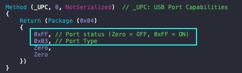

# ACPI-Based USB Port Mapping with Conditional Root Hub Replacement

**TABLE of CONTENTS**

- [Overview](#overview)
- [Advantages](#advantages)
- [Prerequisites](#prerequisites)
- [Patching Principle](#patching-principle)
- [Step-by-Step Guide](#step-by-step-guide)
  - [Step 1: Renaming USB Controllers (if required)](#step-1-renaming-usb-controllers-if-required)
  - [Step 2: Understand Your USB Controllers](#step-2-understand-your-usb-controllers)
  - [Step 3: Extract and Analyze ACPI Tables](#step-3-extract-and-analyze-acpi-tables)
  - [Step 4: Create a Custom SSDT with Alternate Root Hub (`XHUB`/`HUBX`)](#step-4-create-a-custom-ssdt-with-alternate-root-hub-xhubhubx)
  - [Step 5: Compile and Save the SSDT](#step-5-compile-and-save-the-ssdt)
  - [Step 6: Add SSDT to Bootloader](#step-6-add-ssdt-to-bootloader)
  - [Step 7: Test and Verify](#step-7-test-and-verify)
- [Example SSDT](#example-ssdt)
- [Tips and Best Practices](#tips-and-best-practices)
- [Troubleshooting Common Issues](#troubleshooting-common-issues)
- [References](#references)

---

## Overview
Proper USB port mapping is essential for a stable Hackintosh system running macOS, as it ensures that USB ports are correctly recognized, operate at their intended speeds, and support features like sleep and power management. The method described here, developed by **samuelnotfound**, uses ACPI to map USB ports by disabling the default USB Root Hub (`RHUB` or `HUBN`) and creating a custom one (`XHUB` or `HUBX`) which is used that contains all the ports that should be used when macOS is running.

This guide expands on the original method by providing a detailed, beginner-friendly walkthrough of the process, including prerequisites, tools, and step-by-step instructions. The principle is straightforward: redefine USB ports in ACPI to create a custom, macOS-compatible USB map. However, the technical steps can be complex, so this guide breaks them down clearly.

## Advantages
Compared to dropping the OEM SSDT containing the USB table and replacing it with a custom one (as explained [here](https://github.com/5T33Z0/OC-Little-Translated/blob/main/Content/03_USB_Fixes/ACPI_Mapping_USB_Ports/Replace_SSDT/README.md)), the alternate Root Hub (`XHUB`) method with conditional `_STA` disabling offers several benefits:

- **Preserves OEM SSDT Integrity**: By keeping the OEM SSDT intact and only disabling `RHUB` for macOS via `_STA`, you avoid removing critical ACPI definitions that may affect other system components, reducing the risk of boot failures or hardware conflicts.
- **Dual-Boot Compatibility**: The `_STA` method ensures `RHUB` remains active for other operating systems (e.g., Windows, Linux), maintaining native USB functionality in dual-boot setups, whereas dropping the OEM SSDT could disrupt USB behavior in non-macOS environments.
- **Simpler Implementation**: Disabling `RHUB` conditionally requires less extensive ACPI modifications compared to rewriting the entire USB table, making it easier to create and maintain the SSDT.
- **Lower Risk of Errors**: Dropping an OEM SSDT requires precise identification of the correct table (e.g., via `OemTableId`) and a comprehensive replacement, which can introduce errors if other ACPI dependencies are missed. The `XHUB` method is more targeted, modifying only the USB hub behavior.
- **Flexibility for Updates**: If the OEM firmware updates the USB table (e.g., via BIOS updates), the `HXUB` method adapts by overriding only the necessary parts, while a dropped OEM SSDT may require a complete rewrite to incorporate new firmware changes.
- **Reduced Debugging Complexity**: If issues arise, troubleshooting is simpler with the `HXUB` method, as you’re only adjusting a small SSDT rather than debugging a full OEM table replacement, which could impact unrelated system functions.
- **Customizability**: A custom Root Hub (`HXUB`) allows precise control over port definitions, especially for internal devices like Bluetooth, which macOS expects to be set as "Internal" (type 255).

This approach is particularly useful for systems with complex USB configurations or those affected by macOS's 15-port-per-controller limit, and it avoids reliance on kexts like `USBInjectAll` or tools like Hackintool, which may not work well for all platforms (e.g., AMD chipsets) or macOS versions post-Big Sur 11.3.

## Prerequisites
Before starting, ensure you have the following:

- **A Hackintosh System**: macOS installed with a working bootloader (e.g., OpenCore or Clover).
- **MaciASL**: A tool to edit and compile ACPI tables (download from [GitHub](https://github.com/acidanthera/MaciASL/releases)).
- **IORegistryExplorer**: Used to identify active USB ports and their assignments (available via Apple Developer account or Xcode additional tools).[](https://aplus.rs/2020/usb-mapping-why/)
- **USB Devices for Testing**: A USB 2.0 device (e.g., flash drive or mouse), a USB 3.0 device, and, if applicable, a USB-C device or adapter.[](https://www.travelertechie.com/2019/02/create-ssdt-to-fix-usb-rehabmans-way.html)
- **Basic ACPI Knowledge**: Familiarity with ACPI terms like DSDT (Differentiated System Description Table) and SSDT (Secondary System Description Table). If new to ACPI, refer to the [ACPI Specification](https://uefi.org/specifications) for background.
- **EFI Partition Access**: Ability to mount and edit your EFI partition using tools like OpenCore Auxiliary Tools or Clover Configurator.
- **Backup**: Always back up your EFI folder before making changes to avoid boot issues.[](https://hackintool.com/2025/05/19/how-do-i-use-hackintool-to-map-usb-ports/)
- **Text Editor**: For editing SSDT files (MaciASL includes one, but any code editor like Visual Studio Code works).

## Patching Principle

To implement a custom USB port map using ACPI, we follow this sequence:

- **Rename the USB controller** if necessary (e.g., `XHC1` to `SHCI`), to avoid conflicts with existing port maps in macOS.
- **Disable `RHUB` and/or `HUBN` under macOS only**: This also disables their `_UPC` methods. These hubs remain enabled under other operating systems.
- **Add `XHUB` or `HUBX`**, enabled only under macOS. These act as macOS-specific substitutes for `RHUB` and `HUBN`.
- **Assign original `_ADR` values to the new hubs**: `XHUB` inherits the `_ADR` of `RHUB`, and `HUBX` that of `HUBN`, ensuring correct device tree structure under macOS.
- **Enumerate active ports and assign their original `_ADR`s**: For each active port, copy the `_ADR` from its original definition under `RHUB`/`HUBN` to the corresponding port under `XHUB`/`HUBX`.
   *Example: if `HS01` under `RHUB` has `_ADR` `0x01`, replicate that value in the new definition under `XHUB`.*
- **Define appropriate `_UPC` values for each active port** to specify port type and usage (e.g., USB2, USB3, internal Bluetooth).

## Step-by-Step Guide

### Step 1: Renaming USB Controllers (if required)

Certain USB controllers needs to be renamed in order to avoid conflict with Apple's own USB maps. Refer to the Dortania's [OpenCore Install Guide](https://dortania.github.io/OpenCore-Post-Install/usb/system-preparation.html) and rename USB Controllers as needed.

### Step 2: Understand Your USB Controllers
1. **Open IORegistryExplorer**:
   - Launch IORegistryExplorer on your Hackintosh.
   - Navigate to the `IOService` pane and select `Root`.
   - Search for `XHC` (or `XHC1`, `XHC2`, etc.) to locate your USB controllers. These are typically labeled `XHC`, `EHC1`, or `EHC2` for Intel systems, or `PTXH` for some AMD systems.
   - Note the controller names and their associated ports (e.g., `HS01`, `SS01`, `PR01`). Ports labeled `HSxx` are USB 2.0, `SSxx` are USB 3.0, and `USR` ports (if present) are non-functional in macOS and can be excluded.

2. **Identify Physical Ports**:
   - Plug and unplug USB 2.0 and USB 3.0 devices into each physical port on your system (front, back, USB-C, etc.).
   - In IORegistryExplorer, observe which ports (e.g., `HS01`, `SS03`) become active (highlighted with a device name or arrow) when a device is connected.
   - Create a table mapping physical ports to their logical names (e.g., "Front Left USB 3.0 = SS01"). This helps during SSDT creation.

3. **Check Port Count**:
   - Count the total ports per controller. If a controller has more than 15 ports, you’ll need to disable some to comply with macOS’s limit.
   - Note internal devices (e.g., Bluetooth, webcam) as these must be set to type 255 (Internal).

### Step 3: Extract and Analyze ACPI Tables
1. **Open MaciASL**:
   - Launch MaciASL, which automatically loads your system’s DSDT and SSDTs.
   - Filter for `XHC` or `RHUB` to find the SSDT containing USB port declarations. This is typically an SSDT like `SSDT-XHCI` or similar.

2. **Locate the Root Hub (RHUB)**:
   - Within the SSDT, find the `RHUB` device under the USB controller (e.g., `XHC1`).
   - The `RHUB` section lists ports (e.g., `HS01`, `SS01`) with their `_UPC` (USB Port Capabilities) and `_PLD` (Physical Location of Device) methods. `_UPC` defines port availability and type, while `_PLD` describes physical location.

3. **Understand `_UPC` Parameters**:
   - The `_UPC` method returns a package with four values, the first two are relevant to us:<br>
     - **Port Availability**: `0xFF` (connectable) or `0x00` (not connectable).
     - **Port Type**:
      	|   Value    | Port Type                            |
		| :--------: | ------------------------------------ |
		| **`0X00`** | USB Type `A`                         |
		| **`0x01`** | USB `Mini-AB`                        |
		| **`0x02`** | ExpressCard                         |
		| **`0x03`** | USB 3 Standard Type `A`              |
		| **`0x04`** | USB 3 Standard Type `B`              |
		| **`0x05`** | USB 3 `Micro-B`                      |
		| **`0x06`** | USB 3 `Micro-AB`                     |
		| **`0x07`** | USB 3 `Power-B`                      |
		| **`0x08`** | Type C connector - HS only           |
		| **`0x09`** | Type C connector - HS and SS with Switch |
		| **`0x0A`** | Type C connector - HS and SS without Switch |
		|**`0x0B` - `0xFE`** | Reserved |
		| **`0xFF`** | Internal (e.g, Bluetooth and Camera) |
   - You’ll modify these to define your custom ports.

### Step 4: Create a Custom SSDT with Alternate Root Hub (`XHUB`/`HUBX`)
1. **Start a New SSDT in MaciASL**:
   - In MaciASL, click `File > New` to create a new SSDT.
   - Name it something descriptive, like `SSDT-HXUB.aml`.

2. **Define the Scope and Device**:
   - Set the scope to the USB controller (e.g., `_SB.PCI0.XHC1`).
   - Create a new device named `XHUB` to replace `RHUB` or HUBX to replace `HUBN`

3. **Disable the Original RHUB**:
   - Add a conditional check to disable `RHUB` when macOS is running. This is done using the `_STA` method, which returns 0x00 (disabled) if the operating system is Darwin (macOS).
   - **Example** (if your system uses `HUBN` instead of `RHUB`, disable that and use `HUBX` for the device in the Scope):
     
        ```asl
        DefinitionBlock ("", "SSDT", 2, "OCL", "XHUB", 0x00000000)
        {	
        // References to possible USB controllers and their locations (use the one(s) suitable to your system)
        External (_SB_.PCI0.EH01.HUBX, DeviceObj) // USB 2.0 Controller (Pre-Haswell systems)
        External (_SB_.PCI0.EH02.HUBX, DeviceObj) // USB 2.0 Controller (Pre-Haswell systems, second controller)
        External (_SB_.PCI0.EHC_.HUBX, DeviceObj) // USB 2.0 Controller (Pre-Haswell systems, alternate naming)
        External (_SB_.PCI0.SHCI.XHUB, DeviceObj) // USB 3.0 Controller (macOS-compatible renamed controller)
        External (_SB_.PCI0.XHC_.XHUB, DeviceObj) // USB 3.0 Controller (standard naming for modern systems)
            
            Scope (\_SB.PCI0.XHC.RHUB)
            {
                Method (_STA, 0, NotSerialized)  // _STA: Status
                {
                    If (_OSI ("Darwin"))
                    {
                        Return (Zero)
                    }
                    Else
                    {
                        Return (0x0F)
                    }
                }
            }
        …
     ```

4. Define a new Root Hub Device for macOS:

	```	asl
    Device (\_SB.PCI0.XHC.XHUB) // Adjust PCI path and device name according to your DSDT
    {
        Name (_ADR, Zero)  // _ADR: Address
        Method (_STA, 0, NotSerialized)  // _STA: Status
        {
            If (_OSI ("Darwin"))
            {
                Return (0x0F) // Enable custom XHUB under macOS
            }
            Else
            {
                Return (Zero) // Disable custom XHUB for other OSes
            }
        }
        …    
	```

5. **Define Ports in `XHUB`/`HUBX`**:
   - For each port you want to keep (up to 15 per controller), define a device (e.g., `HS01` (USB 2), `SS01` (USB 3), etc.) with `_UPC` and `_PLD` methods.
   - Example for a USB 2.0 port (`HS01`):
     ```asl
     Device (HS01) {
         Name (_ADR, One) // Address for HS01
         Method (_UPC, 0, NotSerialized) {
             Return (Package (0x04) {
                 0xFF, // Connectable
                 Zero, // USB 2.0 Type-A
                 Zero,
                 Zero
             })
         }
         Method (_PLD, 0, NotSerialized) {
             Return (Package (0x01) {
                 Buffer (0x10) {
                     // Physical location data (example)
                     0x81, 0x00, 0x00, 0x00, 0x00, 0x00, 0x00, 0x00,
                     0x00, 0x00, 0x00, 0x00, 0x00, 0x00, 0x00, 0x00
                 }
             })
         }
     }
     ```
	- Example for a USB 3.0 port (`SS01`):
		```asl
		 Device (SS01) {
			 Name (_ADR, 0x11) // Address for SS01
			 Method (_UPC, 0, NotSerialized) {
				 Return (Package (0x04) {
					 0xFF, // Connectable
					 0x03, // USB 3.0 Type-A
					 Zero,
					 Zero
				 })
			 }
			 Method (_PLD, 0, NotSerialized) {
				 Return (Package (0x01) {
					 Buffer (0x10) {
						 // Physical location data (example)
						 0x81, 0x00, 0x00, 0x00, 0x00, 0x00, 0x00, 0x00,
						 0x00, 0x00, 0x00, 0x00, 0x00, 0x00, 0x00, 0x00
					 }
				 })
			 }
		 }
		 ```
	- Example for an internal USB 2.0 port (`HS07`):
	     ```asl
	     Device (HS07) {
	         Name (_ADR, 0x07) // Address for HS07
	         Method (_UPC, 0, NotSerialized) {
	             Return (Package (0x04) {
	                 0xFF, // Connectable
	                 0xFF, // Internal USB 2.0 connector
	                 Zero,
	                 Zero
	             })
	         }
	         Method (_PLD, 0, NotSerialized) {
	             Return (Package (0x01) {
	                 Buffer (0x10) {
	                     // Physical location data (example)
	                     0x81, 0x00, 0x00, 0x00, 0x00, 0x00, 0x00, 0x00,
	                     0x00, 0x00, 0x00, 0x00, 0x00, 0x00, 0x00, 0x00
	                 }
	             })
	         }
	     }
		```
	- Repeat for each port, adjusting `_ADR` (address) and `_UPC` accordingly. Ensure internal devices like Bluetooth are set to type 255.

7. **Limit to 15 Ports**:
   - If your controller has more than 15 ports, exclude unused or less critical ports (e.g., internal headers not in use). Update your table from Step 1 to reflect the final selection.

### Step 5: Compile and Save the SSDT
1. **Check Syntax**:
   - In MaciASL, click `Compile` to check for errors. Fix any syntax issues (e.g., missing brackets).
2. **Save as AML**:
   - Go to `File > Save As`, select `ACPI Machine Language Binary` (.aml), and name it (e.g., `SSDT-XHUB.aml`).
   - Save it to your Desktop or a known location.

### Step 6: Add SSDT to Bootloader
1. **Mount EFI Partition**:
   - Use a tool like OpenCore Auxiliary Tools or Clover Configurator to mount your EFI partition.
2. **Copy SSDT**:
   - Place `SSDT-HUBX.aml` in `EFI/OC/ACPI` (OpenCore) or `EFI/Clover/ACPI/patched` (Clover).
3. **Update Config**:
   - Open your `config.plist` in a plist editor (e.g., ProperTree).
   - Add an entry under `ACPI > Add` for `SSDT-XHUB.aml`. Set `Enabled` to `true`.
   - Example for OpenCore:
     ```xml
     <dict>
         <key>Path</key>
         <string>SSDT-XHUB.aml</string>
         <key>Enabled</key>
         <true/>
     </dict>
     ```

### Step 7: Test and Verify
1. **Reboot**:
   - Save changes, reboot your Hackintosh, and ensure it boots correctly.
2. **Test USB Ports**:
   - Use IORegistryExplorer to verify that `XHUB` is active and `RHUB` is disabled under macOS.
   - Plug in USB 2.0, 3.0, and internal devices to confirm they appear under `XHUB` with correct types and functionality.
3. **Troubleshoot**:
   - **Ports Not Recognized**: Check physical connections and BIOS USB settings (e.g., enable XHCI Handoff).
   - **Boot Issues**: Revert to your EFI backup and verify SSDT syntax.
   - **Port Limit Exceeded**: Ensure no more than 15 ports are defined per controller.
 
## Example SSDT
Below, you will find the code for the `SSDT-XHUB.aml` I am using on my desktop system, containing 15 mapped USB Ports (USB 2 and USB 3 and a USB Type C port with switch):


<details>
<summary><strong>Code:</strong> (click to reveal)</summary>

```asl
DefinitionBlock ("", "SSDT", 2, "OCLT", "XHUB", 0x00000000)
{
    External (_SB_.PCI0.XHC_.RHUB, DeviceObj) // Reference to the USB Root Hub device in the ACPI namespace

    Scope (\_SB.PCI0.XHC.RHUB)
    {
        Method (_STA, 0, NotSerialized)  // _STA: Status, determines device presence
        {
            If (_OSI ("Darwin")) // Check if running macOS
            {
                Return (Zero) // Disable RHUB on macOS
            }
            Else
            {
                Return (0x0F) // Enable RHUB on other OSes
            }
        }
    }

    Device (\_SB.PCI0.XHC.XHUB)
    {
        Name (_ADR, Zero)  // _ADR: Address, XHUB is at address 0
        Method (_STA, 0, NotSerialized)  // _STA: Status, determines device presence
        {
            If (_OSI ("Darwin")) // Check if running macOS
            {
                Return (0x0F) // Enable XHUB on macOS
            }
            Else
            {
                Return (Zero) // Disable XHUB on other OSes
            }
        }

        Device (HS01)
        {
            Name (_ADR, 0x01)  // _ADR: Address, High-Speed port 1
            Method (_UPC, 0, NotSerialized)  // _UPC: USB Port Capabilities
            {
                Return (Package (0x04)
                {
                    0xFF, // Connectable
                    Zero, // Type-A connector
                    Zero, // Not proprietary
                    Zero  // Reserved
                })
            }

            Method (_PLD, 0, NotSerialized)  // _PLD: Physical Location of Device
            {
                Return (Package (0x01)
                {
                    Buffer (0x10)
                    {
                        /* 0000 */  0x81, 0x00, 0x00, 0x00, 0x00, 0x00, 0x00, 0x00,  // Visible, default location
                        /* 0008 */  0x00, 0x00, 0x00, 0x00, 0x00, 0x00, 0x00, 0x00   // Reserved
                    }
                })
            }
        }

        Device (HS02)
        {
            Name (_ADR, 0x02)  // _ADR: Address, High-Speed port 2
            Method (_UPC, 0, NotSerialized)
            {
                Return (Package (0x04)
                {
                    0xFF, // Connectable
                    Zero, // Type-A connector
                    Zero, // Not proprietary
                    Zero  // Reserved
                })
            }

            Method (_PLD, 0, NotSerialized)
            {
                Return (Package (0x01)
                {
                    Buffer (0x10)
                    {
                        /* 0000 */  0x81, 0x00, 0x00, 0x00, 0x00, 0x00, 0x00, 0x00,
                        /* 0008 */  0x00, 0x00, 0x00, 0x00, 0x00, 0x00, 0x00, 0x00
                    }
                })
            }
        }

        Device (HS03)
        {
            Name (_ADR, 0x03)  // _ADR: Address, High-Speed port 3
            Method (_UPC, 0, NotSerialized)
            {
                Return (Package (0x04)
                {
                    Zero, // Not connectable
                    Zero, // Type-A connector
                    Zero, // Not proprietary
                    Zero  // Reserved
                })
            }

            Method (_PLD, 0, NotSerialized)
            {
                Return (Package (0x01)
                {
                    Buffer (0x10)
                    {
                        /* 0000 */  0x81, 0x00, 0x00, 0x00, 0x00, 0x00, 0x00, 0x00,
                        /* 0008 */  0x00, 0x00, 0x00, 0x00, 0x00, 0x00, 0x00, 0x00
                    }
                })
            }
        }

        Device (HS04)
        {
            Name (_ADR, 0x04)  // _ADR: Address, High-Speed port 4
            Method (_UPC, 0, NotSerialized)
            {
                Return (Package (0x04)
                {
                    Zero, // Not connectable
                    Zero, // Type-A connector
                    Zero, // Not proprietary
                    Zero  // Reserved
                })
            }

            Method (_PLD, 0, NotSerialized)
            {
                Return (Package (0x01)
                {
                    Buffer (0x10)
                    {
                        /* 0000 */  0x81, 0x00, 0x00, 0x00, 0x00, 0x00, 0x00, 0x00,
                        /* 0008 */  0x00, 0x00, 0x00, 0x00, 0x00, 0x00, 0x00, 0x00
                    }
                })
            }
        }

        Device (HS05)
        {
            Name (_ADR, 0x05)  // _ADR: Address, High-Speed port 5
            Method (_UPC, 0, NotSerialized)
            {
                Return (Package (0x04)
                {
                    0xFF, // Connectable
                    Zero, // Type-A connector
                    Zero, // Not proprietary
                    Zero  // Reserved
                })
            }

            Method (_PLD, 0, NotSerialized)
            {
                Return (Package (0x01)
                {
                    Buffer (0x10)
                    {
                        /* 0000 */  0x81, 0x00, 0x00, 0x00, 0x00, 0x00, 0x00, 0x00,
                        /* 0008 */  0x00, 0x00, 0x00, 0x00, 0x00, 0x00, 0x00, 0x00
                    }
                })
            }
        }

        Device (HS06)
        {
            Name (_ADR, 0x06)  // _ADR: Address, High-Speed port 6
            Method (_UPC, 0, NotSerialized)
            {
                Return (Package (0x04)
                {
                    0xFF, // Connectable
                    Zero, // Type-A connector
                    Zero, // Not proprietary
                    Zero  // Reserved
                })
            }

            Method (_PLD, 0, NotSerialized)
            {
                Return (Package (0x01)
                {
                    Buffer (0x10)
                    {
                        /* 0000 */  0x81, 0x00, 0x00, 0x00, 0x00, 0x00, 0x00, 0x00,
                        /* 0008 */  0x00, 0x00, 0x00, 0x00, 0x00, 0x00, 0x00, 0x00
                    }
                })
            }
        }

        Device (HS07)
        {
            Name (_ADR, 0x07)  // _ADR: Address, High-Speed port 7
            Method (_UPC, 0, NotSerialized)
            {
                Return (Package (0x04)
                {
                    Zero, // Not connectable
                    Zero, // Type-A connector
                    Zero, // Not proprietary
                    Zero  // Reserved
                })
            }

            Method (_PLD, 0, NotSerialized)
            {
                Return (Package (0x01)
                {
                    Buffer (0x10)
                    {
                        /* 0000 */  0x81, 0x00, 0x00, 0x00, 0x00, 0x00, 0x00, 0x00,
                        /* 0008 */  0x00, 0x00, 0x00, 0x00, 0x00, 0x00, 0x00, 0x00
                    }
                })
            }
        }

        Device (HS08)
        {
            Name (_ADR, 0x08)  // _ADR: Address, High-Speed port 8
            Method (_UPC, 0, NotSerialized)
            {
                Return (Package (0x04)
                {
                    0xFF, // Connectable
                    Zero, // Type-A connector
                    Zero, // Not proprietary
                    Zero  // Reserved
                })
            }

            Method (_PLD, 0, NotSerialized)
            {
                Return (Package (0x01)
                {
                    Buffer (0x10)
                    {
                        /* 0000 */  0x81, 0x00, 0x00, 0x00, 0x00, 0x00, 0x00, 0x00,
                        /* 0008 */  0x00, 0x00, 0x00, 0x00, 0x00, 0x00, 0x00, 0x00
                    }
                })
            }
        }

        Device (HS10)
        {
            Name (_ADR, 0x0A)  // _ADR: Address, High-Speed port 10
            Method (_UPC, 0, NotSerialized)
            {
                Return (Package (0x04)
                {
                    0xFF, // Connectable
                    0x0A, // USB-C connector without switch
                    Zero, // Not proprietary
                    Zero  // Reserved
                })
            }

            Method (_PLD, 0, NotSerialized)
            {
                Return (Package (0x01)
                {
                    Buffer (0x10)
                    {
                        /* 0000 */  0x81, 0x00, 0x00, 0x00, 0x00, 0x00, 0x00, 0x00,
                        /* 0008 */  0x00, 0x00, 0x00, 0x00, 0x00, 0x00, 0x00, 0x00
                    }
                })
            }
        }

        Device (HS14)
        {
            Name (_ADR, 0x0E)  // _ADR: Address, High-Speed port 14
            Method (_UPC, 0, NotSerialized)
            {
                Return (Package (0x04)
                {
                    0xFF, // Connectable
                    0xFF, // Unknown connector type
                    Zero, // Not proprietary
                    Zero  // Reserved
                })
            }

            Method (_PLD, 0, NotSerialized)
            {
                Return (Package (0x01)
                {
                    Buffer (0x10)
                    {
                        /* 0000 */  0x81, 0x00, 0x00, 0x00, 0x00, 0x00, 0x00, 0x00,
                        /* 0008 */  0x00, 0x00, 0x00, 0x00, 0x00, 0x00, 0x00, 0x00
                    }
                })
            }
        }

        Device (SS01)
        {
            Name (_ADR, 0x11)  // _ADR: Address, SuperSpeed port 1
            Method (_UPC, 0, NotSerialized)
            {
                Return (Package (0x04) // Note: Original code has incorrect package size (0x11)
                {
                    0xFF, // Connectable
                    0x03, // USB 3.0 Type-A connector
                    Zero, // Not proprietary
                    Zero  // Reserved
                })
            }

            Method (_PLD, 0, NotSerialized)
            {
                Return (Package (0x01)
                {
                    Buffer (0x10)
                    {
                        /* 0000 */  0x81, 0x00, 0x00, 0x00, 0x00, 0x00, 0x00, 0x00,
                        /* 0008 */  0x00, 0x00, 0x00, 0x00, 0x00, 0x00, 0x00, 0x00
                    }
                })
            }
        }

        Device (SS02)
        {
            Name (_ADR, 0x12)  // _ADR: Address, SuperSpeed port 2
            Method (_UPC, 0, NotSerialized)
            {
                Return (Package (0x04) // Note: Original code has incorrect package size (0x12)
                {
                    0xFF, // Connectable
                    0x03, // USB 3.0 Type-A connector
                    Zero, // Not proprietary
                    Zero  // Reserved
                })
            }

            Method (_PLD, 0, NotSerialized)
            {
                Return (Package (0x01)
                {
                    Buffer (0x10)
                    {
                        /* 0000 */  0x81, 0x00, 0x00, 0x00, 0x00, 0x00, 0x00, 0x00,
                        /* 0008 */  0x00, 0x00, 0x00, 0x00, 0x00, 0x00, 0x00, 0x00
                    }
                })
            }
        }

        Device (SS03)
        {
            Name (_ADR, 0x13)  // _ADR: Address, SuperSpeed port 3
            Method (_UPC, 0, NotSerialized)
            {
                Return (Package (0x04)
                {
                    0xFF, // Connectable
                    0x03, // USB 3.0 Type-A connector
                    Zero, // Not proprietary
                    Zero  // Reserved
                })
            }

            Method (_PLD, 0, NotSerialized)
            {
                Return (Package (0x01)
                {
                    Buffer (0x10)
                    {
                        /* 0000 */  0x81, 0x00, 0x00, 0x00, 0x00, 0x00, 0x00, 0x00,
                        /* 0008 */  0x00, 0x00, 0x00, 0x00, 0x00, 0x00, 0x00, 0x00
                    }
                })
            }
        }

        Device (SS04)
        {
            Name (_ADR, 0x14)  // _ADR: Address, SuperSpeed port 4
            Method (_UPC, 0, NotSerialized)
            {
                Return (Package (0x04)
                {
                    0xFF, // Connectable
                    0x03, // USB 3.0 Type-A connector
                    Zero, // Not proprietary
                    Zero  // Reserved
                })
            }

            Method (_PLD, 0, NotSerialized)
            {
                Return (Package (0x01)
                {
                    Buffer (0x10)
                    {
                        /* 0000 */  0x81, 0x00, 0x00, 0x00, 0x00, 0x00, 0x00, 0x00,
                        /* 0008 */  0x00, 0x00, 0x00, 0x00, 0x00, 0x00, 0x00, 0x00
                    }
                })
            }
        }

        Device (SS05)
        {
            Name (_ADR, 0x15)  // _ADR: Address, SuperSpeed port 5
            Method (_UPC, 0, NotSerialized)
            {
                Return (Package (0x04)
                {
                    0xFF, // Connectable
                    0x0A, // USB-C connector without switch
                    Zero, // Not proprietary
                    Zero  // Reserved
                })
            }

            Method (_PLD, 0, NotSerialized)
            {
                Return (Package (0x01)
                {
                    Buffer (0x10)
                    {
                        /* 0000 */  0x81, 0x00, 0x00, 0x00, 0x00, 0x00, 0x00, 0x00,
                        /* 0008 */  0x00, 0x00, 0x00, 0x00, 0x00, 0x00, 0x00, 0x00
                    }
                })
            }
        }

        Device (SS06)
        {
            Name (_ADR, 0x16)  // _ADR: Address, SuperSpeed port 6
            Method (_UPC, 0, NotSerialized)
            {
                Return (Package (0x04)
                {
                    0xFF, // Connectable
                    0x0A, // USB-C connector without switch
                    Zero, // Not proprietary
                    Zero  // Reserved
                })
            }

            Method (_PLD, 0, NotSerialized)
            {
                Return (Package (0x01)
                {
                    Buffer (0x10)
                    {
                        /* 0000 */  0x81, 0x00, 0x00, 0x00, 0x00, 0x00, 0x00, 0x00,
                        /* 0008 */  0x00, 0x00, 0x00, 0x00, 0x00, 0x00, 0x00, 0x00
                    }
                })
            }
        }

        Device (SS07)
        {
            Name (_ADR, 0x17)  // _ADR: Address, SuperSpeed port 7
            Method (_UPC, 0, NotSerialized)
            {
                Return (Package (0x04)
                {
                    0xFF, // Connectable
                    0x03, // USB 3.0 Type-A connector
                    Zero, // Not proprietary
                    Zero  // Reserved
                })
            }

            Method (_PLD, 0, NotSerialized)
            {
                Return (Package (0x01)
                {
                    Buffer (0x10)
                    {
                        /* 0000 */  0x81, 0x00, 0x00, 0x00, 0x00, 0x00, 0x00, 0x00,
                        /* 0008 */  0x00, 0x00, 0x00, 0x00, 0x00, 0x00, 0x00, 0x00
                    }
                })
            }
        }

        Device (SS08)
        {
            Name (_ADR, 0x18)  // _ADR: Address, SuperSpeed port 8
            Method (_UPC, 0, NotSerialized)
            {
                Return (Package (0x04)
                {
                    0xFF, // Connectable
                    0x03, // USB 3.0 Type-A connector
                    Zero, // Not proprietary
                    Zero  // Reserved
                })
            }

            Method (_PLD, 0, NotSerialized)
            {
                Return (Package (0x01)
                {
                    Buffer (0x10)
                    {
                        /* 0000 */  0x81, 0x00, 0x00, 0x00, 0x00, 0x00, 0x00, 0x00,
                        /* 0008 */  0x00, 0x00, 0x00, 0x00, 0x00, 0x00, 0x00, 0x00
                    }
                })
            }
        }
    }
}
```
</details>

## Tips and Best Practices
- **Document Your Ports**: Keep a detailed map of physical-to-logical port assignments for future reference.
- **Test Incrementally**: Add a few ports at a time to your SSDT and test to avoid overwhelming errors.
- **Use the template**. If you have a newer PC, you can use SSDT-XHUB.dsl as a template to map your system's ports. If you are using an older system which uses  EHCI or OHCI controllers, that use the SSDT_USBMAP_Template.dsl instead
- **Check BIOS Settings**: Ensure USB ports are enabled and XHCI Handoff is set to "Enabled" in BIOS.
- **Avoid USBInjectAll**: This kext is outdated and can cause conflicts. Use only if necessary for initial port discovery.
- **Use Descriptive Names**: In `_PLD`, include comments or names (e.g., "Front USB 3.0") for maintainability.
- **Consult ACPI Specs**: Refer to the ACPI 6.3 specification (section 9.14) for detailed `_UPC` and `_PLD` parameters.


## Troubleshooting Common Issues
- **Ports Not Showing**: Verify ACPI path in IORegistryExplorer and ensure the SSDT is loaded in `config.plist`.
- **System Instability**: Check for syntax errors in the SSDT or conflicting kexts (e.g., `USBInjectAll`). Remove unnecessary kexts.
- **Bluetooth Issues**: Ensure Bluetooth is set to type 255 (Internal) and connected to the correct port.
- **Exceeding Port Limit**: Reduce the number of defined ports to 15 or fewer per controller.

## References
- Original method by samuelnotfound: [GitHub Repository](https://github.com/samuelnotfound/miscellaneous-hackintosh-guides/tree/main/SSDT_USB_Mapping)
- ACPI Specification: [UEFI ACPI Specs](https://uefi.org/specifications)
