# How to create/modify a Layout-ID for AppleALC

## Preface
🚧 This guide is a work in progress, so don't follow it yet. Completed chapters: I, to IV and VIII to XI.

This is my attempt of providing an up-to-date and easier(?) to follow guide for creating Layout-IDs for the AppleALC kext to make audio work on a Hackintosh. 

It is aimed at users for whom the existing Layout-IDs either do not work so they're forced to create one from scratch and for those who wish to modify an existing Layout-ID for other reasons. Maybe the Layout-ID in use was created for the same Codec but a different system/mainboard and causes issues or they want to add auxiliary inputs or outputs missing from the current Layout-ID in use.

### The work that goes into creating a Layout-ID 
From a user's perspective, making audio work is a simple matter of entering the correct number of an ALC Layou-ID in the config.plist, save it and you're done. 

But once you are on the other side, trying to actually *create* a new Layout-ID this becomes a whooooole different story: you have to dump the audio Codec in Linux, you have to install a bunch of other tools, you have to convert data, you have to edit data inside various files, you have to configure Xcode to compile the kext, you have to add it to your EFI folder. Then you have to reboot to test it. Does it work? Of course not! Well, do it again… and reboot. Does it work? No? Do it again and again and again… and again… and again… Sounds like fun, right?! So now that you have been warned, we can begin – are you still sure you want to do this?

### How to use this guide
- **Feel free to jump back and forth between chapters**! &rarr; The process of creating a Layout-ID for AppleALC is rather complex. It requires going back and forth between editing files and data, having various Apps and windows open at all times. Although this guide follows a linear structure that will get you from A to Z eventually, you probably will have to jump between chapters IV to IX more than once.
- **Do as I say, not as I do**! &rarr; Although the Layout-ID created in this guide is for a specific Codec (Realtek ALC269VC) in a specific machine (Lenovo T530 Laptop) and a specific use case (getting the line-out of the docking station station to work), the general principles and techniques apply to *any* given Audio Codec. You just have to abstract from the given example and apply the concepts and techniques to your specific Codec and use case.

**NOTE**: If you'd just like to compile a slimmed-down version of the AppleALC kext for the Layout-ID you are using, you can follow [this guide](https://github.com/dreamwhite/ChonkyAppleALC-Build) instead.

<details>
<summary><strong>Why this guide is needed</strong> (click to reveal)</summary>

### Why this guide is needed
Although AppleALC comes with around 600 (!) pre-configured Layout-IDs for more than 100 Audio Codecs, the process of *creating* or *modifying* a Layout-ID and integrating it into the source code for compiling the kext is not covered on the AppleALC repo. As a matter of fact, it's not covered anywhere! I only could find 4 guides which explain parts of if but never the whole process as it is required today.

Most of the guides I found were either outdated, over-complicated or only parts of them are applicable today (check the "Credits and Resources" section). More importantly, ***none*** of the existing guides actually explain how to integrate the PinConfig data into the AppleALC source code and how to compile the actual kext!

The most convincing guide I found yet is written in German by MacPeet who has created a lot of Layout-IDs for AppleALC over the years. It's from 2015 when patching AppleHDA.kext was still necessary since AppleALC didn't exist. Although not all of its instructions are applicable today, it introduced a new, partly automated workflow, which is much easier to understand and follow: it utilizes tools to visualize the Codec dump and scripts to generate required verb data for the PinConfig which previously required a lot of manual labour.

My guide is an adaptation of MacPeet's work but expands on it where necessary to meet today's requirements. It makes use of all the nice new features markdown has to offer, such as syntax highlighting, adding tables and mermaid integration for creating flowcharts, etc.

So, unless you are fine with being dependent on the grace of others to create a Layout-ID for you, an updated guide was long overdue.
</details>

## Contents
This guide will cover the following topics:

- Components of a AppleALC Layout-ID
- Creating a dump of the Audio Codec in Linux
- Converting and visualizing the Codec dump data
- Creating a Pin Configuration and a PathMap 
- Creating a new Layout-ID for your Codec
- Integrating the data into the AppleALC source code and compiling the kext with Xcode
- Submitting your Layout-ID to the AppleALC github repo via Pull Request

## I. Files that make up the ALC Layout-ID 
Creating a Layout-ID requires generating Data and editing various files and compiling the AppleALC kext it in Xcode, mainly:

- `info.plist` inside of the `PinConfigs.kext` &rarr; Provides macOS with details about the available audio sources of the Codec (Speakers, Mic, Inputs and Outputs)
- `LayoutXX.xml` &rarr; Defines the properties of the used Codec
- `PlatformsXX.xml` &rarr; Contains the actual routing of the Codec

**NOTE**: The `XX` stands for the number of the Layout-ID. More about that later.

## II. Prep work (plenty)
Creating a Layout-ID for AppleALC is possibly one of the most challenging tasks for "regular" hackintosh users who are not programmers (me included). It's not only challenging and time consuming, it's also confusing and requires a lot of tools and prep work. So let's get it out the way right away.

### Obtaining an Audio CODEC dump in Linux
Why Linux? Unfortunately, Codec dumps obtained with Clover/OpenCore can't be processed by the tools required to convert and visualize the data inside the Codec dump. Codec dumps created in Linux, however, can be processed by these tools just fine. 

When I compared the dumps obtained with Clover and Linux, I noticed that the one created in Linux contained almost twice the amount of data (293 vs 172 lines). I guess this is because Linux dynamically discovers the paths of an audio codec through a graph traversal algorithm. And in cases where the algorithm fails, it uses a huge lookup table of patches specific to each Codec. My guess is that this additional data is captured in the Codec dump as well.

Therefore, we need to use (a live version of) Linux to create the codec dump without having to actually install Linux. We can use Ventoy for this. It prepares a USB flash drive which can run almost any ISO directly without having to create a USB installer.

#### Preparing a USB flash drive for running Linux from an ISO
Users who already have Linux installed can skip to "Dumping the Codec"!

1. Use a USB 3.0 flash drive (at least 8 GB or more)
2. In Windows, download [**Ventoy**](https://www.ventoy.net/en/download.html) and follow the [Instructions](https://www.ventoy.net/en/doc_start.html) to prepare the flash drive. It's pretty straight forward.
3. Next, download an ISO of a Linux distribution of your choice, e.g. [**Ubuntu**](https://ubuntu.com/download/desktop), [Zorin](https://zorin.com/os/download/) or whatever distro you prefer – they all work fine.
4. Copy the ISO to your newly created Ventoy stick
5. Reboot from the flash drive
6. In the Ventoy menu, select the Linux ISO and hit enter
7. From the GNU Grub, select "Try or Install Linux"
8. Once Ubuntu has reached the Desktop environment, select "Try Ubuntu" (or whatever the distro of your choise prompts).

#### Dumping the Codec
1. Once Linux is up and running, open Terminal and enter:</br>
	```shell
	cd ~/Desktop && mkdir CodecDump && for c in /proc/asound/card*/codec#*; do f="${c/\/*card/card}"; cat "$c" > CodecDump/${f//\//-}.txt; done && zip -r CodecDump.zip CodecDump
	```
2. Store the generated `CodecDump.zip` on a medium which you can access later from within macOS (HDD, other USB stick, E-Mail, Cloud). You cannot store it on the Ventoy flash drive itself, since it's formatted in ExFat and can't be accessed by Linux without additional measures.
3. Reboot into macOS
4. Extract `CodecDump.zip` to the Desktop
5. ⚠️ Rename `card0-codec#0.txt` inside the "CodecDump" folder to `codec_dump.txt`. This is important. Otherwise the script we will use in step III. can't find the file (it's looking specifically for "codec_dump.txt") and the file conversion process will fail.

### Additional Requirements
💡Please follow the instructions below carefully and thoroughly to avoid issues.

- Download and install [**Python**](https://www.python.org/downloads/) if you haven't already
- Install either [**MacPorts**](https://www.macports.org/install.php) or [**Homebrew**](https://brew.sh/) (I used MacPorts, but Homebrew works, too)
- Once that's done, reboot.
- Next, install [**graphviz**](https://graphviz.org/) via terminal (takes about 10 minutes!):
	- If you are using **MacPorts**, enter `sudo port install graphviz`
	- If you are using **Homebrew**, enter `brew install graphviz` 
- Next, download and unzip [**codecgraph.zip**](https://github.com/5T33Z0/OC-Little-Translated/raw/main/L_ALC_Layout-ID/codecgraph.zip)
- Copy the `codegraph` folder to the Desktop. We need it to convert and visualize the data inside the Codec dump, so we have can work with it.
- Move the `codec_dump.txt` into the "codecgraph" folder
- Download and extract [**PinConfigurator**](https://github.com/headkaze/PinConfigurator/releases)
- Download [**Hackintool**](https://github.com/headkaze/Hackintool). We may need it for checking PCI devices and Hex to Decimal conversions later.
- Get a plist editor like PlistEditPro or [**XPlist**](https://github.com/ic005k/Xplist)
- Download and install the [correct version](https://developer.apple.com/support/xcode/) of [**Xcode**](https://developer.apple.com/download/all/?q=xcode) supported by the macOS you are running. The download is about 10 GB and the installed application is about 30 GB, so make sure you have enough space on your drive! And: make sure to move the app to the "Programs" folder – otherwise compiling fails.

#### Preparing the AppleALC Source Code
- Clone, Fork or Download and extract the [**AppleALC**](https://github.com/acidanthera/AppleALC) Source Code (click on "Code" and "Download Zip")
- Download the Debug Version of [**Lilu**](https://github.com/acidanthera/Lilu/releases) and copy it to the "AppleALC" root folder
- In Terminal, enter: `cd`, hit space and drag and drop your AppleALC folder into the window and press enter.
- Next, enter `git clone https://github.com/acidanthera/MacKernelSDK` and hit enter.
- The resulting folder structure should look like this:</br>

- The files we need to create (or modify) a Layout-ID are:
	- `info.plist` (located in AppleALC/Resources/PinConfigs.kext/Contents/)
	- `LayoutXX.aml` and `PlatformsXX.xml` (located in a "ALCXXX"-subfolder corresponding the Codec model).

#### Configuring Xcode
- Start Xcode
- Open the `AppleALC.xcodeproj` file located in the AppleALC folder
- Highlight the AppleALC project file:</br>
- Under "Build Settings", check if the entries </br> `KERNEL_EXTENSION_HEADER_SEARCH_PATHS` and `KERNEL_FRAMEWORK_HEADERS` exist
- If not, press the "+" button and click on "Add User-Defined Settings" to add them. Make sure that both point to "(PROJECT_DIR)/MacKernelSDK/Headers":</br>
- Next, Link to custom `libkmod.a` library by adding it under "Link Binary with Libraries": 
- Verify that `libkmod.a` is present in /MacKernelSDK/Library/x86_64/ inside the AppleALC Folder. Once all that is done, you are prepared to compile AppleALC.kext.

Now, that we have the prep work out of the way, we can begin!

## III. Extracting data from the Codec dump
In order to create a routing of the audio inputs and outputs for macOS, we need to extract and convert data from the codec dump. To make the data easier to work with, we will visualize it so we have a schematic of the audio codec which makes routing easier than browsing through the text file of the codec dump.

### Converting the Codec Dump 
1. Open the `codec_dump.txt` located in the "codecgraph" folder with TextEdit. It should look similar to this:</br>
2. Delete the line: `AFG Function Id: 0x1 (unsol 1)` &rarr; otherwise the the following file conversions will fail!
3. Save the file
4. Next, double-click on `Script Patch Codec by HoangThanh`

**This will generate 5 new files inside the codecgraph folder:**

- **`codec_dump_dec.txt`** &rarr; Codec dump converted from Hex to Decimal. We we need it since the data has to be entered in decimals in AppleAlC's .xml files.
- **`finalfinalverbs.txt`** &rarr; Text file containing the Pin Configuration extracted from the codec dump using the [verbit.sh](https://github.com/maywzh/useful_scripts/blob/master/verbit.sh) script. The Pin Configuration represents the available inputs/outputs in macOS'es Audio Settings.
- **`verbitdebug.txt`** &rarr; A log file of the corrections and modifications `verbit.sh` applied to the verb data.
- **`codec_dump_dec.txt.svg`** &rarr; PathMap converted from hex to decimal. We will work with this most of the time.
- **`codec_dump.txt.svg`** – PathMap of the Codec's routing in Hex.

## IV. Understanding the Codec schematic
Shown below is `codec_dump.txt_dec.txt.svg`, a visual representation of the data inside the codec dump for the **Realtek ALC269VC** used in my Laptop. It shows the complete routing capabilities of the Audio Codec.  Depending on the Codec used in your system, the schematic will look different!


Form              | Function
------------------|-----------------------------------------------
**Triangle**      | Amplifier
**Blue Ellipse**  | Audio Output
**Red Ellipse**   | Audio Input
**Parallelogram** | Audio selector (this codec doesn't have any)
**Hexagon**       | Audio mixer (with various connections 0, 1, 2,…)
**Rectangle**     | Pin Complex Nodes representing audio sources we can select in system settings (Mic, Line-out, Headphone etc.)
**Black Lines**   | Available paths
**Dotted Lines**  | Currently used path
**Blue Lines**    | ???

### How to read the schematic
The schematic a bit hard to read and comprehend because of its structure. It's also misleading: since all the arrows point to the right one might think this represents the signal flow. But that's not the case! 

Just ignore the arrows! Instead, you need to take a different approch:

#### Routing inputs
For **Inputs**, start at the input and end at the Pin Complex Node:

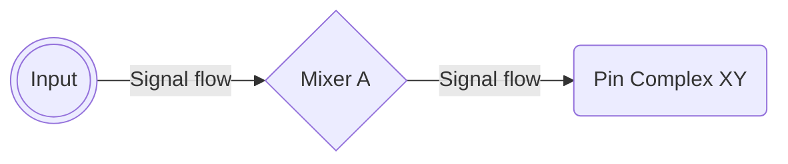

#### Routing outputs
For **Outputs**, the path that an outgoing signal takes can be obtained by starting at the Pin Complex Node and then following it through the mixer(s) to the physical output (jack or speakers):

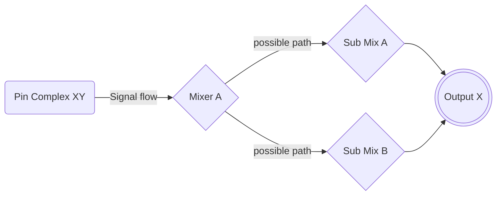
Whether or not a signal travels to more than one Mixer node depends on the design of the Codec and is not really relevant. What's important is to list all the "stations" a signal passes from the Pin Complex Node to the desired Output. 

### Examples from ALC269
Headphone Output switch, possible routings:

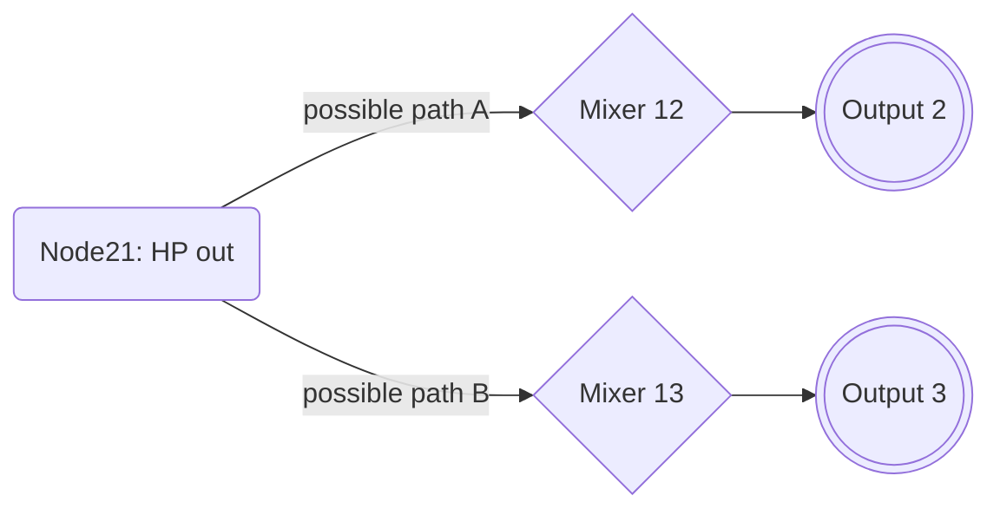
Internal Mic Input:
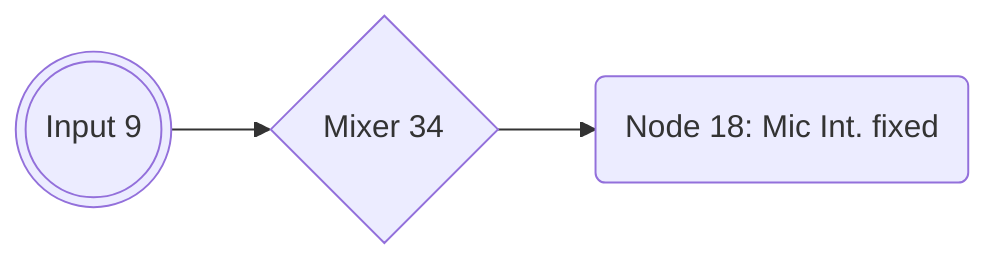
Line Input:
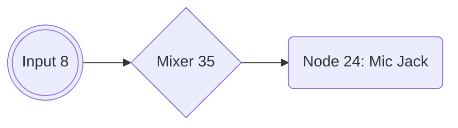

We will come back to the schematic later… 

## V. Creating the `PinConfig`
Audio Codecs support various Inputs and Outputs: Internal speakers an/or a mic (on Laptops) as well as Line-Ins and Outs (both analog and digital). Apple's HDA Driver supports up to 8 different audio sources – so stay within this limit when creating your `PinConfig`

These Inputs and Outputs are represented by the so-called `PinConfig`. It tells macOS which audio sources are available to the system. It's a long sequence of digits (called "verbs") consisting of 4 components: the Codec's address, Node IDs, Verb Commands and Verb Data which has to extracted from the Codec dump and injected into macOS via AppleALC kext. 

Luckily for us, the script we ran previously automatically extracted and corrected the verbs from the Codec dump and stored them in the "finalfinalverbs.txt". But if you want know how extract the verb data *manually*, please refer to Parts 2 and 3 of [EMlyDinEsH's guide](https://osxlatitude.com/forums/topic/1946-complete-applehda-patching-guide/).

Once we got the PinConfig, it has to be added to the `info.plist` of the `PinConfigs.kext` before compiling the `AppleAlC.kext`.

### Relevant data

Amongst other things, the Codec dump text contains the following details:

- The Codec model
- Its Address
- It's Vendor Id (in AppleALC it's used as `CodecID`)
- Pin Complex Nodes with Control Names (these form the `PinConfig`)
- The actual routing capabilities of the Codec:
	- Mixer/Selector Nodes
	- Audio Output Nodes
	- Audio Input Nodes
	- Number of connections from/to a Node/Mixer/Selector/Switch

### Finding relevant Nodes
First, let's find the *relevant* Nodes inside the Codec dump. You can use "codec_dump_dec.txt" for most of it. But for the `PinDefault` values we need the "codec_dump.txt" instead, since these values needs to be in Hex. You can double-check the PinDefault data against "finalverbs.txt" as well.

Then we will use "finalverbs.txt" and the PinConfigurator App to create the the final PinConfig. The .svg schematic is a useful visual aid as well to decide which Nodes add to the PinConfig (check Chapter V to learn how to read it).

**And Remember**: the search function is your friend!

#### Pin Complex Nodes with `Control: name="XYZ"`
⚠️ Only Nodes that are a Pin Complex and have a Control name assigned to them are viable candidates for the PinConfig! So in case of the Realtek ALC269VC in my system, these are:

Node ID | Control Name             | Type                   | PinDefault (Original)| PinDefault (Corrected)
:------:|--------------------------|------------------------|:-----------:|:------:
18      | Internal Mic Boost Volume| Stereo Amp-In          | 0x90a60140  |
20      | Speaker Playback Switch  | Stereo Amp-Out         | 0x90170110  |
21      | Headphone Playback Switch| Stereo Amp-Out         | 0x03211020  |
24      | Mic Boost Volume         | Stereo Amp-In/ Amp-Out | 0x03a11830  |
25      | Dock Mic Boost Volume    | Stereo Amp-In/ Amp-Out | 0x411111f0  |
27      | Headphone Playback Switch| Stereo Amp-In/ Amp-Out | 0x411111f0  |
29      |                          | Mono-In                | 0x40138205  |	
#### Mixer Nodes
Node ID | Name         | Type         
:------:|--------------|--------------
11      | Audio Mixer  | Stereo Amp-In
12      | Audio Mixer  | Stereo Amp-In 
13      | Audio Mixer  | Stereo Amp-In           
15      | Audio Mixer  | Mono Amp-In
34      | Audio Mixer  | Stereo Amp-In            
35      | Audio Mixer  | Stereo Amp-In            

#### Input and Output Nodes
Node ID | Control Name             | Type       
:------:|--------------------------|---------------
2       |	Speaker Playback Volume  | Audio Output (Stereo Amp-Out)
3       | Headphone Playback Volume| Audio Output (Stereo Amp-Out)
8       |                          | Audio Input (Stereo Amp-In)
9       | Capture Volume           | Audio Input (Stereo Amp-In)

TBC…

## VI. Modifying an existing `PinConfig`
In case you already have a working Layout-ID for your system which you just want to modify in order to add Inputs or Outputs to, you don't need to build the `PinConfig` from scratch again. You only have to modify the existing `PinConfig` data, add the path of new source to the PathMap inside the corresponding Platform.xml. and re-compile the AppleALC kext.

Since I am using a docking station with a Line-out jack, I want audio to come out of it when I plug my external speakers which is currently not working. The Layout-ID I am currently using (ID 18 for ALC269) was created for the Lenovo X230 which is very similar to the T530 in terms of features. It uses the same Codec revision and orks fine besides the missing support for the Line-out of the dock.

To modify an existing `PinConfig`, do the following:

1. Open the `info.plist` inside the `PinConfig.kext` (under AppleALC/Resources) 
2. Find the Layout-ID for your `CodecID`. I use this:</br>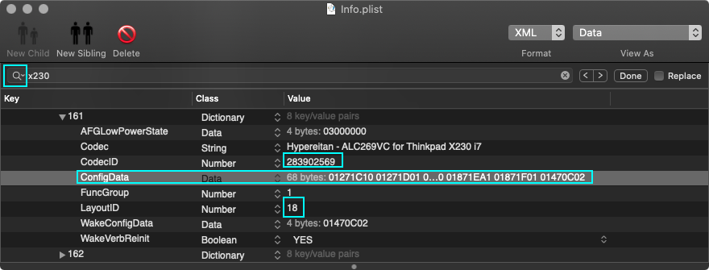
3. Select the data inside the `ConfigData` field (⌘+A) and copy is (⌘+C)
4. Start the PinConfigurator Appy5. From the menubar, select File > Import > Clipboard
6. This is how it looks:</br> 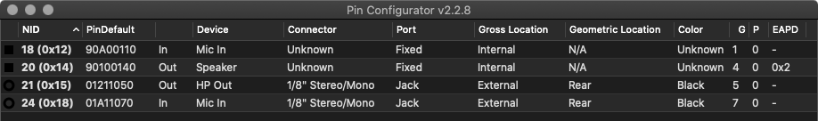

As expected, there's no entry for a second Output (whether "HP" nor "Line-out"), so we need to add one. Since Node 27 is a Heaphone Playback switch as well, we will add it to the current PinConfig. There are several ways/methods to do this.

### Method 1: Using finalverbs.txt and copy/pasting

1. Open `finalverbs.txt`
2. Place the cursor at the end of the document 
3. Paste (⌘+V) the PinConfig (it should still be in the Clipboard).
4. Next, add the Verb Data for the Node you want to add to the existing PinConfig:</br>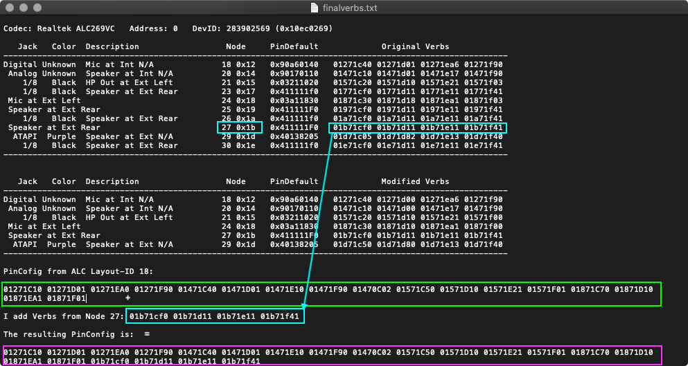
5. Copy the resulting PinConfig back into the clipboard
6. Switch back to PinConfigurator
7. From the menubar, select File > Import > Clipboard
8. This is the new PinConfig:</br>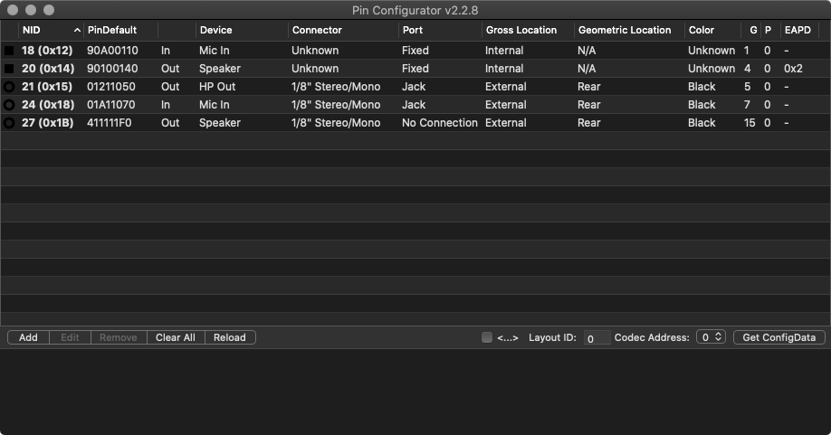

### Method 2: Add a node to PinConfigurator and configure it manually

1. In PinConfigurator, click "Add"
2. This Opens a dialog with a bunch of options to configure the new Node
3. Use `finalverbs.txt` and the codec dump to configure it. 
4. In my case, Node 27 will be the new node:</br>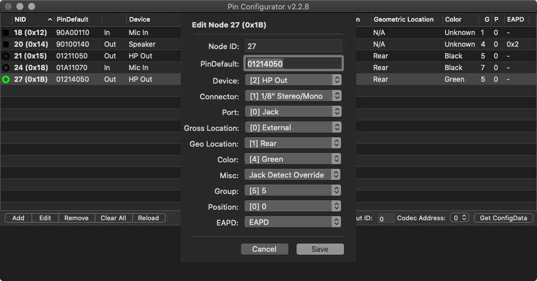
5. Back in the main Window, click on "Get ConfigData"
6. The new/modified PinConfig will be listed in the text field below it:</br> 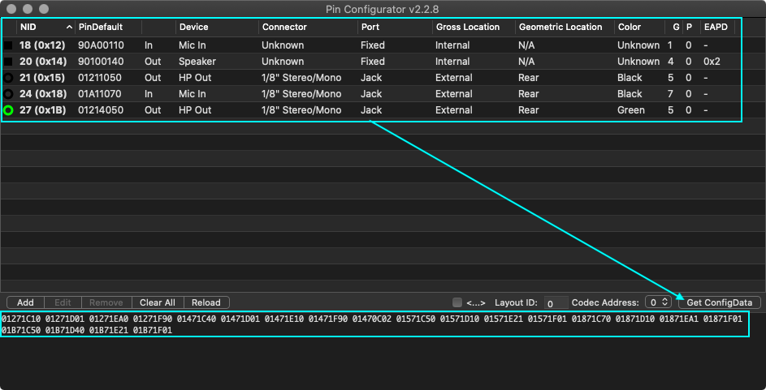
7. Save the new PinConfig in the `finalverbs.text` with a name that makes sense to you. I save it as "PinConfig Trial 1". We need it Later

### Understanding `finalverbs.txt` and fixing possible conversion errors
Open the `finalverbs.txt` located inside the "codecgraph" folder with TextEdit. It contains a list of the availabe inputs and outouts of the Codec:


As you can see, it's divided into two major sections: "**Original Verbs**" and "**Modified Verbs**". "Original Verbs" lists all available connections the Codec provides while "Modified Verbs" lists all the device which are currently connected. Their verb data was corrected/modified by the verbit.sh script.

You may have also noticed that some Nodes have *not* been converted from hex to decimal (pink) while some `PinDefault` data *has* been converted which shouldn't have been converted (red). So lets fix this using the original `codec_dump.txt`. Using the "Calc" function in Hackintool, we can easily convert Hex to Decimal. We find that `0x18` is `24`, `0x19` is `25` and `0x1b` is `27`. While we're at it, we'll fix the formatting as well.

For fixing the errors in the `PinDefault` column (red), you can either look up the correct PinDefault data in the `codec_dump.txt` for Nodes `0x18`, `0x19` and `0x1b` or use hackintool's "Calc" function to convert the data back from dec to hex.

Once we're done with fixing the conversion errors, we get this:


**IMPORTANT**: For a Node to become part of the PinConfig, it ***must*** contain a `Pin Complex` and a `Control: name="XXZ"`. Here, a look into the codec dump might be helpful:

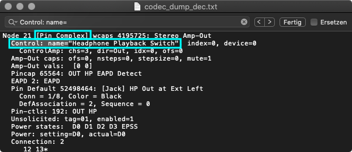

### Analyzing the Verb Data
When comparing the entries of the "Modified Verbs" section with the .svg schematic and the jacks available on the system, I notice that:

- Nodes 23, 26, 27 and 30 are labeled as "Ext Rear"
- Since Node 23 is listed in the same hierarchy as "HP" (= Headphone), it might be a contender for routing audio to the jack of the docking station in my case
- Node 26 could also be an option since it connects to a Jack ("1/8")
- Node 27 is not listed as "1/8" (the Jack type), so it might not work
- Node 30 is a digital output. But since my system doesn't have an Optical or Coaxial S/PDIF, it's not an option for me.
- Node 29 (ATAPI Purple Speaker) is Mono and not really useful to me either &rarr; I delete this line right away

Whether or not you want to build a Layout-ID from scratch or you want to modify and existing Layout-ID, the workflow slightly differs.

### Modifying the Verb data
So now that we know which inputs and outputs we want/need, we can adjust the "Modified Verbs" section. For my first trial, I delete Node 29 and replace it Node 23. The result looks like this:

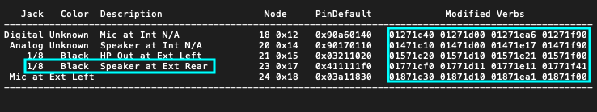

Now that we have a list of inputs and outputs we want to use, we have to get the modified verb data into the clipboard so we can import it into PinConfigurator for further editing. Since selecting text in TextEdit is restricted to lines, we have to copy/paste it to an empty section before we can copy it to the clipboard. Like so:

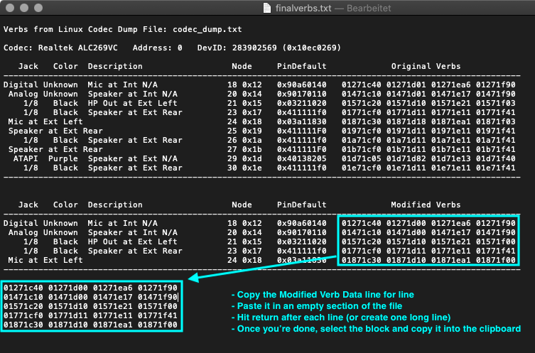

### Creating the final `PinConfig` in PinConfigurator
- Next, run **PinConfigurator** 
- Click on File > Import > Clipboard
- This should create entries with inputs and outputs:</br>
- Open the "codec_dump_dec.txt" and search fore for "EAPD" (external amplifier power down). Some systems use it to activate a port (usually headphones or speakers). In my case, Nodes 20 and 21 make use of it:</br>
- Back in PinConfigurator double click on a Node which uses EAPD. This brings up the settings window for that Node:</br>
- In the EAPD dropdown menu, select EAPD.
- Repeat for other Nodes using EAPD
- (**Optional**) at this stage you can also set the Geo Location of the Jack(s) and their Color(s)
- Next, I need to configure Node 23 (but it could be any other node added to the default configuration of your Codec for that matter), so I double-click it to bring up the settings menu. For my requirements, I have changed the following settings:</br>
<br>
**Explanation**: Since the rear connector of my dock basically an extension of the Headphone Jack, I want the routing to switch automatically when connecting/disconnecting a jack to either one of them. The internal speakers are supposed to turn off when plugging in a cable into the dock's audio jack and should switch back to the speakers when pulling it. And of course audio should be coming through the rear port as well, when connecting external speakers. So in order to make the routings switch automatically, I add Node 23 to the same group ad Node 21 (Group 2), but change it's position to 1, because 0 is the headphone Jack.
- Click "Save" to apply the settings and close the window.
- Back in the main window, de-select "<…>" and click on "Get Config Data":</br>
- Select the generated PinConfig Data (without the <>) and copy it to the clipboard 
- Paste it into "finalverbs.txt" and give it a name so you can see which configs you already tried if this PinConfig doesn't work:</br>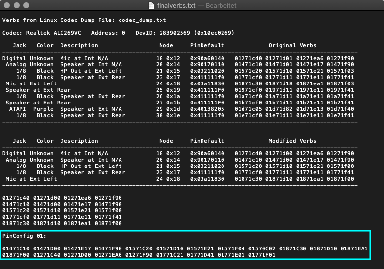
- Save the file but don't close the window yet.

### Adding the PinConfig to the AppleALC source code
Now that we (finally) have our `PinConfig`, we have to integrate it into the AppleALC source code. Depending on your use case, the workflow differs. So pich the scenario that suits your use case.

#### Finding an unused Layout-ID number
In order to find a yet unused Layout-ID for your Codec, you have to check which Layout-IDs exist already and chose a different one in the range from 11 to 99:

- Visit [this repo](https://github.com/dreamwhite/ChonkyAppleALC-Build)
- Click on the folder of your Codec manufacturer (in my case it's Realtek)
- Next, click on the .md file reprecenting your Codec (in my case: [ALC269](https://github.com/dreamwhite/ChonkyAppleALC-Build/blob/master/Realtek/ALC269.md))
- As you can see, ALC269 has a lot of Layout-IDs already.
- Pick a Layout-ID which is not used already (make a mental note or write it down somehwere)

I am picking Layout-ID 39 because a) it's availabe and b) followed by by the Lenove W530 which is the workstation version of the T530.

**IMPORTANT**: Layout-IDs 1 to 10 are reserved but Layouts 11 to 99 are user-assignable. 

#### Scenario 1: Modifying data of an existing Layout-ID

1. Open "codec_dump_dec.txt"
2. Copy the "Vendor-Id" in decimal (= `CodecID` in AppleALC)
3. Locate the `PinConfigs.kext` inside AppleALC/Resources
4. Right-click it and select "Show Package Contents"
5. Inside the Contents folder, you'll find the "info.plist"
6. Open it with a Plist editor (I am using PlistEdit Pro)
7. All PinConfigs and the Layout-ID they are associataed with are stored under:
	- IOKitPersonalities
		- as.vit9696.AppleALC
			- HDAConfigDefault
8. Use the search function (⌘+F) and paste the "Vendor Id". In my case it's "283902569". This will show all existing Layout-IDs your Codec.
9. For my test, Im am using entry number 162 as a base, since it's for the same Codec and was created for the the Lenovo X230 which is very similar to the T530 and works for my system:</br>
10. Highlight the dictionary and press ⌘+D. This will duplicate the entry.
11. Add/change the following data to the new entry:
	- In the `Codec` String: Author name (Yours) and description
	- In `ConfigData`, enter the PinConfig data we created in PinConfigurator (we stored  it as "PinConfig 01" in finbalverbs.txt)
	- Change the `LayoutID` the PinConfig Data should be associated with. 
12. This is the resulting entry:</br>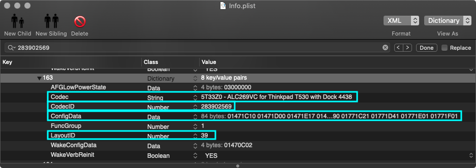

#### Scenario 2: Creating a new Layou-ID from scratch (todo)

Now that we got the PinConfig out of the way, we can continue.

## VII. Creating a PathMap
The PathMap describes the signal flow within the codec from Pin Complex Nodes to physical outputs and from Inputs to Pin Complex Nodes. Some routings are fixed (internal Mics) while others can be routed freely. Some Nodes can even be both, input and output. The data has to be entered in a PlatformsXX.xml later.

### Tracing possible paths
Now that we know how to read the schematic of the Codec, we can use it to trace all available paths the codec provides and create a chart with it, which helps later when transferring the data into .xml:

Node ID (Pin Complex)| Device Name/Type            | Path(s)               | EAPD
---------------------|-----------------------------|-----------------------|:----:
18                   |Internal Mic (S)             | 9 - 34 - 18 (fixed)   |
20                   |Internal Speakers (S)        | 20 - 12 - 2 or</br> 20 - 13- 3|YES
21                   |Headphone Output (S)         | 21 - 12 - 2 or 21 - 13 - 3|YES
23                   |Speaker at Ext Rear (M)      | 23 - 15 - 2              |
24                   |Line-In (Jack) (S)           | 8 - 35 - 24              |
25 (as Output)       | Speaker Ext. Rear (S) OUT Detect|25 - 11 - 15 - 2 (Mono) or </br>25 - 11 - 12 - 2 or</br>25 - 11 - 13 - 3
25 (as Input)        |Speaker Ext. Rear (S) IN  Detect|8 - 35 - 11 - 25 or</br> 8 - 35 - 25 or </br> 9 - 34 - 25 or </br> 9 - 34 - 11 - 25
26 (as Output)		 |Speaker at Ext Rear OUT HP Detect| 26 - 11 - 15 - 2 (M) or</br>26 - 11 - 12 - 2 or </br> 26 - 11 - 13 - 3
26 (as Input)        |Speaker at Ext Rear IN HP Detect|8 - 35 - 26 or </br> 8 - 35- 11- 26 or </br> 9 - 34 - 26 or </br> 9 - 34 - 11 - 26 
27 (as Output)		 | Speaker at Ext Rear OUT Detect| 27 - 11 - 15 - 2 (M) or </br>27 - 11 - 12 - 2 or </br> 27 - 11 - 12 - 2 or </br> 27 - 11 - 13 - 3
27 (as Input)		    |Speaker at Ext Rear IN Detect| 8 - 35 - 27 or </br> 8 - 35 - 11 - 27 or </br> 9 - 34 - 27 or </br> 9 - 34 - 11 - 27
29 Mono (as Output)	 |Speaker at Ext |29 - 11- 15 - 2 (M) or </br> 29 - 11 - 12 - 2 or </br> 29 - 11 - 13 - 3
29 Mono (as Input)   |Mono IN| 8 - 35 - 29 or </br> 9 - 34 -29
30				        |Speaker Ext. Rear Digital (SPDIF) | 6 - 30| 

<details>
<summary><strong>Double-Checking</strong> (click to reveal)</summary>

#### Double-Checking against codec-dump_dec.txt
We can also use the codec dump to verify the routing. Here's an example for Node 21 which is the main output of the T530:


As you can see, Node 21 has 2 possible connections (Node 12 and 13) and is currently connected to Node 13, which is one of the Audio mixers:


 And Node 13's final destination is Node 3, which is the HP out:


</details>

## Transferring the PathMap to `PlatformsXY.xml`
Now that we found all the possible paths which can connect Pin Complex Nodes with Inputs and Outputs, we need to transfer the ones we want to use into a PlatformXY.xml file ("XY" corresponds to the previously chosen Layout-ID. In my case: 39).

AppleALC's "Resources" folder contains sub-folders for each supported Codec. All of these sub-folders contain additional .xml files, LayoutXY.xml as well as the afore mentioned PlatformXY.xml. For each existing Layout-ID there are corresponding .xml files with the same number.

### Structure of `Platforms.xml`
The Platform.xml contains the PathMap. The PathMap represents the routing of input and output devices of the Codec. The way inputs and outputs are organized within the PathMap structure, defines whether or not inputs and outputs are switched automatically or have to be sitched manually.

#### Switch-Mode

- **PathMap**
	- **Array 0**
		- Input 0 (Nodes 0, 1 and 2)
		- Input 1 (Nodes 0, 1 and 2)
	- **Array 1**
		- Output 0 (Nodes 0, 1 and 2)
		- Output 1 (Nodes 0, 1 and 2)
	- etc. 

#### Manual-Mode

- **PathMap**
	- **Array 0**
		- Input 0 (Nodes 0, 1 and 2)
	- **Array 1**
		- Input 1 (Nodes 0, 1 and 2)
	- **Array 2**
		- Output 0 (Nodes 0, 1 and 2)
	- **Array 3**
 		- Output 1 (Nodes 0, 1 and 2)
 	- etc.

If you open it, you don't see much on the top level:</br>
</br>
Once you dive down into the file hierarchy, there will be another `PathMap` Array containing 2 more arrays, `0` and `1`. Array `0` contains Inputs while Array `1` contains Outputs:</br>
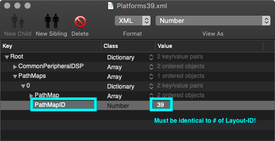</br>

**INPUTS Branch**

Let's follow the branch of Array. Next level down we find 2 more arrays representing 2 Input sources:</br>
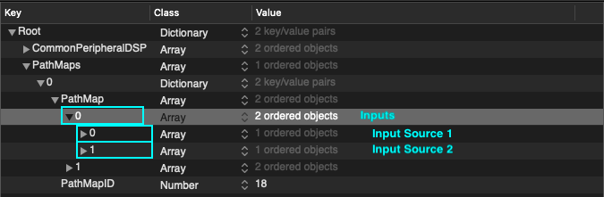
Let's continue. The next array contains 3 more array which finally contain the Nodes representing the path of the Interal Mic: Input (with Amp) Nobe 9  &rarr; Node 34 (Mixer) &rarr; 18 (Internal Mic):</br>

Next, let's check the 2nd Input source (Array 1):</br>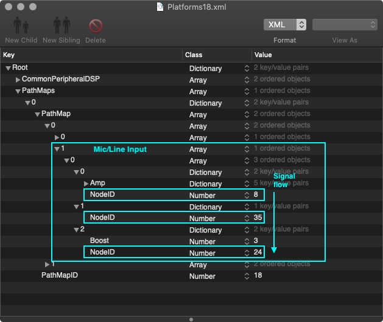

**OUTPUTS Branch**

TBC

### Modifying an existing `Platforn.xml`
If you want to modify an existing Layout-ID, do the following:

- In Finder, navigate to the resources folder for your Codec. (For me, it's `AppleALC/Resources/ALC269`)
- Copy the LayoutYX.xml.zlib and PlatformXY.xml.zlib corresponding to the Layout-ID you want to modify into the "zlib" folder inside the "codecgraph" folder on your "desktop" (In my case layout18.xml.zlib and Platforms18.xml.zlib). We need to unzip the files before we can edit them. 
- Open Terminal and enter (replace "XY" with the actual number of the files):
	```swift
	cd ~/desktop/codecgraph/zlib
	perl zlib.pl inflate LayoutXY.xml.zlib> LayoutXY.xml
	perl zlib.pl inflate PlatformsXY.xml.zlib> PlatformsXY.xml
	```
- This should give you something like this:</br>
- Duplicate both LayoutXX.xml and PlatfomXX.xml 
- Rename them and replace the Layout-ID with the one you want use. In my case Layout-ID39:</br>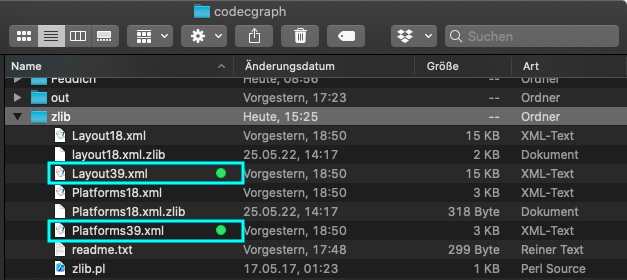
- more
- more
- Save the file
- Put it back in the Apple/ALC/Resources/ALCXXX folder for your Codec

To be continued…

## VIII. Preparing an existing `LayoutXX.xml`
- Open the Layout.xml file from the previous step with a plist Editor. In my case Layout39.xml
- Adjust the following settings as needed:</br> 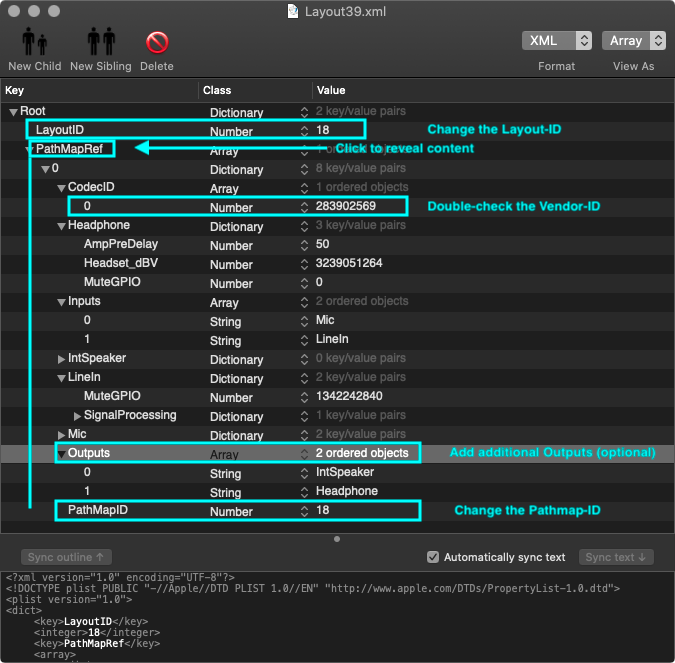
- In my case, I changed the `LayoutID` and `PathMapID` to `39` and added a `LineOut` to the `Outputs` because I think I need it for the dock:</br>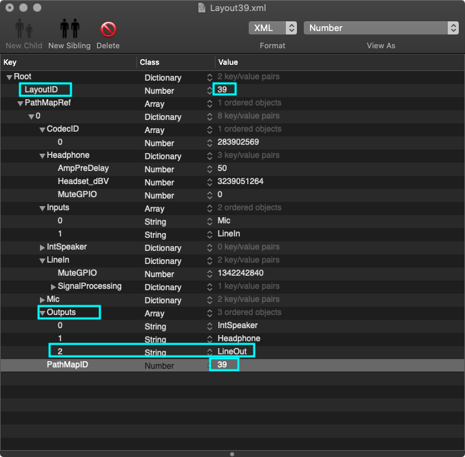
- Save the file
- Put it back in the Apple/ALC/Resources/ALCXXX folder for your Codec

**NOTE**: `LayoutID` and `PathMapID` **must be identical** and must use the same number you chose for your Layout-ID previously.

## IX. Compiling the AppleALC.kext
Now that we prepared all the requirred files, wen can finally compile the kext.

- In Terminal, "cd" into the AppleALC folder containing the `AppleALC.xcodeproj` file
- Enter `xcodebuild` and hit Enter. Compiling should start and a lot of text should appear on screen during the process.
- Once the kext is compiled, there will be the prompt "BUILD SUCCEEDED". 
- The kext will present in `/AppleALC/build/Release`.

## X. Testing
- Add your newly compiled AppleALC.kext to your EFI/OC/Kexts folder
- Open the config.plist and change the Layout-ID to the one you chose for your Layout-ID
- Save the cong and reboot
- Check if sound is working (Internal, Inputs, Outputs, Headphones)
- If it's working: Congrats.
- If it's not working: re-check Pin-Config, Platforms.xml, adjust them, re-compile the kext, replace it in the EFI, reboot, test, repeat.

## XI. Adding your Layout-ID to the AppleALC Repo
Once your custom Layout-ID is working, you can submit it to the AppleALC GitHub repo via Pull Request. Otherwise you would lose your custom made routing every time you update the AppleALC.kext since this overwrites the info.plist and the .xml support files.

In order to add your Layout-ID to AppleALC's database, you have to do the following:
- Create a fork of the repo
- Add the required files to the "Resources" folder. Follow the [Instructions](https://github.com/acidanthera/AppleALC/wiki/Adding-codec-support). 
- Sync it with github and then create a pull request.
- Wait for approval

Once your Layout is part of the main AppleALC repo you can update AppleALC without having to compile your own version every time the source code is updated. 

## CREDITS and RESOURCES
- **Guides**:
	- MacPeet for [[Guide] Anleitung patch AppleHDA](https://www.root86.com/blog/40/entry-51-guide-anleitung-patch-applehda-bedingt-auch-f%C3%BCr-codec-erstellung-in-applealc/) (German)
	- EMlyDinEsH for [Complete Apple HDA Patching Guide](https://osxlatitude.com/forums/topic/1946-complete-applehda-patching-guide/)
	- F0x1c for [AppleALC_Instructions](https://github.com/F0x1c/AppleALC_Instructions)
	- The King for [[HOW TO] Patch AppleHDA - Knowledge Base, Guide for how to fix/use original AppleHDA](http://web.archive.org/web/20150105004602/http://www.projectosx.com/forum/index.php?showtopic=465&st=0)
	- Master Chief for [[How To] Pinconfig for Linux users](https://www.insanelymac.com/forum/topic/149128-how-to-pinconfig-for-linux-users-%EF%BF%BD-realtek-alc883-example/)
	- Daliansky for [AppleALC Guide](https://blog-daliansky-net.translate.goog/Use-AppleALC-sound-card-to-drive-the-correct-posture-of-AppleHDA.html?_x_tr_sl=auto&_x_tr_tl=en&_x_tr_hl=de&_x_tr_pto=wapp)
	- Daliansky for [Using VoodooHDA for finding valid Nodes](https://blog-daliansky-net.translate.goog/With-VoodooHDA-comes-getdump-find-valid-nodes-and-paths.html?_x_tr_sl=auto&_x_tr_tl=en&_x_tr_hl=de&_x_tr_pto=wapp)

- **About Intel High Definition Audio**:
	- Intel for [HDA Specs](https://www.intel.com/content/www/us/en/standards/high-definition-audio-specification.html)
 	- HaC Mini Hackintosh for additional info about the [HDA Codec and Codecgraph](https://osy.gitbook.io/hac-mini-guide/details/hda-fix#hda-codec)
 	- Daliansky for [List of HDA Verb Parameters](https://blog-daliansky-net.translate.goog/hda-verb-parameter-detail-table.html?_x_tr_sl=auto&_x_tr_tl=en&_x_tr_hl=de&_x_tr_pto=wapp)
- **Tools**:
	- cmatsuoka for [codecgraph](https://github.com/cmatsuoka/codecgraph)
	- Headkaze for porting [PinConfigurator](https://github.com/headkaze/PinConfigurator) to 64 bit 
	- Pixelglow for [graphviz](http://www.pixelglow.com/graphviz/)
- **Other**:
	- [Mermaid](https://mermaid-js.github.io/mermaid/#/README) script for creating flowcharts and diagrams in Markdown
	- Jack Plug schematics: 
		- OMTP [WIKI Commons](https://commons.wikimedia.org/wiki/File:3mm5_jack_4.svg) 
		- CTIA [WIKI Commons](https://commons.wikimedia.org/wiki/File:3.5mm_jack_plug_4i.svg)
