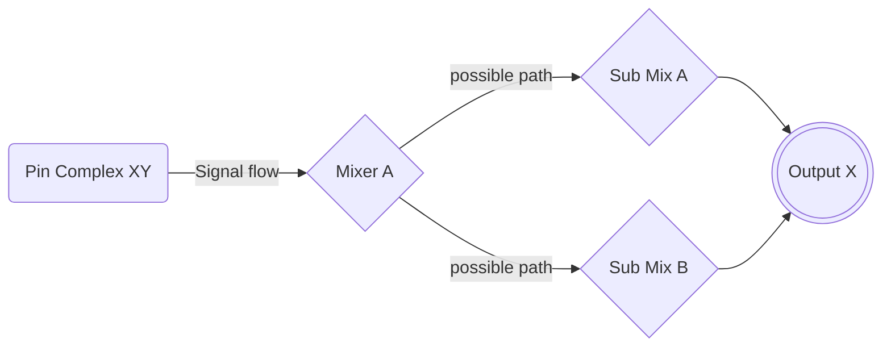
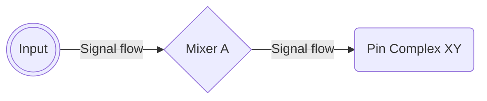
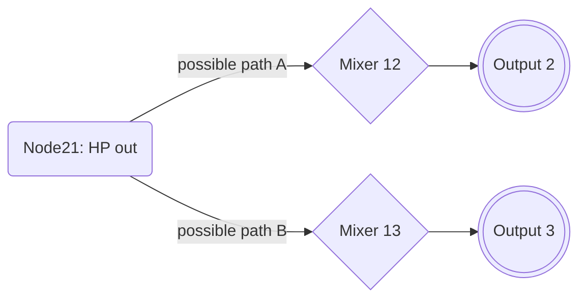
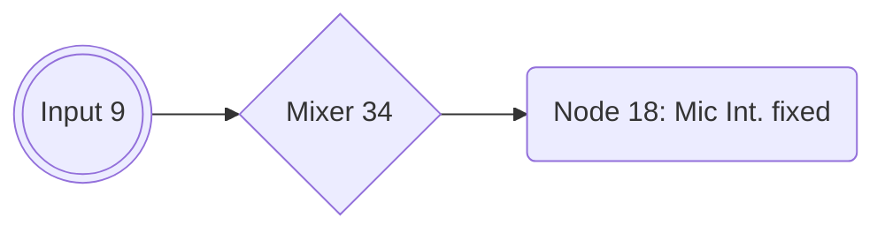
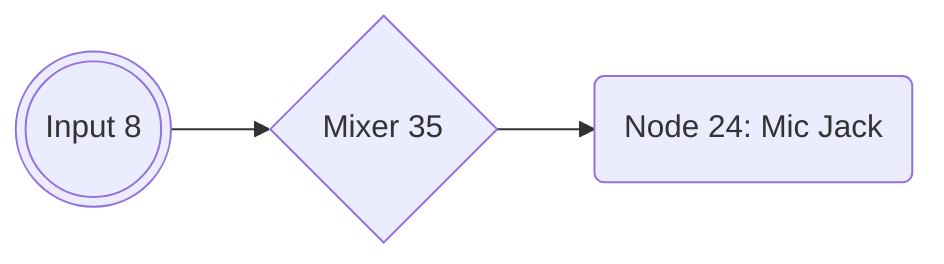

# How to create/modify a Layout-ID for AppleALC (Work in progress)

## Preface
:warning: This is not finished (Chptrs. I to III are finished, though)

This is my attempt of providing an up-to-date and easy to follow guide for creating Layout-IDs for AppleALC to make audio work on a Hackintosh. It is aimed at users for whom the existing Layout-IDs either do not work so they're forced to create one from scratch or for users who wish to modify an existing Layout-ID for other reasons. Maybe the Layout-ID in use was created for the same Codec but a different system/mainboard and they want to change the routing, fix issues or add features.

### How to use this guide
Although the Layout-ID created in this guide is for a specific Codec (Realtek ALC269VC) and a specific device (Lenovo T530 Laptop with a docking station), the basic concepts presented along the way apply to any Audio Codec. Therefore: 

* Don't just follow the given instruction in this guide blindly!
* Instead, abstract from the given example and apply the presented methods and techniques to your specific use case! These use cases can be:

	1. Creatin a Layout-ID for an Audio Codec from scratch (because a working one doesn't exist yet)
	2. Modifying an existing Layout-ID (like an additional output for a Laptop dock for example). This is what I am going to do during the course of this guide.
	3. Compiling a slimmed-down version of AppleALC for the one Layout-ID yo are using. In this case, follow [this guide](https://github.com/dreamwhite/ChonkyAppleALC-Build).

### Source situation: do we really need another guide for this?

Short answer: **Hell yeah, we need another guide!** Let me explain why…

Although AppleALC comes with around 600 (!) pre-configured Layout-IDs for more than 100 Audio Codecs, the process of how to actually *create* a Layout-ID from scratch is not covered on the AppleALC repo. As a matter of fact, it's rarely covered at all. I only could find about 4 guides which explain some aspects of if it but never the entire process as it is required today.

Most of the guides I did find are either outdated or over-complicated or are no longer applicable today. The oldest guide I found is from from 2012 by EMlyDinEsH. It contains some really insightful info, but is incomplete. The newest guides I could find are from 2017. One by F0x1c which is based on EMlyDinEsH's guide. But the markdown version of his guide is a horrible, unreadable mess. Fortunately, the zipped version of the github source also contains a .rtf document containing some additional details. The third guide I found is by Daliansky. It's written in Chinese and is way too complex, way too long and way too hard to follow. Plus most of the linked content doesn't work once you use google translate.

The most compelling guide I found thus far is by MacPeet who has created a lot of Layout-IDs for AppleALC over the years. It's from 2015 when patching AppleHDA.kext was still a necessity since AppleALC didn't exist yet. Although not all of the steps are applicable today, it contains some great workflows and a visual approach to creating Layout-IDs which is a lot easier to understand and follow. Since german is my native language, it's easy for me to follow and translate it, so that's why my guide is based on his work. But it's not just a simple copy/translate/paste typo of deal, but rather an adaption and update, making use of all the new tools and nice new features markdown has to offer, such as syntax highlighting, adding tables and mermaid integration for creating flowcharts, etc.

So, unless you are fine with being dependent on the grace of others to create a Layout-ID for you, an up-to-date guide is long overdue.

## Contents
This guide will cover the following topics (subject to change):

- Creating a dump of the Audio Codec in Linux
- Converting and visualizing the data
- Creating a Pathmap and Pin Configuration
- Creating a new Layout-ID for your Codec
- Building your own Apple-ALC kext using Xcode
- Submitting the newly created Layout-ID to the AppleALC github repo via Pull Request

## I. Preparations
### Obtaining an Audio CODEC dump in Linux
Why Linux? Unfortunately, neither Codec dumps created with OpenCore nor Clover can be processed with the tools we need to visualize the data of the codec dump. When using dumps created in Linux however, the tools can handle the data inside the dumps just fine.

This might be because in Linux, the paths of an audio codec are dynamically discovered through a graph traversal algorithm. And in cases where the algorithm fails, it uses a huge lookup table of patches specific to each Codec. 

Therefore, we will use (a live version of) Linux to create the codec dump without having to actually install Linux. I will use Ventoy for this. It prepares a USB flash drive which can run almost any ISO directly without having to create a USB installer.

#### Preparing a USB flash drive for running Linux from an ISO
Users who already have Linux installed can skip to "Dumping the Audio Codec"!

1. Get a USB 3.0 flash drive (at least 8 GB or more)
2. In Windows, download [**Ventoy**](https://www.ventoy.net/en/download.html) and follow the [Instructions](https://www.ventoy.net/en/doc_start.html) to prepare the USB flash drive. It's pretty straight forward.
3. Next, Download an ISO of a Linux distribution of your choice, e.g. [**Ubuntu**](https://ubuntu.com/download/desktop), [Zorin](https://zorin.com/os/download/) or whatever distro you prefer – they all work fine.
4. Copy the ISO to your newly created Ventoy stick
5. Reboot from the flash drive
6. In the Ventoy menu, select the Linux ISO and hit enter
7. From the GNU Grub, select "Try or Install Linux"
8. Once Ubuntu has reached the Desktop environment, select "Try Ubuntu"

#### Dumping the Audio Codec
1. Once Linux is up and running, open Terminal and enter:</br>
	```shell
	cd ~/Desktop && mkdir CodecDump && for c in /proc/asound/card*/codec#*; do f="${c/\/*card/card}"; cat "$c" > CodecDump/${f//\//-}.txt; done && zip -r CodecDump.zip CodecDump```
2. Store the generated `CodecDump.zip` on a medium which you can access later from within macOS (HDD, other USB stick, E-Mail, Cloud). You cannot store it on the Ventoy flash drive itself, since it's formatted in ExFat which can't be accessed by Linux without additional measures.
3. Reboot into macOS
4. Extract `CodecDump.zip` to the Desktop
5. Rename `card0-codec#0.txt` located in the "CodecDump" folder to `codec_dump.txt`

### Required Files and Tools
:warning: Please follow the instructions below carefully and thoroughly. Use the suggested file names and locations, otherwise the provided terminal commands won't work without adjustments!

- Install [**Python**](https://www.python.org/downloads/) if you haven't already
- Install either [**MacPorts**](https://www.macports.org/install.php) or [**Homebrew**](https://brew.sh/) (I used MacPorts, but Homebrew works, too)
- Once that's done, reboot
- Next, install [**graphviz**](https://graphviz.org/) via terminal (takes about 10 minutes!):
	- If you are using **MacPorts**, enter `sudo port install graphviz`
	- If you are using **Homebrew**, enter `brew install graphviz` 
- Download and extract [**PinConfigurator**](https://github.com/headkaze/PinConfigurator/releases)
- Download [**Hackintool**](https://github.com/headkaze/Hackintool). We may need it for checking PCI devices and Hex to Decimal conversions later.
- Next, download and unpack the [**codecgraph.zip**](https://github.com/5T33Z0/OC-Little-Translated/raw/main/L_ALC_Layout-ID/codecgraph.zip) from this repo
- Copy the `codegraph` folder to the desktop. We need it to visualize the data inside the Codec dump, so we have an easy to read schematic of the codec.
- Move the `codec_dump.txt` into the "codecgraph" folder
- Download and install the [correct version](https://developer.apple.com/support/xcode/) of [**Xcode**](https://developer.apple.com/download/all/?q=xcode) supported by the macOS you are running. The download is about 10 GB and the installed application is about 30 GB, so make sure you have enough space on your drive!
- Preparing **AppleALC**:
	- Clone, Fork or Download and extract the [**AppleALC**](https://github.com/acidanthera/AppleALC) Source Code (click on "Code" and "Download Zip")
	- Download the Debug Version of [**Lilu**](https://github.com/acidanthera/Lilu/releases) and copy it to the "AppleALC-master" folder
	- In Terminal, enter: `cd`, hit space and drag and drop your AppleALC folder into Terminal and press enter.
	- Next, enter `git clone https://github.com/acidanthera/MacKernelSDK` and hit enter.
	- The resulting folder structure should look like this:</br>
	

Now, that we have most of the prep work out of the way, we can begin.

## II. Extracting relevant data from the Codec dump
In order to create a routing of the audio inputs and outputs for macOS, we need to extract and convert data from the codec dump. To make the data easier to work with, we will visualize it so we have a schematic of the audio codec which makes routing easier than browsing through the text file of the codec dump.

### Converting the Codec Dump 
1. Open the `codec_dump.txt` located in the "codecgraph" folder with TextEdit. It should look similar to this:</br>
2. Delete the line: `AFG Function Id: 0x1 (unsol 1)` &rarr; it will cause the generation of "verbs.txt" to fail otherwise
3. Save the file
4. Now, execute the following commands in Terminal (one by one):
	```swift
	cd ~/Desktop/codecgraph
	./codecgraph codec_dump.txt
	chmod +x ./convert_hex_to_dec.rb
	./convert_hex_to_dec.rb codec_dump.txt.svg > ~/Desktop/codecgraph/codec_dump_dec.txt.svg
	./convert_hex_to_dec.rb codec_dump.txt > ~/Desktop/codecgraph/codec_dump_dec.txt
	./Verbit codec_dump.txt> verbs.txt
	```
	**This creates 4 new files inside the codecgraph folder:**
	- **`codec_dump_dec.txt`** – Codec dump converted from Hex to Decimal. We we need it since the data has to be entered in decimals in AppleAlC's .xml files.
	- **`codec_dump.txt.svg`** – Pathmap of the Codec's routing in Hex
	- **`codec_dump.txt_dec.txt.evg`** – Pathmap converted to decimal. We will work with this most of the time.
	- **`Verbs.txt`** – Text file containing the Pin Configuration extracted from the codec dump using the [verbit.sh](https://github.com/maywzh/useful_scripts/blob/master/verbit.sh) script. The Pin Configuration represents the available inputs/outputs in macOS'es Audio Settings. Verbs consist of 4 components: 1) the Codec Address, 2) a Node ID, 3) Verb Commands and 4) Verb Data. If you want to extract the necessary verb data for creating the Pin Configuration *manually* or want to know how it works in general, please refer to Chapter 1 of [this guide](https://osxlatitude.com/forums/topic/1946-complete-applehda-patching-guide/).

## III. Analyzing the Schematic
Shown below is `codec_dump.txt_dec.txt.evg`, a visual representation of the data inside the codec dump for the **Realtek ALC269VC** used in my Laptop:


Depending on the Codec used in your system, the schematic will look different.

**Legend**:

Form              | Function
------------------|-----------------------------------------------
**Triangle**      | Amplifier
**Blue Ellipse**  | Audio Output
**Red Ellipse**   | Audio Input
**Parallelogram** | Audio selector (this codec doesn't have any)
**Hexagon**       | Audio mixer (with various connections 0, 1, 2,…)
**Rectangle**     | Pin Complex Nodes representing audio sources we can select in system settings (Mic, Line-out, Headphone etc.)
**Black Lines**   | Available paths
**Dotted Lines**  | Currently used path
**Blue Lines**    | ???

Let's have a look at the Block Diagram of the ALC269 in comparison: </br> 

On the I/O side, we have:

- 2 PCM outputs (with a DAC for each channel), 
- 2 PCM inputs (with an ADC for each channel) and 
- 2 S/PDIF (Sony/Philips Digital Interface) outputs (I don't care about those since my Laptops doen't have a TosLink nor Coaxial jack)

Else:

- The schematic of the Codec dump lists only one clearly visible digital output.
- As far as the Mixers (labeled as `∑`) are concerned, I count 3 as well: 0Bh, 23h, and 24h.
- Line 1+2 and Mic 1+2 can be either Input or Outpt (I/O).

### Understanding signal flow
My Lenovo T530 Laptop only has one 1/8" jack which serves as input and output at the same time (combo jack). It detects what kind of plug (Line-in/out, Headphone/Headset) is plugged into it. Headphone have 3 poles, while Headset plugs have 4 poles to separate the 3 audio channels and ground: left/right output (stereo) and a mono input (Aux). 2 variants are available, **OMTP** and **CTIA**.

**OMTP**:  and **CTIA**: 

Once a plug is plugged into the jack, the internal speakers are muted (and turn back on automatically once the plug is pulled). If the plug has 4 poles (as shown above), it is available as a mic or line-in for macOS as well (if the Layout-ID is configured accordingly). So there is some automatic switching going on in the background as well which happens inside the mixer(s).

That's why there are several outgoing connections from some nodes as well as two levels of Mixer Nodes, Node 11 being the Main Mixer while Nodes 15, 12, 13 handle output signal while nodes 35 an 34 handle input signals (Mic, Line-In). 

Depending on the way we structure the routing of our Layout-ID ,the audio either is switched automatically when plugging something into a jack or we have to switch the input/output manually via system preferences. More about that later.

#### Output routing
For **Outputs**, the path that an outgoing signal takes can be obtained by starting at the Pin Complex Node and then following it through the mixer(s) to the physical output (jack):

Wether or not a signal travels to more than one Mixer node depends on the design of the Codec and is not really relevant. What's important is to list all the "stations" a signal passes through from the beginning (Pin Complex) to the destination (Output). 

#### Input routing
For **Inputs**, the whole process is reversed:



### Examples from ALC269
Headphone Output, possible routings:


Internal Mic Input:

Line Input:


## IV Creating a Pathmap
Now that we know how to read the schematic of the ALC269 Codec, we can deduce all the available routings and create what's called a pathmap.

A pathmap describes the signal flow within the codec from the Pin Complex to  physical outputs and from Inputs to Pin Complexes. Some routings ar fixed (internal Mics) while others can be routed freely. Some Nodes cane even be input and output at the same time. The path a signal takes is defined by the nodes it travels through. In macOS, the pathmap is limited to 8 nodes.

### Tracing possible routings
We will use to the schematic as a visual aid to trace all possible connections and create a table with all the relevant info which makes routing easier later:

Node ID (Pin Complex)| Device Name/Type            | Path(s)               | EAPD
---------------------|-----------------------------|-----------------------|:----:
18                   |Internal Mic (S)             | 9 - 34 - 18 (fixed)   |
20                   |Internal Speakers (S)        | 20 - 12 - 2 or</br> 20 - 13- 3|YES
21                   |Headphone Output (S)         | 21 - 12 - 2 or 21 - 13 - 3|YES
23                   |Speaker at Ext Rear (M)      | 23 - 15 - 2              |
24                   |Line-In (Jack) (S)           | 8 - 35 - 24              |
25 (as Output)       | Speaker Ext. Rear (S) OUT Detect|25 - 11 - 15 - 2 (Mono) or </br>25 - 11 - 12 - 2 or</br>25 - 11 - 13 - 3
25 (as Input)        |Speaker Ext. Rear (S) IN  Detect|8 - 35 - 11 - 25 or</br> 8 - 35 - 25 or </br> 9 - 34 - 25 or </br> 9 - 34 - 11 - 25
26 (as Output)		 |Speaker at Ext Rear OUT HP Detect| 26 - 11 - 15 - 2 (M) or</br>26 - 11 - 12 - 2 or </br> 26 - 11 - 13 - 3
26 (as Input)        |Speaker at Ext Rear IN HP Detect|8 - 35 - 26 or </br> 8 - 35- 11- 26 or </br> 9 - 34 - 26 or </br> 9 - 34 - 11 - 26 
27 (as Output)		 | Speaker at Ext Rear OUT Detect| 27 - 11 - 15 - 2 (M) or </br>27 - 11 - 12 - 2 or </br> 27 - 11 - 12 - 2 or </br> 27 - 11 - 13 - 3
27 (as Input)		 | Speaker at Ext Rear IN Detect| 8 - 35 - 27 or </br> 8 - 35 - 11 - 27 or </br> 9 - 34 - 27 or </br> 9 - 34 - 11 - 27
29 Mono (as Output)	 |Speaker at Ext |29 - 11- 15 - 2 (M) or </br> 29 - 11 - 12 - 2 or </br> 29 - 11 - 13 - 3
29 Mono (as Input)   |Mono IN| 8 - 35 - 29 or </br> 9 - 34 -29
30				     |Speaker Ext. Rear Digital (SPDIF) | 6 - 30| 

We can also have a look inside the codec dump to verify the routing. Here's an example for Node 21 which is the main output of the T530:


As you can see, Node 21 has 2 possible connections (Node 12 and 13) and is currently connected to Node 13, which is one of the Audio mixers:


 And Node 13's final destination is Node 3, which is the HP out:
 


### Transfering the PathMap to `Platforms.xml` (todo)

## V. Creating the PinConfiguration
We can use the schematic and the "verbs.txt" file to create the PinConfiguration. The PinConfig tells macOS whuch audio devices/routings are available, such as: speakers (on Laptops), line-in/out, internal mic, analog/digital. Apple's HDA Driver can handle up to 8 devices so stay within that limit.

Since I have a docking station for my Lenovo T530 with a Line-out Audio Jack on the rear, I want audio coming out of it when I connect my external speakers to it which currently doesn't work. So I want to modify Layout 18 for ALC269 since it's for the same Codec revision and was created for the Lenovo X230 which is very similar to the T530.

### Understanding `verbs.txt`
Open the `verbs.txt` located inside the "codecgraph" folder with TextEdit. In there you should find some kind of table:</br>

As you can see, it's divided into two major sections: "Original Verbs" and "Modified Verbs". "Original Verbs" lists all available connections the Codec provides while "Modified Verbs" lists Verb data which was corrected/modified by `verbit.sh`.

You can also see, that some Nodes have not been converted from Hex to Decimal and the data is not formatted nicely, so lets fix it for visuals. Using the "Calc" function in Hackintool, we can easily convert Hex to Decimal. We find that `0x18` is `24`, `0x19` is `25` and `0x1b` is `27`. Once we're done with fixing the formatting, we get this:</br> 

### Analyzing the PinConfig
When comparing the entries of the "Modified Verbs" section with the .svg schematic and the jacks available on the system, I notice that:

- Nodes 23, 26, 27 and 30 are labeled as "Ext Rear"
- Since Node 23 is listed in the same hierarchy as "HP" (= Headphone) this might be a contender to be added to the routing
- Node 26 could be an option since it connects to a Jack ("1/8")
- Node 27 is not listed as "1/8" (the Jack type), so it might not work
- Node 30 is Digital and since my system neither has Optical or SPDIF, it's not an option either
- Node 29 (ATAPI Purple Speaker) is Mono and not really useful to me &rarr; so I delete this line right away

### Creating/Modifying the PinCong
So now that we know which entries are required and which are not we can modify the "Modified Verbs" section. For my first trial, I delete the line for Node 29 and add the line for Node 23. The result looks like this:</br> 

Now that we have selected the routings we want to usw, we need to copy the data ot the "Modified Verbs" column to a new file line for line: 

1. Press ⌘+N to create a new empty file
2. From the menubar, select "Format" > "Make Plain Text" (or press ⌘+Shift+T) so the formatting is correct
3. Back in the "Verbs.txt" window, copy the 4 pairs of digits in the Modified Verbs column and paste them into the new file.
4. Repeat until you have transferred all the values for each entry. It should look like this:</br>
5. Now, select all the values (⌘+A) and Copy them to the Clipboard (⌘+C)
6. Next, run **PinConfigurator** 
7. Click on File > Import > Clipboard
8. This should create entries with inputs and outputs:</br>
9. Open the "codec_dump_dec.txt" and search fore for "EAPD" (external amplifier power down). Some systems use it to activate a port (usually headphones or speakers). In my case, Nodes 20 and 21 make use EAPD:</br>
10. Back in PinConfigurator double click on a Node which uses EAPD. This brings up the settings window for that Node:</br>
11. In the EAPD dropdown menu, select EAPD.
12. Repeat for other Nodes using EAPD
13. (Optional) at this stage you could als set the Geo Location of the Jacks and their Color
14. Next, I need to configure Node 23 (but it could be any other node added to the default configuration of your Codec for that matter), so double click it to bring up the settings menu. For my requirements, I have changed the following settings:</br>
<br>
**Explanation**: Since the rear connector of the dock is basically an extension of the Headphone Jack, I want the routing to switch automatically when connecting/disconnecting a jack to either one of them. The internal speakers are supposed to turn off when plugging in a cable into the dock's audio jack and should switch back to the speakers when pulling it. And of course audio should be coming through the rear port as well, when connecting external speakers. So in order to make the routings switch automatically, I add Node 23 to the same group ad Node 21 (Group 2), but change it's position to 1, because 0 is the headphone Jack.
15. Click save to close the window.
16. Back in the main window, click on "Get Config Data":</br>
17. Select the generated PinConfig Data (without the <> and copy it to the clipboard 
18. Create a new raw text file, paste the data and save it as PinConfig01 (or similar), so you don't lose the data.

### Adding the PinConfig to Apple ALC
Now that we (finally) have the PinConfig Data, we need to somehow inject it into macOS. That's what we use AppleALC.kext for.

1. Open "codec_dump_dec.txt"
2. Copy the "Vendor-Id" in decimal (= "CodecID" in AppleALC)
3. Locate the `PinConfigs.kext` inside the AppleALC/Resources folder
4. Right-click it and select "Show Package Contents"
5. Inside the Contents folder, you'll find the "info.plist"
6. Open it with a Plist editor
7. All Layout-IDs and PinConfigs are located under:
	- IOKitPersonalities
		- as.vit9696.AppleALC
			- HDAConfigDefault
8. Use the search function and enter the "Vendor Id." In my case it's "283902569". This will show all existing Layout-IDs your Codec.
9. For my test, Im am using entry no. 162 as a base, since it's for the same Codec and was created for the the Lenovo X230 which is very similar to the T530:</br>

…To be continued…

## VI. Creating a unique ALC Layout-ID for your PC/Laptop
Once you have a fully working PinConfiguration (test all the inputs and outputs), you can create a unique Layout-ID for your type of mainboard or Laptop model.

1. Visit this [Repo](https://github.com/dreamwhite/ChonkyAppleALC-Build)
2. Click on the folder of the Manufacturer of your Codec. In my case "Realtek"
3. Next, click on the .md file for your Codec. In my case [ALC269](https://github.com/dreamwhite/ChonkyAppleALC-Build/blob/master/Realtek/ALC269.md)
4. This lists all already used Layout-IDs. Pick one which is NOT used already (in the range of 11 to 99). Since the W530 uses Layout-ID 40, I think I go with LayoutID `39`
6. So back in AppleALC's info.plist duplicate the entry (Dictionary 182) we edited earlier
7. Next, change the following:
	- `Codec` field: add Author, the ALC version and the system/board it's for
	- Change the `LayoutID` to a number which is not used yet:</br>
8. Once this is done, change the Layout ID in your config.plist to the new Layout.
9. Reboot and test

## VII. Compiling AppleALC

- Next, run Xcode
- Open the `AppleALC.xcodeproj` file included in the AppleALC folder
- Highlight the AppleALC project file:</br>
- Under "Build Settings", check if the entries </br> `KERNEL_EXTENSION_HEADER_SEARCH_PATHS` and `KERNEL_FRAMEWORK_HEADERS` exist
- If not, press the "+" button and click on "Add User-Defined Settings" and add them and make sure that both point to "(PROJECT_DIR)/MacKernelSDK/Headers":</br>
- Next, Link to custom `libkmod.a` library by adding it under "Link Binary with Libraries": 
- Nect, check if `libkmod.a` is present at /MacKernelSDK/Library/x86_64/ inside the AppleALC Folder.
- Once all that is done, you can Compile using XCode (or xcodebuild from CLI)

## VIII. Testing (todo)

## IX. Adding your Layout-ID to the AppleALC Repo
Once your custom Layout-ID is working, you can submit it to the main AppleALC Repo. In order to add your newly created Layout-ID to AppleALC's database, you have to create a fork of the repo first, then add the required files to the Resources folder (Follow the [Instructions](https://github.com/acidanthera/AppleALC/wiki/Adding-codec-support)), sync it with github and then create a pull request. Otherwise you would lose your custom made routing every time you update the AppleALC.kext since this overwrites the info.plist and the .xml support files.

## CREDITS and RESOURCES
- Mac Peet for original [guide](https://www.root86.com/blog/40/entry-51-guide-anleitung-patch-applehda-bedingt-auch-f%C3%BCr-codec-erstellung-in-applealc/) (German)
- HaC Mini Hackintosh for addtional info about the [HDA Codec and codecgraph](https://osy.gitbook.io/hac-mini-guide/details/hda-fix#hda-codec)
- EMlyDinEsH for [Complete Apple HDA Patching Guide](https://osxlatitude.com/forums/topic/1946-complete-applehda-patching-guide/)
- Daliansky for his [guide](https://blog-daliansky-net.translate.goog/Use-AppleALC-sound-card-to-drive-the-correct-posture-of-AppleHDA.html?_x_tr_sl=auto&_x_tr_tl=en&_x_tr_hl=de&_x_tr_pto=wapp)
- Daliansky for [List of HDA Verb Parameters](https://blog-daliansky-net.translate.goog/hda-verb-parameter-detail-table.html?_x_tr_sl=auto&_x_tr_tl=en&_x_tr_hl=de&_x_tr_pto=wapp)
- Foxit for [AppleALC_Instructions](https://github.com/F0x1c/AppleALC_Instructions)
- cmatsuoka for [codecgraph](https://github.com/cmatsuoka/codecgraph)
- Headkaze for porting [PinConfigurator](https://github.com/headkaze/PinConfigurator) to 64 bit 
- [graphviz](http://www.pixelglow.com/graphviz/)
- [Mermaid](https://mermaid-js.github.io/mermaid/#/README) script for creating diagrams in Markdown
- Jack Plug schematics: 
	- OMTP [WIKI Commons](https://commons.wikimedia.org/wiki/File:3mm5_jack_4.svg) 
	- CTIA [WIKI Commons](https://commons.wikimedia.org/wiki/File:3.5mm_jack_plug_4i.svg)
- [Using VoodooHDA for finding valid Nodes](https://blog-daliansky-net.translate.goog/With-VoodooHDA-comes-getdump-find-valid-nodes-and-paths.html?_x_tr_sl=auto&_x_tr_tl=en&_x_tr_hl=de&_x_tr_pto=wapp)
