# How to create/modify a Layout-ID for AppleALC

## I. Introduction
This is my attempt to provide an up-to-date guide for creating/modifying Layout-IDs for the AppleALC kext to make audio work on a Hackintosh in 2022 (and beyond).

### Who this guide is for
This guide is aimed at users who want to create a new or modify an existing Layout-ID for different reasons. Maybe the one in use was created for the same Codec but a different system/mainboard and causes issues or they want to add inputs or outputs missing from the current Layout-ID in use.

If you just want to compile a slimmed-down version of the AppleALC kext for the Layout-ID you are using, you can follow [this guide](https://github.com/dreamwhite/ChonkyAppleALC-Build).

### Are you *sure*, you want to do this?
From a user's perspective, making audio work in hackintosh is a no-brainer: add AppleALC to the kext folder of your Boot Manager, enter the correct ALC Layout-ID to the config – and voilà: Sound! 

But once you are on the other end, trying to actually *create* your own Layout-ID this becomes a completely different story quickly and chances are that your custom Layout-ID won't work at all the first time around.

So, are you still sure you *want* to do this?

<details>
<summary><strong>Why another guide?</strong> (click to reveal)</summary>

### Why another guide?
Although the AppleALC kext comes with about 600 pre-configured Layout-IDs for more than 100 Audio Codecs, the process of *creating* or *modifying* a Layout-ID and integrating it into the source code for compiling is not covered on the AppleALC repo – and nowhere else on that matter.

The hand full of guides I could find however, stem from an era before AppleALC even existed, when patching AppleHDA was still a thing. Most of them are either outdated, over-complicated or only parts of them are applicable today. And most importantly: ***none*** of them actually explain how to integrate all the data into the AppleALC source code to compile the kext!

The most convincing guide I did find is written in German by MacPeet. He has created more than 50 (!) Layout-IDs for AppleALC over the years. It's from 2015 so it predates AppleALC. 

Although not all of its instructions are applicable today, his guide introduced a new, partly automated workflow, using tools to visualize the Codec dump and scripts to extract required data from it which previously had to be extracted manually.

My guide is an adaptation of MacPeet's work but updates and enhances it, where possible.It introduces new tools and workflows and  utilizes all the nice features markdown has to offer to present the instruction in the best way possible, such as: headings, syntax highlighting, tables and mermaid integration for flowcharts, etc.
</details>

## II. Preparations
Creating a Layout-ID for AppleALC is possibly one of the more challenging tasks for "regular" hackintosh users who are not programmers (me included). It's not only challenging and time consuming, it's also confusing and requires a lot of tools and prep work. So let's get it out the way right away.

### Obtaining an Audio CODEC dump in Linux
Unfortunately, Codec dumps obtained with Clover/OpenCore can't be processed by the tools required to convert and visualize the data inside of them. Codec dumps created in Linux, however, can be processed by these tools just fine.[^2]

Therefore, we need to use (a live version of) Linux to create the codec dump without having to actually install Linux. We can use Ventoy for this. It prepares a USB flash drive which can run almost any ISO directly without having to create a USB installer.

[^2]: When I compared the dumps obtained with Clover and Linux, I noticed that the one created in Linux contained almost twice the data (293 vs 172 lines). I guess this is because Linux dynamically discovers the paths of an audio codec through a graph traversal algorithm. And in cases where the algorithm fails, it uses a huge lookup table of patches specific to each Codec. My guess is that this additional data is captured in the Codec dump as well.

#### Preparing a USB flash drive for running Linux from an ISO
Users who already have Linux installed can skip to "Dumping the Codec"!

1. Use a USB 3.0 flash drive (at least 8 GB or more)
2. In Windows, download [**Ventoy**](https://www.ventoy.net/en/download.html) and follow the [Instructions](https://www.ventoy.net/en/doc_start.html) to prepare the flash drive. It's pretty straight forward.
3. Next, download an ISO of a Linux distribution of your choice, e.g. [**Ubuntu**](https://ubuntu.com/download/desktop), [Zorin](https://zorin.com/os/download/) or whatever distro you prefer – they all work fine.
4. Copy the ISO to your newly created Ventoy stick
5. Reboot from the flash drive
6. In the Ventoy menu, select the Linux ISO and hit enter
7. From the GNU Grub, select "Try or Install Linux"
8. Once Ubuntu has reached the Desktop environment, select "Try Ubuntu" (or whatever the distro of your choice prompts).

#### Dumping the Codec
1. Once Linux is up and running, open Terminal and enter:</br>
	```shell
	cd ~/Desktop && mkdir CodecDump && for c in /proc/asound/card*/codec#*; do f="${c/\/*card/card}"; cat "$c" > CodecDump/${f//\//-}.txt; done && zip -r CodecDump.zip CodecDump
	```
2. Store the generated `CodecDump.zip` on a medium which you can access later from within macOS (HDD, other USB stick, E-Mail, Cloud). You cannot store it on the Ventoy flash drive itself, since it's formatted in ExFat and can't be accessed by Linux without additional measures.
3. Reboot into macOS
4. Extract `CodecDump.zip` to the Desktop
5. ⚠️ Rename `card0-codec#0.txt` inside the "CodecDump" folder to `codec_dump.txt`. This is important. Otherwise the script we will use in step III. can't find the file (it's looking specifically for "codec_dump.txt") and the file conversion process will fail.

#### Relevant Codec data
Amongst other things, the Codec dump text contains the following details:

- The Codec model
- Its Address (usually `0`)
- It's Vendor Id (in AppleALC it's used as `CodecID`)
- Pin Complex Nodes with Control Names (these form the `PinConfig`)
- The actual routing capabilities of the Codec:
	- Pin Complex Nodes
	- Mixer/Selector Nodes
	- Audio Output Nodes
	- Audio Input Nodes
	- Number of connections from/to a Node/Mixer/Selector/Switch

### Required Tools and Files
💡Please follow the instructions below carefully and thoroughly to avoid issues.

- Download and install [**Python**](https://www.python.org/downloads/) if you haven't already
- Install either [**MacPorts**](https://www.macports.org/install.php) or [**Homebrew**](https://brew.sh/) (I used MacPorts, but Homebrew works, too)
- Once that's done, reboot.
- Next, install [**graphviz**](https://graphviz.org/) via terminal (takes about 10 minutes!):
	- If you are using **MacPorts**, enter `sudo port install graphviz`
	- If you are using **Homebrew**, enter `brew install graphviz` 
- Next, download and unzip [**codecgraph.zip**](https://github.com/5T33Z0/OC-Little-Translated/raw/main/L_ALC_Layout-ID/codecgraph.zip)
- Copy the `codegraph` folder to the Desktop. We need it to convert and visualize the data inside the Codec dump, so we have can work with it.
- Move the `codec_dump.txt` into the "codecgraph" folder
- Download and extract [**PinConfigurator**](https://github.com/headkaze/PinConfigurator/releases)
- Download [**Hackintool**](https://github.com/headkaze/Hackintool). We may need it for checking PCI devices and Hex to Decimal conversions later.
- Get a plist editor like PlistEditPro or [**XPlist**](https://github.com/ic005k/Xplist)
- Download and install the [correct version](https://developer.apple.com/support/xcode/) of [**Xcode**](https://developer.apple.com/download/all/?q=xcode) supported by the macOS you are running. The download is about 10 GB and the installed application is about 30 GB, so make sure you have enough space on your drive! And: make sure to move the app to the "Programs" folder – otherwise compiling fails.

### Preparing the AppleALC Source Code
- Clone, Download or Fork or and extract the [**AppleALC**](https://github.com/acidanthera/AppleALC) Source Code (click on "Code" and "Download Zip")
- Download the Debug Version of [**Lilu**](https://github.com/acidanthera/Lilu/releases) and copy it to the "AppleALC" root folder
- In Terminal, enter: `cd`, hit space and drag and drop your AppleALC folder into the window and press enter.
- Next, enter `git clone https://github.com/acidanthera/MacKernelSDK` and hit enter.
- The resulting folder structure should look like this:</br>


#### Important files we have to work on:

|Parameter(s)   |File            |Location
:------------:|------------------|----------
**PinConfig** |`info.plist`      |Inside `PinConfigs.kext` (AppleALC/Resources/PinConfigs)
**PathMap**   |`PlatformsXX.xml` |AppleALC/Resources &rarr; ALCXXX-subfolder of corresponding Codec
**various**   | `layoutXX.xml`   |same
Add entries for **PlatformsXX.xml.zlib** </br> **layoutXX.xml.zlib** | `info.plist` | same

**NOTE**: The `XX` stands for the number of the chosen Layout-ID. `XXX` stands for the corresponding Codec model the Layout-ID is for (and not what you thought). More about that later.

### Configuring Xcode
- Start Xcode
- Open the `AppleALC.xcodeproj` file located in the AppleALC folder
- Highlight the AppleALC project file:</br>
- Under "Build Settings", check if the entries </br> `KERNEL_EXTENSION_HEADER_SEARCH_PATHS` and `KERNEL_FRAMEWORK_HEADERS` exist
- If not, press the "+" button and click on "Add User-Defined Settings" to add them. Make sure that both point to "(PROJECT_DIR)/MacKernelSDK/Headers":</br>
- Next, Link to custom `libkmod.a` library by adding it under "Link Binary with Libraries": 
- Verify that `libkmod.a` is present in /MacKernelSDK/Library/x86_64/ inside the AppleALC Folder. Once all that is done, you are prepared to compile AppleALC.kext.

Now, that we've got the prep work out of the way, we can begin!

## III. Extracting data from the Codec dump
In order to create a routing of the audio inputs and outputs for macOS, we have to extract and convert data from the codec dump. To make the data easier to work with, we will visualize it so we have a schematic of the audio codec which makes routing easier than browsing through the text file of the codec dump.

### Converting the Codec Dump 
1. Open the `codec_dump.txt` located in the "codecgraph"
2. Delete the line: `AFG Function Id: 0x1 (unsol 1)` &rarr; otherwise the file conversions will fail!
3. Save the file.
4. Next, double-click `Script Patch Codec by HoangThanh`

**This will generate 5 new files inside the codecgraph folder:**

- **`codec_dump_dec.txt`** &rarr; Codec dump converted from Hex to Decimal. We we need it since the data has to be entered in decimals in AppleAlC's .xml files.
- **`finalverbs.txt`** &rarr; Text file containing the Pin Configuration extracted from the codec dump using the [verbit.sh](https://github.com/maywzh/useful_scripts/blob/master/verbit.sh) script. The Pin Configuration represents the available inputs/outputs in macOS'es Audio Settings.
- **`verbitdebug.txt`** &rarr; A log file of the corrections and modifications `verbit.sh` applied to the verb data.
- **`codec_dump_dec.txt.svg`** &rarr; PathMap converted from hex to decimal. We will work with this most of the time.
- **`codec_dump.txt.svg`** – PathMap of the Codec's routing in Hex.

[^3]: Applied corrections:</br>Pin Defaults of 0x411111f0 or 0x400000f0 are removed 
Remove CD at INT ATAPI</br>
Taken Care of by blacklist array above, shouldn't be in current verb array</br>
71c Sequence should always be 0</br>
71c Association needs to be unique!</br>
71d Set all Misc to 0 (Jack Detect Enabled) and determine which should be 1 later </br>
71e Not Processed in this version <br>
71f Location should not use 02 for Front Panel, use 01 instead

## IV. Understanding the Codec schematic
Shown below is `codec_dump.txt_dec.txt.svg`, a visual representation of the data inside the codec dump for the **Realtek ALC269VC** used in my Laptop. It shows the routing capabilities of the Audio Codec. Depending on the Codec used in your system, the schematic will look different!


Form              | Function
------------------|-----------------------------------------------
**Triangle**      | Amplifier
**Blue Ellipse**  | Audio Output
**Red Ellipse**   | Audio Input
**Parallelogram** | Audio selector (this codec doesn't have any)
**Hexagon**       | Audio mixer (with various connections 0, 1, 2,…)
**Rectangle**     | Pin Complex Nodes representing audio sources we can select in system settings (Mic, Line-out, Headphone etc.)
**Black Lines**   | Default connection (indicated by an asterisk next to it in the Codec_Dump.txt!)
**Dotted Lines**  | Optional connection 
**Blue Lines**    | Info N/A. I guess it's the connection to the output Nodes

### How to read the schematic
The schematic a bit hard to read and comprehend because of its structure. It's also misleading: since all the arrows point to the right one might think this represents the signal flow. But that's not the case! 

Just ignore the arrows! Instead, you need to take a different approach:

#### Routing inputs
For **Inputs**, start at the input and end at the Pin Complex Node:
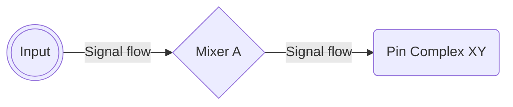
#### Routing outputs
For **Outputs**, the path that an outgoing signal takes can be obtained by starting at the Pin Complex Node and then following it through the mixer(s) to the physical output (jack or speakers):
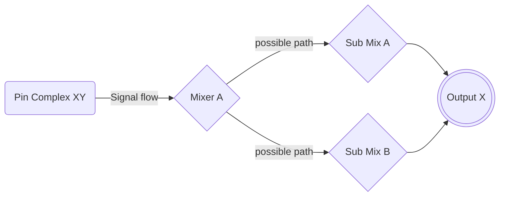
Whether or not a signal travels to more than one Mixer node depends on the design of the Codec and is not really relevant. What's important is to list all the "stations" a signal passes from the Pin Complex Node to the desired Output. 

#### Routing Examples from ALC269
**Headphone Output switch:**
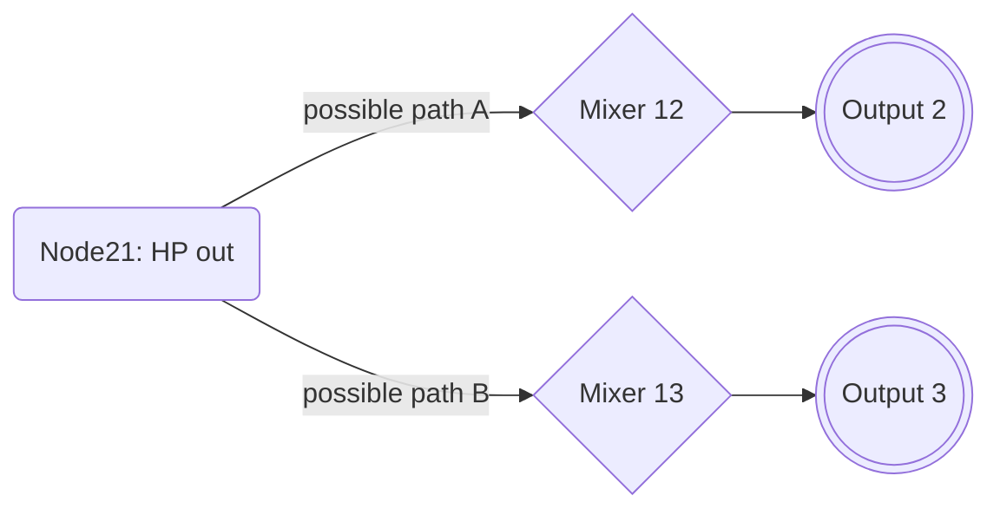
**Internal Mic Input:**
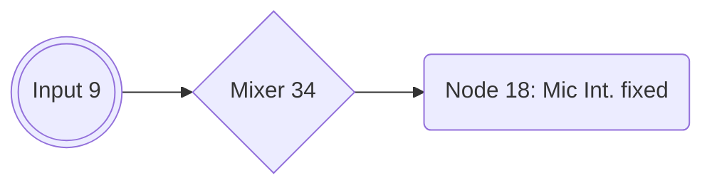
**Line Input**:
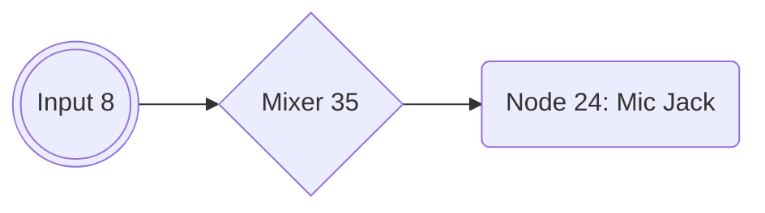

#### Tracing possible paths
Since I want the Line-Out of the Dock to work, I need to assign some other Pin Complex Node to Mixer13. 

we can use it to trace all available paths the codec provides and create a chart with it, which helps later when transferring the data into .xml:

Node ID (Pin Complex)| Device Name/Type            | Path(s)           | EAPD [^1]
:-------------------:|-----------------------------|-----------------------|:----:
18 (In)              |Internal Mic (S)             | 9 - 34 - 18 (fixed)    |
20 (Out)             |Internal Speakers (S)        | 20 - 12 - 2 or</br> 20 - 13- 3|YES
21 (Out)             |Headphone Output (S)         | 21 - 12 - 2 or </br>21 - 13 - 3|YES
23 (Out)             |Speaker at Ext Rear (M)      | 23 - 15 - 2 (Mono)    |
24 (as Output)       |Mic/Line-In (Jack) (S)       | 24 - 12 - 2 or </br> 24 - 13 - 3|
24 (as Input)        |(Jack) Mic at Ext Left | 8 - 35 -24 or </br> 9 - 34 - 24
25 (as Output)       |Speaker Ext. Rear (S) OUT Detect|25 - 12 - 2 or </br>25 - 13 - 3
25 (as Input)        |Speaker Ext. Rear (S) IN  Detect|8 - 35 - 25 or </br> 9 - 34 - 25
26 (as Output)		 |Speaker at Ext Rear OUT HP Detect| 26 - 12 - 2 or</br>26 - 13 - 3
26 (as Input)        |Speaker at Ext Rear IN HP Detect| 8 - 35 - 26 or </br> 9 - 34 - 26 
27 (as Output)		 |Speaker at Ext Rear OUT Detect| 27 - 13 - 3 or </br>27 - 12 - 2
27 (as Input)        |Speaker at Ext Rear IN Detect| 8 - 35 - 27 or </br> 9 - 34 - 27 or
29 Mono (as Input)   |Mono IN| 8 - 35 - 29 or </br> 9 - 34 -29
30	(Digital Out)     |Speaker Ext. Rear Digital (SPDIF) | 6 - 30| 

[^1]: **EAPD** = EAPD (External Amplifier Power Down). If it's supported by the Node, enabling it is recommended. For more details, please refer to Chapter 7.3.3.16 of the High Definition Audio Specification, Rev. 1.0a by Intel, 2010.

<details>
<summary><strong>Double-Checking</strong> (click to reveal)</summary>

##### Double-Checking against codec-dump_dec.txt
We can also use the codec dump to verify the routing. Here's an example for Node 21 which is the main output of the T530:


As you can see, Node 21 has 2 possible connections (Node 12 and 13) and is currently connected to Node 13, which is one of the Audio mixers:


 And Node 13's final destination is Node 3, which is the HP out:


</details>

We will come back to the schematic later… 

## V. Creating the `PinConfig`
Audio Codecs support various Inputs and Outputs: Internal speakers and/or a mic (on Laptops) as well as Line-Ins and Outs (both analog and digital). These audio sources are injected into macOS by AppleALC as a long sequence of code (or "verbs") which form the the so-called `PinConfig`.

Apple's HDA Driver supports up to 8 different audio sources – so stay within this limit when creating your `PinConfig`!

⚠️ For a Node to become part of the PinConfig, it ***must*** contain a `Pin Complex` and a `Control: name="XXZ"`. Here, a look into the codec dump is helpful:


### Understanding "Verbs"
"Verbs" consist of a combination of 4 components: the Codec's address, Node IDs, Verb Commands and Verb Data which has to extracted from the Codec dump, corrected and injected into macOS via AppleALC kext.

Luckily for us, the script we ran previously automatically extracted and corrected the verbs from the Codec dump for us and stored them in the `finalverbs.txt`.

For more info on how to extract the verb data *manually*, please refer to Parts 2 and 3 of [EMlyDinEsH's guide](https://osxlatitude.com/forums/topic/1946-complete-applehda-patching-guide/).

### About `finalverbs.txt`
The `finalverbs.txt` located inside the "codecgraph" folder already contains all the necessary "Verbs" extracted and corrected from the Codec dump. It looks like this:


As you can see, it's divided into two major sections: "**Original Verbs**" and "**Modified Verbs**". "Original Verbs" lists all available audio sources the Codec provides while "Modified Verbs" lists all the source which are actually connected and their verb data was corrected/modified by the verbit.sh script.[^3]

#### Fixing possible conversion errors

You may have also noticed that the formatting look a bit little off in some lines. On closer inspection, it turns out that some Nodes have *not* been converted from hex to decimal (pink) while their `PinDefault` data (red) *has* been converted to decimal which shouldn't have happened.

If you want to integrate any of the pink nodes into your PinConfig, you need to fix their `PinDefault` data first. In order to do so,Look up the data in the original `codec_dump.txt` and copy it over. With the "Calc" function in Hackintool, we can easily convert Hex to Decimal: `0x18` is `24`, `0x19` is `25` and `0x1b` is `27`. 

For fixing the errors in the `PinDefault` column (red), you can either look up the correct PinDefault data in the `codec_dump.txt` for Nodes `0x18`, `0x19` and `0x1b` or use Hackintool's "Calc" function to convert the data back from dec to hex.

Once we're done fixing the conversion errors, we get this:


#### Analyzing the Verb Data
When comparing the entries of the "Modified Verbs" section with the .svg schematic and the jacks available on the system, I notice that:

- Nodes 23, 26, 27 and 30 are labeled as "Ext Rear"
- Since Node 23 is listed in the same hierarchy as "HP" (= Headphone), it might be a contender for routing audio to the jack of the docking station
- Node 26 could also be an option since it connects to a Jack ("1/8")
- Node 27 is not listed as "1/8" (the Jack type), so it might not work
- Node 29 (ATAPI Purple Speaker) is Mono and not really useful to me either &rarr; I delete it right away
- Node 30 is a digital output. Since my system doesn't have an Optical or Coaxial S/PDIF, it's not an option for me.

#### Modifying the Verb data
So now that we know which inputs and outputs we want/need, we can adjust the "Modified Verbs" section. For my first trial, I delete Node 29 and replace it Node 23. The result looks like this:


Now that we have a list of inputs and outputs we want to use, we have to get the modified verb data into the clipboard so we can import it into PinConfigurator for further editing. Since selecting text in TextEdit is restricted to lines, we have to copy/paste it to an empty section before we can copy it to the clipboard. Like so:


### Creating a `PinConfig` in PinConfigurator
- Next, run **PinConfigurator** 
- Click on File > Import > Clipboard
- This should create entries with inputs and outputs:</br>
- Open the "codec_dump_dec.txt" and search fore for "EAPD" (external amplifier power down). Some systems use it to activate a port (usually headphones or speakers). In my case, Nodes 20 and 21 make use of it:</br>
- Back in PinConfigurator double click on a Node which uses EAPD. This brings up the settings window for that Node:</br>
- In the EAPD dropdown menu, select EAPD.
- Repeat for other Nodes using EAPD
- (**Optional**) at this stage you can also set the Geo Location of the Jack(s) and their Color(s)
- Next, I need to configure Node 23 (but it could be any other node added to the default configuration of your Codec for that matter), so I double-click it to bring up the settings menu. For my requirements, I have changed the following settings:[^5]</br>
<br>
[^5]: Since the rear connector of my dock basically an extension of the Headphone Jack, I want the routing to switch automatically when connecting/disconnecting a jack to either one of them. The internal speakers are supposed to turn off when plugging in a cable into the dock's audio jack and should switch back to the speakers when pulling it. And of course audio should be coming through the rear port as well, when connecting external speakers. So in order to make the routings switch automatically, I add Node 23 to the same group ad Node 21 (Group 2), but change it's position to 1, because 0 is the headphone Jack.
- Click "Save" to apply the settings and close the window.
- Back in the main window, de-select "<…>" and click on "Get Config Data":</br>
- Select the generated PinConfig Data (without the <…>) and copy it to the clipboard 
- Paste it into "finalverbs.txt" and give it a name so you can see which configs you already tried if this PinConfig doesn't work:</br>
- Save the file but don't close the window yet.

Continue with Chapter VI.…

### Modifying an existing `PinConfig`
In case you already have a working Layout-ID for your system which you just want to modify in order to add Inputs or Outputs to, you don't need to build the `PinConfig` from scratch again. You only have to modify the existing `PinConfig` data, add the path of new source to the PathMap inside the corresponding Platform.xml. and re-compile the AppleALC kext.

Since I am using a docking station with a Line-out jack, I want audio to come out of it when I plug my external speakers which is currently not working. The Layout-ID I am currently using (ID 18 for ALC269) was created for the Lenovo X230 which is very similar to the T530 in terms of features. It uses the same Codec revision and works fine besides the missing support for the Line-out of the dock.

To modify an existing `PinConfig`, do the following:

1. Open the `info.plist` inside the `PinConfig.kext` (under AppleALC/Resources) 
2. Find the Layout-ID for your `CodecID`. I use this:</br>
3. Select the data inside the `ConfigData` field (⌘+A) and copy is (⌘+C)
4. Start the PinConfigurator App
5. From the menubar, select File > Import > Clipboard
6. This is how it looks:</br> 

As expected, there's no entry for a second Output (whether "HP" nor "Line-out"), so we need to add one. Since Node 27 is a Headphone Playback switch as well, we will add it to the current PinConfig. There are several ways/methods to do this.

#### Method 1: Using finalverbs.txt and copy/pasting

1. Open `finalverbs.txt`
2. Place the cursor at the end of the document 
3. Paste (⌘+V) the PinConfig (it should still be in the Clipboard).
4. Next, add the Verb Data for the Node you want to add to the existing PinConfig:</br>
5. Copy the resulting PinConfig back into the clipboard
6. Switch back to PinConfigurator
7. From the menubar, select File > Import > Clipboard
8. This is the new PinConfig:</br>

#### Method 2: Add a node to PinConfigurator and configure it manually

1. In PinConfigurator, click "Add"
2. This Opens a dialog with a bunch of options to configure the new Node
3. Use `finalverbs.txt` and the codec dump to configure it. 
4. In my case, Node 27 will be the new node:</br>
5. Back in the main Window, click on "Get ConfigData"
6. The new/modified PinConfig will be listed in the text field below it:</br> 
7. Save the new PinConfig in the `finalverbs.text` with a name that makes sense to you. I save it as "PinConfig Trial 1". We need it Later

## VI. Adding the `PinConfig` to the AppleALC source code
Now that we (finally) have our `PinConfig`, we have to integrate it into the AppleALC source code. Depending on your use case, the workflow differs. So pick the scenario that suits your use case.

### Finding an unused Layout-ID number
In order to find a yet unused Layout-ID for your Codec, you have to check which Layout-IDs exist already and chose a different one in the range from 11 to 99:

- Visit [this repo](https://github.com/dreamwhite/ChonkyAppleALC-Build)
- Click on the folder of your Codec manufacturer (in my case it's "Realtek")
- Next, click on the .md file representing your Codec (in my case: [ALC269](https://github.com/dreamwhite/ChonkyAppleALC-Build/blob/master/Realtek/ALC269.md))
- As you can see, ALC269 has a lot of Layout-IDs already.
- Pick a Layout-ID which is not used already (make a mental note or write it down somewhere)

I am picking Layout-ID 39 because a) it's available and b) followed by by the Lenovo W530 which is the workstation version of the T530.

**IMPORTANT**: Layout-IDs 1 to 10 are reserved but Layouts 11 to 99 are user-assignable. 

#### Scenario 1: Modifying data of an existing Layout-ID

1. Open "codec_dump_dec.txt"
2. Copy the "Vendor-Id" in decimal (= `CodecID` in AppleALC)
3. Locate the `PinConfigs.kext` inside AppleALC/Resources
4. Right-click it and select "Show Package Contents"
5. Inside the Contents folder, you'll find the "info.plist"
6. Open it with a Plist editor (I am using PlistEdit Pro)
7. All PinConfigs and the Layout-ID they are associated with are stored under:
	- IOKitPersonalities
		- as.vit9696.AppleALC
			- HDAConfigDefault
8. Use the search function (⌘+F) and paste the "Vendor Id". In my case it's "283902569". This will show all existing Layout-IDs your Codec.
9. For my test, Im am using entry number 162 as a base, since it's for the same Codec and was created for the the Lenovo X230 which is very similar to the T530 and works for my system:</br>
10. Highlight the dictionary and press ⌘+D. This will duplicate the entry.
11. Add/change the following data to the new entry:
	- In the `Codec` String: Author name (Yours) and description
	- In `ConfigData`, enter the PinConfig data we created in PinConfigurator (we stored  it as "PinConfig 01" in "finalverbs".txt)
	- Change the `LayoutID` the PinConfig Data should be associated with. 
12. This is the resulting entry:</br>

#### Scenario 2: Creating a new Layout-ID from scratch (todo)

Now that we got the PinConfig out of the way, we can continue.…

## VII. Creating a PathMap
The PathMap defines the routings of the Nodes within the Codec which are injected into macOS. Some routings are fixed (internal Mics) while others can be routed freely. some Nodes can even be both, input and output. The data has to be entered in the `PlatformsXY.xml` file (XY = number of the layout).

### Structure of `PlatformsXX.xml`
1. The PathMap has to be enterer in `PlatformXX.xml` (`XX` = chosen Layout-ID). 
2. The way inputs and outputs are organized within the hierarchy of the PathMap defines whether or not inputs/outputs switch automatically if a device is plugged in or if the input/output have to be changed manually in System Preferences.

#### Switch-Mode
In Switch-Mode, the output signal is re-routed from the current output to another one automatically, once a jack is plugged into the system. On Laptops for example, the internal speakers are muted and the signal is automatically re-routed to the Headphone or Line-out. Once the plug is pulled from the audio jack, the audio output is switched back to the internal speakers again. 

For Switch-Mode to work, certain conditions have to be met also: the Pin Complex Node must support "Detect" and the Pin Complex Node must be capable to connect to more than one Mixer Node.

This has to be represented in the file structure of the PathMap. Nodes you want to switch between have to be part of that same Array:

- **PathMap**
	- **Array 0** (Inputs)
		- Input 0
			- Input Node
			- Mixer Node
			- Pin Complex Node
		- Input 1
			- Input Node
			- Mixer Node
			- Pin Complex Node
	- **Array 1** (Outputs)
		- Output 0
			- Pin Complex Node
			- Mixer Node
			- Output
		- Output 1
			- Pin Complex Node
			- Mixer Node
			- Output Node 
		- etc. 

Let's have a look at the output side of the schematic:</br>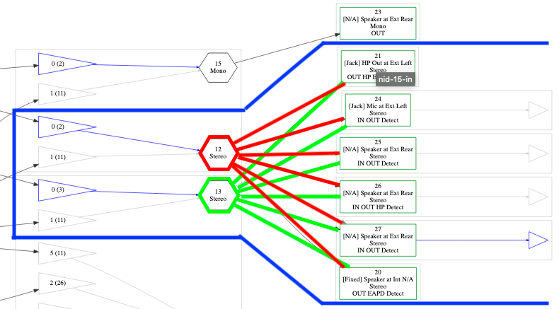

- Nodes 20, 21, 24, 25, 26 and 27 support the Detect feature
- These Nodes can all connect to Mixers 12 (red) and 13 (green)
- Therefore, they can be operated in switch-mode

##### Possible Configurations: Odd/Even
We could apply a bit of logic and group even numbered Nodes and odd numbered Nodes together to create a big switch array.

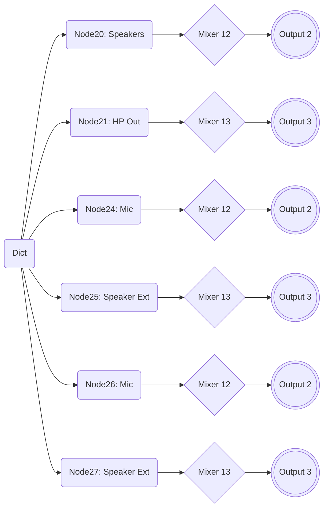
##### Possible Configurations: Custom
For my use, I need Node 20 needs to be fixed. All the switching between HP Out and any of the other available Nodes (24, 25, 26 and 27) need to happen on Mixer 13 and output 3. So something like this

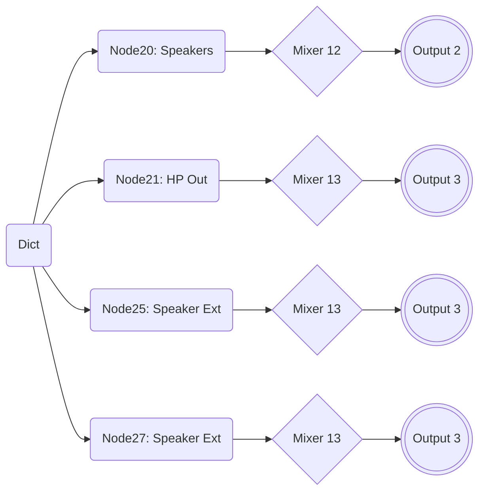
#### Manual Mode
In manual mode, you have to – you've guessed it – switch the input/output manually in the Audio Settings. In this configuration, each Array only contains the nodes for the path of one device. The structure looks as follows

- **PathMap**
	- **Array 0**
		- Input 0 (Nodes 0, 1 and 2)
	- **Array 1**
		- Input 1 (Nodes 0, 1 and 2)
	- **Array 2**
		- Output 0 (Nodes 0, 1 and 2)
	- **Array 3**
 		- Output 1 (Nodes 0, 1 and 2)
 	- etc.

Now that we know to enter the routing data into the PlatformsXX.xml file, we can begin entering the data in a new file.

## VIII. Preparing a `PlatformsXX.xml`
Obviously, we need to avoid changing data of existing Platforms.xml files created by other users. Because it would destroy the Layout for other users, if the Source Code would get synced with the AppleALC repo. Instead, we need to create a new one for our Layout-ID with our own routing, so do the following:

- In Finder, navigate to the resources folder for your Codec. (For me, it's `AppleALC/Resources/ALC269`)
- Select the `Platforms.xml` of the Layout-ID you are currently using (the number is identical). Since I am using ALC Layout-ID 18, I use Platforms18.xml.
- Duplicate the file (⌘+D)
- Change the name to the Layout-ID you chose (For me Platforms39.xml)

## IX. Transferring the PathMap to `PlatformsXX.xml`
Now that we found all the possible paths to connect Pin Complex Nodes with Inputs and Outputs, we need to transfer the ones we need to a PlatformXXX.xml file. "XY" corresponds to the previously chosen Layout-ID. In my case it will be `Platforms39.xml`.

AppleALC's "Resources" folder contains sub-folders for each supported Codec. All of these sub-folders contain additional .xml files, such as `LayoutXY.xml` as well as `PlatformXY.xml`. For each existing Layout-ID there are corresponding .xml files with the same number.

Let's have a look how Switch-Mode for Outputs is realized in ALC Layout-ID 18 inside of `Platforms18.xml`:</br>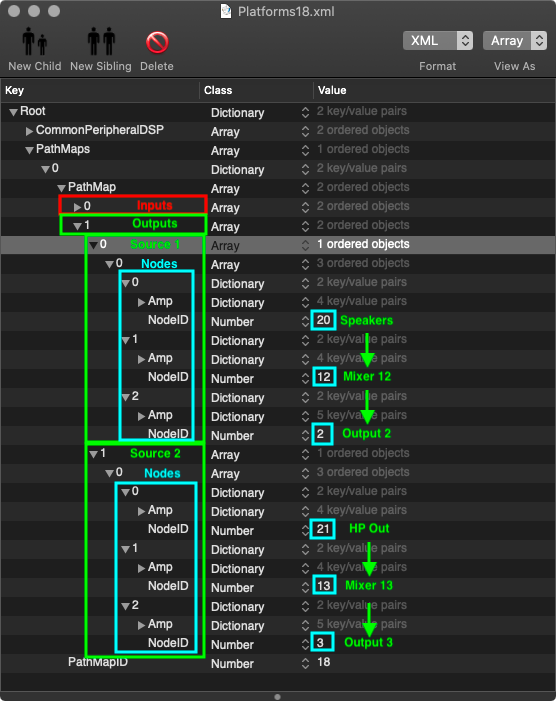

On the Input side, the structure is the same. The only difference is that the order of the nodes is reversed: instead of tracing the path from the Pin Complex Nodes to the Outputs, you start at the output and trace the path back to the Pin Complex Node:


- Enter the required NodeIDs you found in chapter IV for the Inputs and Outputs you need (as explained). 
- To add more devices to the PathMap, duplicate one of the "Source" Array and change the data
- Once, you're done, save the file

**NOTE**: `LayoutID` and `PathMapID` **must be identical** and must use the same number you chose for your Layout-ID previously.

## X. Add `Platforms.xml` and `layout.xml` to `info.plist`
As mentioned earlier, there are 2 info.plists which have to be edited in the AppleALC Source Code. In this case, I am referring to the second one, located inside the ALCXXX folder. In my case the one in `AppleALC/Resources/ALC269`.

- Open the `info.plist`
- Look for the `Files` Dictionary:</br>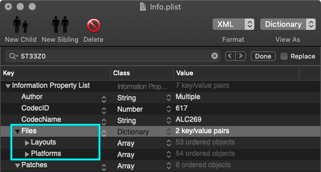
- Open the `Layouts` Dictionary
- Duplicate one of the Dictionaries, doesn't matter which one
- Expand it:</br>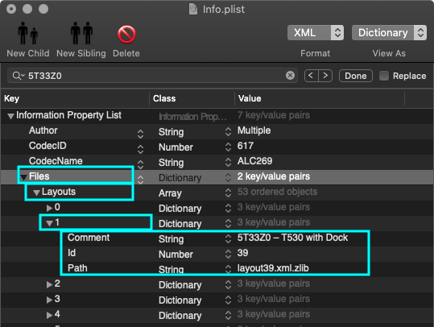
- Change the following details:
	- **Comment**: Author and Codec/Device
	- **Id**: Enter the Layout-ID you are using
	- **Path**: layoutXX.xlm.zlib (XX = the chosen layout-id number. During compilation, the .xml file will be compressed to .zlib so the path has to point to the compressed version)
- Do the same for the PlatformsXX.xml file:</br>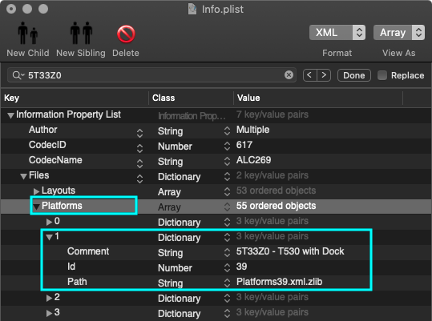

**IMPORTANT**: If these entries don't exist, the AppleALC.kext will be compiled but your Layout-ID entry won't be included, aka no Sound!

## XI. Compiling the AppleALC.kext
Now that we finally prepared all the required files, we can finally compile the kext.

- In Terminal, "cd" into the AppleALC folder containing the `AppleALC.xcodeproj` file
- Enter `xcodebuild` and hit Enter. Compiling should start and a lot of text should appear on screen during the process.
- Once the kext is compiled, there will be the prompt "BUILD SUCCEEDED". 
- The kext will present in `/AppleALC/build/Release`.

## XII. Testing and Troubleshooting
### Testing the new Layout
- Add your newly compiled AppleALC.kext to your EFI/OC/Kexts folder
- Open the config.plist and change the Layout-ID to the one you chose for your Layout-ID
- Save the config and reboot
- Check if sound is working (Internal, Inputs, Outputs, Headphones)
- If it's working: congrats!

### Troubleshooting
If it's not working, do the following: 

- Follow the [AppleALC Troubleshooting Guide](https://github.com/dortania/OpenCore-Install-Guide/blob/e08ee8ebe6fa030393c153b055225f721edafab2/post-install/audio.md#troubleshooting) by Dortania
- Check and adjust/correct: 
	- Pin-Config (maybe calculate it manually)
	- PathMap inside of PlatformsXX.xml
	- LayoutXX.xml 
	- Info.plist &rarr; check if you added your LayoutXX.xml and PlatfomsXX.xml 
- Re-compile the kext, replace it in the EFI, reboot, test, repeat.
- Ask for help on a Forum.

## XIII. Adding your Layout-ID to the AppleALC Repo
Once your custom Layout-ID is working, you can submit it to the AppleALC GitHub repo via Pull Request. Otherwise you would lose your custom made routing every time you update the AppleALC.kext since this overwrites the info.plist and the .xml support files.

In order to add your Layout-ID to AppleALC's database, you have to do the following:
- Create a fork of the repo
- Add the required files to the "Resources" folder. Follow the [Instructions](https://github.com/acidanthera/AppleALC/wiki/Adding-codec-support). 
- Sync it with github and then create a pull request.
- Wait for approval

Once your Layout is part of the main AppleALC repo you can update AppleALC without having to compile your own version every time the source code is updated. 

## CREDITS and RESOURCES
- **Guides**:
	- MacPeet for [[Guide] Anleitung patch AppleHDA](https://www.root86.com/blog/40/entry-51-guide-anleitung-patch-applehda-bedingt-auch-f%C3%BCr-codec-erstellung-in-applealc/) (German)
	- EMlyDinEsH for [Complete Apple HDA Patching Guide](https://osxlatitude.com/forums/topic/1946-complete-applehda-patching-guide/)
	- F0x1c for [AppleALC_Instructions](https://github.com/F0x1c/AppleALC_Instructions)
	- The King for [[HOW TO] Patch AppleHDA - Knowledge Base, Guide for how to fix/use original AppleHDA](http://web.archive.org/web/20150105004602/http://www.projectosx.com/forum/index.php?showtopic=465&st=0)
	- Master Chief for [[How To] PinConfig for Linux users](https://www.insanelymac.com/forum/topic/149128-how-to-pinconfig-for-linux-users-%EF%BF%BD-realtek-alc883-example/)
	- Daliansky for [AppleALC Guide](https://blog-daliansky-net.translate.goog/Use-AppleALC-sound-card-to-drive-the-correct-posture-of-AppleHDA.html?_x_tr_sl=auto&_x_tr_tl=en&_x_tr_hl=de&_x_tr_pto=wapp)
	- Daliansky for [Using VoodooHDA for finding valid Nodes](https://blog-daliansky-net.translate.goog/With-VoodooHDA-comes-getdump-find-valid-nodes-and-paths.html?_x_tr_sl=auto&_x_tr_tl=en&_x_tr_hl=de&_x_tr_pto=wapp)
- **About Intel High Definition Audio**:
	- Intel for [HDA Specs](https://www.intel.com/content/www/us/en/standards/high-definition-audio-specification.html)
 	- HaC Mini Hackintosh for additional info about the [HDA Codec and Codecgraph](https://osy.gitbook.io/hac-mini-guide/details/hda-fix#hda-codec)
 	- Daliansky for [List of HDA Verb Parameters](https://blog-daliansky-net.translate.goog/hda-verb-parameter-detail-table.html?_x_tr_sl=auto&_x_tr_tl=en&_x_tr_hl=de&_x_tr_pto=wapp)
- **Tools**:
	- cmatsuoka for [codecgraph](https://github.com/cmatsuoka/codecgraph)
	- Headkaze for porting [PinConfigurator](https://github.com/headkaze/PinConfigurator) to 64 bit 
	- Pixelglow for [graphviz](http://www.pixelglow.com/graphviz/)
- **Other**:
	- [Mermaid](https://mermaid-js.github.io/mermaid/#/README) script for creating flowcharts and diagrams in Markdown
	- Jack Plug schematics: 
		- OMTP [WIKI Commons](https://commons.wikimedia.org/wiki/File:3mm5_jack_4.svg) 
		- CTIA [WIKI Commons](https://commons.wikimedia.org/wiki/File:3.5mm_jack_plug_4i.svg)
