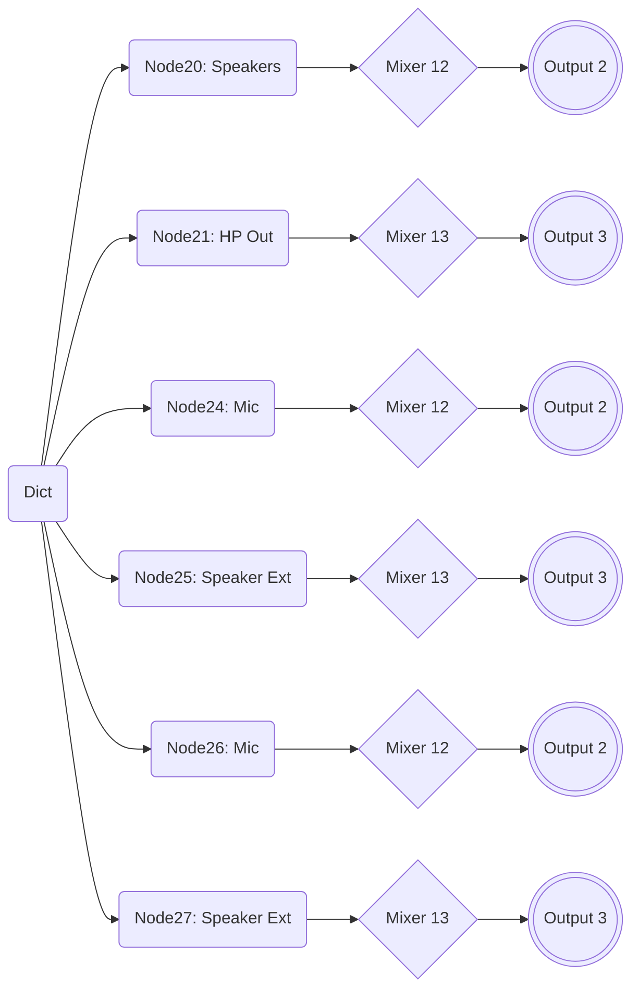
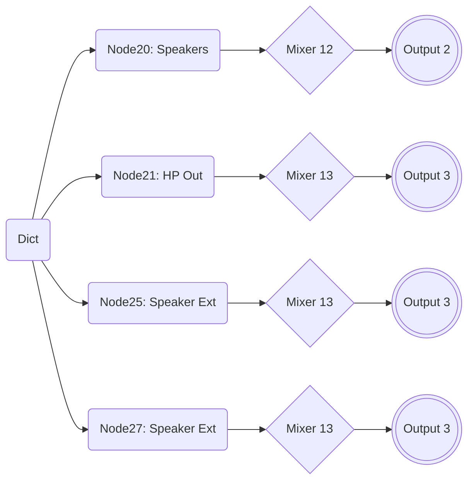

# How to create/modify a Layout-ID for AppleALC

**TABLE of CONTENTS**

<!-- vscode-markdown-toc -->
* [I. Summery](#i.-summery)
* [II. Preparations](#ii.-preparations)
* [III. Extracting data from the Codec dump](#iii.-extracting-data-from-the-codec-dump)
* [IV. Understanding the Codec schematic and signal flow](#iv.-understanding-the-codec-schematic)
* [V. Creating a PinConfig](#v.-creating-a-pinconfig)
* [VI. Integrating the PinConfig into the AppleALC source code](#vi.-integrating-the-`pinconfig`-into-the-applealc-source-code)
* [VII. Creating a PathMap](#vii.-creating-a-pathmap)
* [VIII. Preparing a PlatformsXX.xml](#viii.-preparing-a-`platformsxx.xml`)
* [IX. Transferring the PathMap to PlatformsXX.xml](#ix.-transferring-the-pathmap-to-`platformsxx.xml`)
* [X. Adding Platforms.xml and layout.xml to info.plist](#x.-add-`platforms.xml`-and-`layout.xml`-to-`info.plist`)
* [XI. Compiling the AppleALC.kext](#xi.-compiling-the-applealc.kext)
* [XII. Testing and Troubleshooting](#xii.-testing-and-troubleshooting)
* [XIII. Adding your Layout-ID to the AppleALC Repo](#xiii.-adding-your-layout-id-to-the-applealc-repo)
<!-- vscode-markdown-toc-config
	numbering=false
	autoSave=true
	/vscode-markdown-toc-config -->
<!-- /vscode-markdown-toc -->

## <a name='i.-summery'></a>I. Summery
### About
This is my attempt to provide an up-to-date guide for creating/modifying Layout-IDs for the AppleALC kext to make audio work on a Hackintosh in 2022 (and beyond). It covers the following topics:

- Installing and configuring the necessary tools
- Creating a Codec dump in Linux
- Converting the Data
- Creating a PinConfig, Layout.xml and Platforms.xml files
- Integrating the data into the AppleALC Source Code 
- Compiling a AppleALC.kext
- Adding the newly created Layout-ID to the AppleALC repo

### Who this guide is for
This guide is aimed at users who want to create a new or modify an existing Layout-ID for different reasons. Maybe the one in use was created for the same Codec but a different system/mainboard and causes issues or they want to add inputs or outputs missing from the current Layout-ID in use.

### Why another guide?
Although the AppleALC kext comes with about 600 pre-configured Layout-IDs for more than 100 Audio Codecs, the process of *creating* or *modifying* a Layout-ID and integrating the data into the source code for compiling the kext is not documented on the AppleALC repo.

The hand full of guides I could find stem from an era before AppleALC even existed, when patching AppleHDA was still a thing. Most of them are either outdated (I had to use waybackmachine for some), over-complicated or only parts of them are applicable today. And most importantly: ***none*** of them actually explain how to integrate the data into the AppleALC source code to compile the kext!

The most convincing guide I did find is written in German by MacPeet. He has created over 50 (!) Layout-IDs for AppleALC over the years. It's from 2015 so it predates AppleALC as well. Although not all of its instructions are applicable today, his guide introduced a new, partly automated workflow, using tools to visualize the Codec dump and scripts to extract required data from it which previously had to be extracted manually.

My guide is an adaptation of MacPeet's work but updates and enhances it, where possible. It introduces new tools and workflows and utilizes all the nice features markdown has to offer to present the instruction in the best way possible, such as: headings, syntax highlighting, tables and mermaid integration for flowcharts, etc.

So all in all, there is a justification for having new guide for this to enable and empower users to create their own ALC Layout-IDs if they have to.

### Are you *sure*, you want to do this?
From a user's perspective, making audio work in hackintosh is a no-brainer: add AppleALC to the kext folder of your Boot Manager, enter the correct ALC Layout-ID to the config and reboot. And voilà: Sound! 

But once you are on the other end, trying to actually *create* your own ALC Layout-ID this becomes a completely different story quickly and it's almost a give that your Layout-ID won't work at all the first time around. So, are you still sure you *want* to do this?

💡 **TIPS**

- Click on the litte Header icon next to `README.md` to navigate in the document quickly
- If you just want a slimmed-down version of AppleALC.kext for your Codec, you can use dreamwhite's [Custom AppleALC builds](https://github.com/dreamwhite/ChonkyAppleALC-Build/releases) instead.

## <a name='ii.-preparations'></a>II. Preparations
Creating a Layout-ID for AppleALC is one of the more challenging tasks for "regular" hackintosh users who are not programmers (me included). It's not only challenging and time consuming, it's also confusing and requires a lot of tools and prep work. So let's get it out the way right away.

### Obtaining an Audio CODEC dump in Linux
Unfortunately, Codec dumps obtained with Clover/OpenCore can't be processed by the tools required to convert and visualize the data inside of them. Codec dumps created in Linux, however, can be processed by these tools just fine.[^1]

Therefore, we need to use (a live version of) Linux to create the codec dump without having to actually install Linux. We can use Ventoy for this. It prepares a USB flash drive which can run almost any ISO directly without having to create a USB installer.

**NOTES**: If you can live without a schematic of the Codec dump, you *can* use the dumps created with Clover and OpenCore as well.

- **Clover**: Hit `F8` in the boot menu. `AudioDxe.efi` has to be present in `CLOVER/drivers/UEFI`. The file(s) will be stored in `EFI/CLOVER/misc`.
- **OpenCore**: Requires the Debug version. Check the [Debugging Section](https://github.com/5T33Z0/OC-Little-Translated/tree/main/K_Debugging#using-opencores-sysreport-feature) for details.

[^1]: When I compared the dumps obtained with Clover and Linux, I noticed that the one created in Linux contained almost twice the data (293 vs 172 lines). I guess this is because Linux dynamically discovers the paths of an audio codec through a graph traversal algorithm. And in cases where the algorithm fails, it uses a huge lookup table of patches specific to each Codec. My guess is that this additional data is captured in the Codec dump as well.

#### Preparing a USB flash drive for running Linux from an ISO
Users who already have Linux installed can skip to "Dumping the Codec"!

1. Use a USB 3.0 flash drive (at least 8 GB or more)
2. In Windows, download [**Ventoy**](https://www.ventoy.net/en/download.html) and follow the [Instructions](https://www.ventoy.net/en/doc_start.html) to prepare the flash drive. It's pretty straight forward.
3. Next, download an ISO of a Linux distribution of your choice, e.g. [**Ubuntu**](https://ubuntu.com/download/desktop), [Zorin](https://zorin.com/os/download/) or whatever distro you prefer – they all work fine.
4. Copy the ISO to your newly created Ventoy stick
5. Reboot from the flash drive
6. In the Ventoy menu, select the Linux ISO and hit enter
7. From the GNU Grub, select "Try or Install Linux"
8. Once Ubuntu has reached the Desktop environment, select "Try Ubuntu" (or whatever the distro of your choice prompts).

#### Dumping the Codec
1. Once Linux is up and running, open Terminal and enter:</br>
	```shell
	cd ~/Desktop && mkdir CodecDump && for c in /proc/asound/card*/codec#*; do f="${c/\/*card/card}"; cat "$c" > CodecDump/${f//\//-}.txt; done && zip -r CodecDump.zip CodecDump
	```
2. Store the generated `CodecDump.zip` on a medium which you can access later from within macOS (HDD, other USB stick, E-Mail, Cloud). You cannot store it on the Ventoy flash drive itself, since it's formatted in ExFat and can't be accessed by Linux without additional measures.
3. Reboot into macOS
4. Extract `CodecDump.zip` to the Desktop
5. ⚠️ Rename `card0-codec#0.txt` inside the "CodecDump" folder to `codec_dump.txt`. Otherwise the script we will use in Chapter III to convert the data will fail since it can't find the file.

#### Relevant Codec data
Amongst other things, the Codec dump text contains the following details:

- The Codec model
- Its Address (usually `0`)
- It's Vendor Id (in AppleALC it's used as `CodecID`)
- Pin Complex Nodes with Control Names (these form the `PinConfig`)
- The actual routing capabilities of the Codec:
	- Pin Complex Nodes
	- Mixer/Selector Nodes
	- Audio Output Nodes
	- Audio Input Nodes
	- Number of connections from/to a Node/Mixer/Selector/Switch

### Required Tools and Files
💡Please follow the instructions below carefully and thoroughly to avoid issues.

- Download and install [**Python**](https://www.python.org/downloads/) if you haven't already
- Install either [**MacPorts**](https://www.macports.org/install.php) or [**Homebrew**](https://brew.sh/) (I used MacPorts, but Homebrew works, too)
- Once that's done, reboot.
- Next, install [**graphviz**](https://graphviz.org/) via terminal (takes about 10 minutes!):
	- If you are using **MacPorts**, enter `sudo port install graphviz`
	- If you are using **Homebrew**, enter `brew install graphviz` 
- Next, download and unzip [**codecgraph.zip**](https://github.com/5T33Z0/OC-Little-Translated/raw/main/L_ALC_Layout-ID/codecgraph.zip). macOS Monterey users need to grab the version for python 3 version by [Core-99](https://github.com/Core-i99/Codec-Graph/releases) instead. 
- Copy the `codegraph` folder to the Desktop. We need it to convert and visualize the data inside the Codec dump, so we have can work with it.
- Move the `codec_dump.txt` into the "codecgraph" folder
- Download and extract [**PinConfigurator**](https://github.com/headkaze/PinConfigurator/releases)
- Download [**Hackintool**](https://github.com/headkaze/Hackintool). We may need it for checking PCI devices and Hex to Decimal conversions later.
- Get a plist editor like PlistEditPro or [**XPlist**](https://github.com/ic005k/Xplist)
- Download and install the [correct version](https://developer.apple.com/support/xcode/) of [**Xcode**](https://developer.apple.com/download/all/?q=xcode) supported by the macOS you are running. The download is about 10 GB and the installed application is about 30 GB, so make sure you have enough space on your drive! And: make sure to move the app to the "Programs" folder – otherwise compiling fails.

### Preparing the AppleALC Source Code
- Clone, Download or Fork or and extract the [**AppleALC**](https://github.com/acidanthera/AppleALC) Source Code (click on "Code" and "Download Zip")
- Download the Debug Version of [**Lilu**](https://github.com/acidanthera/Lilu/releases) and copy it to the "AppleALC" root folder
- In Terminal, enter: `cd`, hit space and drag and drop your AppleALC folder into the window and press enter.
- Next, enter `git clone https://github.com/acidanthera/MacKernelSDK` and hit enter.
- The resulting folder structure should look like this:</br>


#### Important files we have to work on:

|Parameter(s)   |File            |Location
:------------:|------------------|----------
**PinConfig** |`info.plist`      |Inside `PinConfigs.kext` (AppleALC/Resources/PinConfigs)
**PathMap**   |`PlatformsXX.xml` |AppleALC/Resources &rarr; ALCXXX-subfolder of corresponding Codec
**various**   | `layoutXX.xml`   |same
Add entries for **PlatformsXX.xml.zlib** </br> **layoutXX.xml.zlib** | `info.plist` | same

**NOTE**: The `XX` stands for the number of the chosen Layout-ID. `XXX` stands for the corresponding Codec model the Layout-ID is for (and not what you thought). More about that later.

### Configuring Xcode
- Start Xcode
- Open the `AppleALC.xcodeproj` file located in the AppleALC folder
- From the menubar, select "File > Project Settings"
- Change "Derived Data" to "Project-relative Location" and click "Done".
- Next, select the AppleALC project
- Under "Build Settings", scroll down to "User-Defined Settings" and check if the entries `KERNEL_EXTENSION_HEADER_SEARCH_PATHS` and `KERNEL_FRAMEWORK_HEADERS` exist
- If not, press the "+" button, click on "Add User-Defined Settings" and add them:<br>
- Make sure that both point to "(PROJECT_DIR)/MacKernelSDK/Headers":</br>
- Next, Link to custom `libkmod.a` library by adding it under "Link Binary with Libraries": 
- Verify that `libkmod.a` is present in /MacKernelSDK/Library/x86_64/ inside the AppleALC Folder. Once all that is done, you are prepared to compile AppleALC.kext.

Now, that we've got the prep work out of the way, we can begin!

## <a name='iii.-extracting-data-from-the-codec-dump'></a>III. Extracting data from the Codec dump
In order to create a routing of the audio inputs and outputs for macOS, we have to extract and convert data from the codec dump. To make the data easier to work with, we will visualize it so we have a schematic of the audio codec which makes routing easier than browsing through the text file of the codec dump.

### Converting the Codec Dump 
1. Open the `codec_dump.txt` located in the "codecgraph" folder
2. Delete the line: `AFG Function Id: 0x1 (unsol 1)` &rarr; otherwise the file conversions will fail!
3. Save the file.
4. Next, double-click `Script Patch Codec by HoangThanh`. This will generate 5 new files inside the "codecgraph" folder, 3 of which are useful to us:
	- **`codec_dump_dec.txt`** &rarr; Codec dump converted from Hex to Decimal. We need it since the data has to be entered in decimals in AppleAlC's .xml files.
	- **`codec_dump_dec.txt.svg`** &rarr; Schematic of the Codec converted from hex to decimal. We will work with this most of the time. You can open it in the web browser to view it in full size.
	- **`codec_dump.txt.svg`** – Same Schematic, just in Hex.
	- ~~**`finalverbs.txt`** &rarr; Text file containing the Pin Configuration extracted from the codec dump using the [verbit.sh](https://github.com/maywzh/useful_scripts/blob/master/verbit.sh) script. The Pin Configuration represents the available Inputs an Outputs Sources available to macOS.~~ We won't use this one, since it contains errors.
	- ~~**`verbitdebug.txt`** &rarr; A log file of the corrections and modifications `verbit.sh` applied to the verb data.~~ Not really relevant to us.
5. Run PinConfigurator
6. Select "File > Open…" (⌘+O) and open "codec_dump.txt"
7. This will extract the available audio sources from the Codec dump
8. Select "File > Export > verbs.txt". It will will be stored on the Desktop automatically.

**NOTE**: While creating my own Layout-ID, I noticed that the `finalverbs.txt` generated by verbit.sh contains errors and doesn't include the `WakeConfigData`. Therefore we will use the `verbs.txt` genereated in PinConfigurator instead (if needed).

## <a name='iv.-understanding-the-codec-schematic'></a>IV. Understanding the Codec schematic and signal flow
Shown below is `codec_dump.txt_dec.txt.svg`, a visual representation of the data inside the codec dump for the **Realtek ALC269VC** used in my Laptop. It shows the routing capabilities of the Audio Codec. Depending on the Codec used in your system, the schematic will look different!


Form              | Function
------------------|-----------------------------------------------
**Triangle**      | Amplifier
**Blue Ellipse**  | Audio Output
**Red Ellipse**   | Audio Input
**Parallelogram** | Audio selector (this codec doesn't have any)
**Hexagon**       | Audio mixer (with various connections 0, 1, 2,…)
**Rectangle**     | Pin Complex Nodes representing audio sources we can select in system settings (Mic, Line-out, Headphone etc.)
**Black Lines**   | Default connection (indicated by an asterisk next to it in the Codec_Dump.txt!)
**Dotted Lines**  | Optional connection 
**Blue Lines**    | Info N/A. I guess it's the connection to the output Nodes

### How to read the schematic
⚠️ The schematic is a bit hard to comprehend and interpret because of its structure. It's also misleading: since all the arrows point to the right one might think they represent the signal flow – they don't. So ignore them! Instead, you need to take an approach which follows the signal flow.

#### Routing Input Devices
For **Input Devices**, start at the input and trace the route to the Pin Complex Node. 

- **Option 1**: Input &rarr; Mixer/Audio Selector &rarr; PinComplex Node:

	```mermaid
	flowchart LR
		id1(((Input))) -->|Signal flow|id2{Mixer A} -->|Signal flow|id3(Pin Complex XY)
		id4(((Input))) -->id5[/Audio Selector/]-->id6(Pin Complex XY)
	```
- **Option 2**: Input &rarr; PinComplex Node:

	```mermaid
		flowchart LR
		id1(((Input))) ------>|Direct Connection|id3(Pin Complex XY)
	```
#### Routing Output Devices
For **Output Devices**, start at the Pin Complex Node and follow the signal through Audio Mixer(s)/Selectors to the physical output Here are some examples of possible routings.

- **Option 1**: Pin Complex Note &rarr; Mixer/Audio Selector &rarr; Output (common):

	```mermaid
	flowchart LR
       id1(Pin Complex XY) -->|Signal flow|Aid2{Mixer A} -->|Signal flow|id5(((Output X)))
       id3(Pin Complex XY)-->id2[/Audio Selector/]-->id6(((Output X)))
	 ```
- **Option 2**: Direct Connection from Pin Complex Node to Output:

	```mermaid
	flowchart LR
       id1(Pin Complex XY) ---->|Direct Connection|id5(((Output X)))
	```

**NOTE**: Whether or not a signal traverses more than one Mixer Node depends on the Codec design. What's important is to list all the "stations" a signal passes from the Pin Complex Node to the desired Output!

#### Routing Examples from ALC269

- **Headphone Output switch**:

	```mermaid
	flowchart LR
    	id1(Node21: HP out) --> |possible path A| id3{Mixer 12} --> id5(((Output 2)))
    	id1(Node21: HP out) --> |possible path B| id4{Mixer 13} --> id6(((Output 3)))
	```
- **Internal Mic Input**:

	```mermaid
	flowchart LR
    	   id1(((Input 9))) -->Aid2{Mixer 34} -->id2(Node 18: Mic Int. fixed)-.-> id3(Aux Return to Mixer 11)-.->id4(Etc.)
	```
- **Line Input**:
	
	```mermaid
		flowchart LR
   		   id1(((Input 8))) -->Aid2{Mixer 35} -->id2(Node 24: Mic Jack)-.-> id3(Aux Return to Mixer 11)-.->id4(Etc.)
	```

**💡 About Signal Flow**

The ALC 269 Codec includes an Aux Return to send (or return) the incoming signal back into the Output path for monitoring via Mixer 11 through either Mixer Nodes 12/13 or 15 (Mono). 

If you would trust the arrows in the schematic, the existence of Mixer 11 wouldn't make any sense. That's why ***you need to follow the signal flow instead of the arrows***! For the `PathMap`, you only need to enter the path following this formula: Input &rarr; Mixer &rarr; PinComplex Node.

#### Tracing possible paths
Since I want the Line-Out of my docking station dock to work, I need to assign some other Pin Complex Node to Mixer13. 

We can use the .svg schematic to trace all available paths the codec provides and create a chart with it, which helps when transferring the data to a Platforms.xml fle later:

Node ID (Pin Complex)| Device Name/Type            | Path(s)               | EAPD [^2]
:-------------------:|-----------------------------|-----------------------|:----:
18 (In)              |Internal Mic (S)             | 9 - 34 - 18 (fixed)   |
20 (Out)             |Internal Speakers (S)        | 20 - 12 - 2 or</br> 20 - 13- 3|YES
21 (Out)             |Headphone Output (S)         | 21 - 12 - 2 or </br>21 - 13 - 3|YES
23 (Out)             |Speaker at Ext Rear (M)      | 23 - 15 - 2 (Mono)    |
24 (as Output)       |Mic/Line-In (Jack) (S)       | 24 - 12 - 2 or </br> 24 - 13 - 3|
24 (as Input)        |(Jack) Mic at Ext Left       | 8 - 35 -24 or </br> 9 - 34 - 24
25 (as Output)       |Speaker Ext. Rear (S) OUT Detect| 25 - 12 - 2 or </br>25 - 13 - 3
25 (as Input)        |Speaker Ext. Rear (S) IN  Detect| 8 - 35 - 25 or </br> 9 - 34 - 25
26 (as Output)       |Speaker at Ext Rear OUT HP Detect| 26 - 12 - 2 or</br>26 - 13 - 3
26 (as Input)        |Speaker at Ext Rear IN HP Detect| 8 - 35 - 26 or </br> 9 - 34 - 26 
27 (as Output)       |Speaker at Ext Rear OUT Detect| 27 - 13 - 3 or </br>27 - 12 - 2
27 (as Input)        |Speaker at Ext Rear IN Detect| 8 - 35 - 27 or </br> 9 - 34 - 27 or
29 Mono (as Input)   |Mono In                      | 8 - 35 - 29 or </br> 9 - 34 -29
30 (Digital Out)     |Speaker Ext. Rear Digital (S/PDIF)| 6 - 30| 

[^2]: **EAPD** = EAPD (External Amplifier Power Down). If it's supported by the Node, enabling it is recommended. For more details, please refer to Chapter 7.3.3.16 of the High Definition Audio Specification, Rev. 1.0a by Intel, 2010.

<details>
<summary><strong>Double-Checking</strong> (click to reveal)</summary>

##### Double-Checking against codec-dump_dec.txt
We can also use the codec dump to verify the routing. Here's an example for Node 21 which is the main output of the T530:


As you can see, Node 21 has 2 possible connections (Node 12 and 13) and is currently connected to Node 13, which is one of the Audio mixers:


 And Node 13's final destination is Node 3, which is the HP out:


</details>

We will come back to the schematic later… 

## <a name='v.-creating-a-pinconfig'></a>V. Creating a PinConfig 
Audio Codecs support various Inputs and Outputs: Internal speakers and a mic (usually on Laptops) as well as Line-Ins and Outs (both analog and digital). These audio sources are injected into macOS by AppleALC as a long sequence of code (or "verbs") which form the so-called `PinConfig`. It's the single most important parameter to get Audio Inputs and Outputs working properly.

"Verbs" consist of a combination of 4 components: the Codec's address, Pin Complex Nodes with Control Names, Verb Commands and Verb Data which has to be extracted from the Codec dump, corrected and injected into macOS via AppleALC kext. For info on how to extract verbs from the Codec dump *manually*, please refer to Parts 2 and 3 of [EMlyDinEsH's guide](https://osxlatitude.com/forums/topic/1946-complete-applehda-patching-guide/).

Luckily for us, we can use **PinConfigurator** to extract the Verbs from the Codec dump automatically…

### Using PinConfigurator to create a PinConfig

#### Default Method (keeps connected Nodes only)
Preferred method if you just want to implement the default Codec configuration.

1. Open **PinConfurator**
2. Click on "File > Open…" (⌘+O) and open "codec_dump.txt"
3. This will extract and import all the available audio sources from the Codec dump:</br>
4. Next, click on "Patch > Remove Disabled". This will remove all Nodes which are not connected except Atapi Internal:</br>
5. Click on "Options > Verb Sanitize" and enable all the options:</br>
6. Select "Patch > Verb Sanitize". This will apply [various fixes](https://github.com/headkaze/PinConfigurator#what-patch-apply-verbit-fix-does-now) to the PinDefault values and Verb Data so that the `PinConfig` will work in macOS.
7. Next, click on "Get ConfigData":</br>
8. Copy the `ConfigData` into the clipboard
9. Select "File > Export > verbs.txt". It will be stored on the Desktop.
10. Open verbs.txt.
11. Paste the ConfigDate in an empty line and save the file. We'll need it later.
12. Continue in **Chapter VI.**

#### Modifying an existing PinConfig (adding Outputs/Inputs)
In case you already have a somewhat working Layout-ID that you want/nedd to modify, do the following:

1. Open the `info.plist` inside the `PinConfig.kext` (in AppleALC/Resources) 
2. Find the Layout-ID for your `CodecID` (look it up in `codec_dump_dec.txt` or search by description in `Codec` field):</br>
3. Select the data inside the `ConfigData` field (⌘+A) and copy it (⌘+C)
4. Start the PinConfigurator App
5. From the menubar, select "File > Import > Clipboard"
6. This is how it looks:</br>
7. Check `codec_dump_dec.txt.svg` to find the Pin Complex Nodes you want to add to the current PinConfig.

**NOTES**: In my case, the PinConfig lacks a second Output to get sound out of the docking station when I connect external speakers to it. The Layout-ID I am currently using (ID 18 for ALC269) was created for the Lenovo X230 which is very similar to the T530 in terms of features. It uses the same Codec revision and works fine besides the missing Line-out of the dock.

Since Node 27 has a Headphone Playback switch as well, I will add it to the current PinConfig. For your Codec you should refer to the Codec schematic and the codec dump text file to find appropriate nodes. 

There are 2 methods to do add a Node to the PinConfig: you can either add one in PinConfigurator and configure it manually or combine verb data insiede the `verbs.txt` to "craft" one, copy it into memory and import it.

#### Method 1: Use verbs.txt to add a Node to the PinConfig

1. Open `verbs.txt`
2. Place the cursor at the end of the document 
3. Paste (⌘+V) the ConfigDate (green). It should still be stored in the Clipboard.
4. Next, add the Verb Data of the Node(s) you want to add (cyan) to the existing PinConfig:</br>
5. Copy the resulting PinConfig (pink) into the clipboard
6. Switch back to PinConfigurator
7. From the menubar, select File > Import > Clipboard. In this example, Node 27 has been added:</br>
8. Select "Patch > Verb Sanatize" to correct the Verb data.
9. Export the data. There are 2 ways to do so: 
	- Either copy/paste the ConfigData to a text file and save it for later, or 
	- Select "File > Export > "PinConfigs.kext" (it's located under /AppleALC/Resources/) to write the data to the info.plist of the kext directly.

#### Method 2: Add a node to PinConfigurator and configure it manually

1. In PinConfigurator, click "Add"
2. This opens a dialog with a bunch of options to configure the new Node:</br>
3. Use `verbs.txt` or `codec_dump.txt` to configure the Node (see "Config Notes")
4. Press "Save" when you're done. In my case, Node 27 will be added.
5. Select "Patch > Verb Sanitize". This will apply [fixes](https://github.com/headkaze/PinConfigurator#what-patch-apply-verbit-fix-does-now) to the PinDefault values and Verb Data so that the `PinConfig` will work in macOS.
6. Back in the main Window, click on "Get ConfigData"
7. The new/modified PinConfig will be listed in the text field below it:</br>
8. Export the data. There are 2 ways to do so: 
	- Either copy/paste the ConfigData to a text file and save it for later, or 
	- Select "File > Export > "PinConfigs.kext" (it's located under /AppleALC/Resources/) to write the data to the info.plist of the kext directly.

**Config Notes** (subject to change):

- **NodeID**: Add the Node number in decimal (get it from `codec_dump_dec.txt`). Only PinComplex Nodes with a Control Name are eligible! Example:</br>
- **PinDefault**: Get the `PinDefault` value for the Node from `codec_dump.txt` (has to be in Hex)
- **Jack Color**: 
	- For internal devices: select "[0] Unknown" 
	- For external devices like Headphones etc., select "[1] Black".
- **EAPD**: Check if the Node you want to add supports EAPD and adjust the Node accordingly
- To be continued…

## <a name='vi.-integrating-the-`pinconfig`-into-the-applealc-source-code'></a>VI. Integrating the `PinConfig` into the AppleALC source code
Now that we (finally) have our `PinConfig`, we have to integrate it into the AppleALC source code. Depending on your use case, the workflow differs. So pick a scenario which best suits your use case.

### Finding an unused Layout-ID number
In order to find a yet unused Layout-ID for your Codec, you have to check which Layout-IDs exist already and chose a different one in the range from 11 to 99:

- Visit [this repo](https://github.com/dreamwhite/ChonkyAppleALC-Build)
- Click on the folder of your Codec manufacturer (in my case it's "Realtek")
- Next, click on the .md file representing your Codec (in my case: [ALC269](https://github.com/dreamwhite/ChonkyAppleALC-Build/blob/master/Realtek/ALC269.md))
- As you can see, ALC269 has a lot of Layout-IDs already.
- Pick a Layout-ID which is not used already (make a mental note or write it down somewhere)

I am picking Layout-ID 39 because a) it's available and b) followed by by the Lenovo W530 which is the workstation version of the T530.

**IMPORTANT**: Layout-IDs 1 to 10 are reserved but Layouts 11 to 99 are user-assignable. 

#### Scenario 1: Modifying data of an existing Layout-ID

1. Open "codec_dump_dec.txt"
2. Copy the "Vendor-Id" in decimal (= `CodecID` in AppleALC)
3. Locate the `PinConfigs.kext` inside AppleALC/Resources
4. Right-click it and select "Show Package Contents"
5. Inside the Contents folder, you'll find the "info.plist"
6. Open it with a Plist editor (I am using PlistEdit Pro)
7. All PinConfigs and the Layout-ID they are associated with are stored under:
	- IOKitPersonalities
		- as.vit9696.AppleALC
			- HDAConfigDefault
8. Use the search function (⌘+F) and paste the "Vendor Id". In my case it's "283902569". This will show all existing Layout-IDs your Codec.
9. For my test, Im am using entry number 162 as a base, since it's for the same Codec and was created for the the Lenovo X230 which is very similar to the T530 and works for my system:</br>
10. Highlight the dictionary and press ⌘+D. This will duplicate the entry.
11. Add/change the following data to the new entry:
	- In the `Codec` String: Author name (Yours) and description
	- In `ConfigData`, enter the PinConfig data we created in PinConfigurator (and saved in "verbs.txt")
	- Add `WakeConfigData`. It's part of the "verbs.txt":</br>
	- Change the `LayoutID` the PinConfig Data should be associated with. 
12. This is the resulting entry:</br>

#### Scenario 2: Creating a new Layout-ID from scratch (todo)

Now that we got the PinConfig out of the way, we can continue.…

## <a name='vii.-creating-a-pathmap'></a>VII. Creating a PathMap
The PathMap defines the routings of the Nodes within the Codec which are injected into macOS. Some routings are fixed (internal Mics) while others can be routed freely. some Nodes can even be both, input and output. The data has to be entered in the `PlatformsXY.xml` file (XY = number of the layout).

### Structure of `PlatformsXX.xml`
1. The PathMap has to be enterer in `PlatformXX.xml` (`XX` = chosen Layout-ID). 
2. The way inputs and outputs are organized within the hierarchy of the PathMap defines whether or not inputs/outputs switch automatically if a device is plugged in or if the input/output have to be changed manually in System Preferences.

#### Switch-Mode
In Switch-Mode, the Output signal is re-routed from the current output to another one automatically, once a jack is plugged into the system. On Laptops for example, the internal speakers are muted and the signal is automatically re-routed to the Headphone or Line-out. Once the plug is pulled from the audio jack, the audio output is switched back to the internal speakers again. 

For Switch-Mode to work, certain conditions have to be met: 
- The Pin Complex Node(s) must support the "Detect" feature
- The Pin Complex Node(s) that should be switched between must be attached to the same Mixer Node.

Let's have a look at the output side of the schematic:</br>

- Nodes 20, 21, 24, 25, 26 and 27 support the Detect feature
- These Nodes can all connect to Mixers 12 (red) and 13 (green)
- Therefore, they can be operated in switch-mode

This has to be represented in the file structure of the PathMap. Nodes you want to switch between have to be part of that same Array:

- **PathMap**
	- **Array 0** (Inputs)
		- Input 0
			- Input Node
			- Mixer Node
			- Pin Complex Node
		- Input 1
			- Input Node
			- Mixer Node
			- Pin Complex Node
	- **Array 1** (Outputs)
		- Output 0
			- Pin Complex Node
			- Mixer Node
			- Output
		- Output 1
			- Pin Complex Node
			- Mixer Node
			- Output Node 
		- etc. 

##### Possible Configurations: Odd/Even
We could apply a bit of logic and group even numbered Nodes and odd numbered Nodes together to create a big switch array.


##### Possible Configurations: Custom
For my use, I need Node 20 needs to be fixed. All the switching between HP Out and any of the other available Nodes (24, 25, 26 and 27) need to happen on Mixer 13 and output 3. So something like this


#### Manual Mode
In manual mode, you have to – you've guessed it – switch the input/output manually in the Audio Settings. In this configuration, each Array only contains the nodes for the path of one device. The structure looks as follows

- **PathMap**
	- **Array 0**
		- Input 0 (Nodes 0, 1 and 2)
	- **Array 1**
		- Input 1 (Nodes 0, 1 and 2)
	- **Array 2**
		- Output 0 (Nodes 0, 1 and 2)
	- **Array 3**
 		- Output 1 (Nodes 0, 1 and 2)
 	- etc.

Now that we know to enter the routing data into the PlatformsXX.xml file, we can begin entering the data in a new file.

## <a name='viii.-preparing-a-`platformsxx.xml`'></a>VIII. Preparing a `PlatformsXX.xml`
Obviously, we need to avoid changing data of existing Platforms.xml files created by other users. Because it would destroy the Layout for other users, if the Source Code would get synced with the AppleALC repo. Instead, we need to create a new one for our Layout-ID with our own routing, so do the following:

- In Finder, navigate to the "Resources" folder for your Codec. (For me, it's `AppleALC/Resources/ALC269`)
- Select the `Platforms.xml` of the Layout-ID you are currently using (the number is identical). Since I am using ALC Layout-ID 18, I use Platforms18.xml.
- Duplicate the file (⌘+D)
- Change the name to the Layout-ID you chose (For me Platforms39.xml)
- Change the `PathmapID` at the bottom of list so it's identical to the number of your Layout-ID (in my case it's `39`):</br>

## <a name='ix.-transferring-the-pathmap-to-`platformsxx.xml`'></a>IX. Transferring the PathMap to `PlatformsXX.xml`
Now that we traced all the possible paths to connect Pin Complex Nodes with Inputs and Outputs, we need to transfer the ones we need to a PlatformXXX.xml file. "XY" corresponds to the previously chosen Layout-ID. In my case it will be `Platforms39.xml`.

### Transferring PinComplex Nodes to PlatformsXX.xml
1. Take the chart with the possible connections you traced in Chapter IV.
2. Decide which Input/Output Device(s) you want to add to the PathMap
3. Decide if you want to add the device(s) in a switch mode configuration or if you want switch the device manually.
4. Add the Nodes to the PlatformsXX.xml accordingly

For reference, Let's have a look how Switch-Mode for Outputs is realized in ALC Layout-ID 18 inside of `Platforms18.xml`:</br>

On the Input side, the structure is the same. The only difference is that the order of the nodes is reversed: instead of tracing the path from the Pin Complex Nodes to the Outputs, you start at the output and trace the path back to the Pin Complex Node:</br>

- Enter the required NodeIDs you found in chapter IV for the Inputs and Outputs you need (as explained). 
- To add more devices to the PathMap, duplicate one of the "Source" Array and change the data
- Once, you're done, save the file

**NOTE**: `LayoutID` and `PathMapID` **must be identical** and must use the same number you chose for your Layout-ID previously.

### Amp Capabilities
Besides entries for the Nodes that the incoming/outgoing signal traverses, the Codec dump also includes entries for Amp stage(s) which have to be reflected in the **Platforms.xml** as well.

#### Amp Node (Input side)
For Inputs, the Amp is usually part of the first entry in the chain, the Input Node: 


Let's have a look inside the Input Amp Array:


The available options/features of the Amp Array are part of the PinComplex Node it belongs to (Input Node 9 in this example) as defined in the codec_dump_dec.txt. So let's see, what it says:


For Node 9 (and others), there's an entry called "Amp-In Caps", which among other things contains different parameters.

#### Amp Node (Output side)
Next, let's look at Array 1 of the PathMap, which contains the Output Devices:


As you can see, for the ALC269, each Node of the Output Path has an Amp stage and the "Channels" array is part of the last Node in the chain rather than the first Node.

### Transferring Amp Capabilities to PlatformsXX.xml

Here's how "Amp Caps" translate to entries in the Platforms.xml:

Dump.txt               | Platforms.xml
-----------------------|------------------------------------------
Mono/Stereo Amp-In/Out | **Channels** array representing the number of channels: 2=Stereo, 1=Mono.</br> ⚠️ The "Channels" array is only present **once** in a path: </br> • In Input Devices it's included in the *first* node</br> • In Output Device side it's included in the *last* Node!||
**Amp-In Caps**        | 
**nsteps**=0 or ≥1     | **VolumeInputAmp** (NO/YES)
**mute**=0 or 1        | **MuteInputAmp** (NO/YES)
**nsteps**=3           | Special case. Describes the "Boost" Level (=3) applied to the destination Node (last Node in the chain). In this example to Node 18 "Internal Mic Boost Volume". For ALC269 is also applies to Nodes 11, 24, 25, 26, and 27.||
**Amp-Out Caps**       |
**nsteps** 0 or ≥1     | **PublishVolume** (NO/YES)
**mute**=0 or 1        | **PublishMute**

**Explanations**: 

- `Mute` in Amp-In an Amp-Out Nodes are different functions in Platforms.xml:
	- `mute` in ***Amp-In Nodes*** = `MuteInputAmp`
	- `mute` in ***Amp-Out Nodes*** = `PublishMute`
- `Nsteps` also has different functions whether it's used in Amp-In or Amp-Out Nodes:
	- `nsteps` in ***Amp-In Nodes*** = `VolumeInputAmp`
	- `nsteps` in ***Amp-Outs Nodes*** = `PublishVolume`
	- `nsteps=3` in **Amp-In Node** = `Boost` factor 3 last Node of the Chain on the Input Device (as shown in the first screenshot)

### Example: Adding an Output device to the PlatformsXX.xml

As we figured out in Chapter IV and VII, possible paths for adding Node 27 as an Output device can be: 27 &rarr; 13  &rarr; 3 or 27  &rarr; 12  &rarr; 2. I may have to try both. 
Since I want the Output to switch from the speakers (connected via 21 &rarr; 12 &rarr; 2) to the dock when I pluck my speakers in, I first try to connect Node 27 to Mixer 12 and Output 2 as well and see if it switches between Node 21 and 27.

So, I add the path 27 - 12 - 2 to `Platforms39.xml`:

- Open PlatformsXX.xml (`XX` = number you chose for your Layout-ID)
- Navigate to the branch containing the Output Devices (expand PathMaps > 0 > Pathmap > 1):</br> 
- Duplicate Array 1 (Output Device 2). The Output device branch should contain 3 arrays now:</br>
- Next, we need to correct the Nodes inside of Array 2 (Ouput device 3) to 27, 12, 2: </br>
- Next, we need to take care of the Amp section of Node 27. Since we are modifying an existing Layout-ID, we already know that Node 12 and 2 are working fine, so we only need to have a look inside `codec_dump_dec.txt` to get the relevant details about Amp-Out Caps of Node 27:
	```swift
  Node 27 [Pin Complex] wcaps 4195727: Stereo Amp-In Amp-Out
  Control: name="Headphone Playback Switch", index=1, device=0
  ControlAmp: chs=3, dir=Out, idx=0, ofs=0
  Amp-In caps: ofs=0, nsteps=3, stepsize=39, mute=0 // => Current Settings: Boost=3; MuteInputAmp=NO 
  Amp-In vals:  [0 0]
  Amp-Out caps: ofs=0, nsteps=0, stepsize=0, mute=1 // => Current Settings: PublishVolume=NO; PublishMute=YES
  Amp-Out vals:  [0 0]
  ...
  Connection: 2
  12 13* // In the dump, Mixer 13 is the current/default connection!
	```
- So, the Amp-Out caps are: nsteps=0, mute=1. Let's transfer that into .xml. Since I don't want this Node to be an Input as well, I leave MuteInputAmp enabled and VolumeInputAmp disabled:</br>
- Repeat for other devices you want to add to the PathMap
- Save the file

## <a name='x.-add-`platforms.xml`-and-`layout.xml`-to-`info.plist`'></a>X. Add `Platforms.xml` and `layout.xml` to `info.plist`

Now the we have edited all the files we need, we have to integrate them into the AppleALC Source Code. As mentioned [earlier](README.md#important-files-we-have-to-work-on), there are 2 info.plists which have to be edited in the AppleALC Source Code. In this case, I am referring to the second one, located inside the ALCXXX folder. In my case the one in `AppleALC/Resources/ALC269`.

- Open the `info.plist`
- Look for the `Files` Dictionary:</br>
- Open the `Layouts` Dictionary
- Duplicate one of the Dictionaries, doesn't matter which one
- Expand it:</br>
- Change the following details:
	- **Comment**: Author and Codec/Device
	- **Id**: Enter the Layout-ID you are using
	- **Path**: layoutXX.xlm.zlib (XX = the chosen layout-id number. During compilation, the .xml file will be compressed to .zlib so the path has to point to the compressed version)
- Do the same in the "Platforms" section:</br>

**IMPORTANT**: If these entries don't exist, the AppleALC.kext will be compiled but your Layout-ID entry won't be included, aka no Sound!

## <a name='xi.-compiling-the-applealc.kext'></a>XI. Compiling the AppleALC.kext
Now that we finally prepared all the required files, we can finally compile the kext.

- In Terminal, "cd" into the AppleALC folder containing the `AppleALC.xcodeproj` file
- Enter `xcodebuild` and hit Enter. Compiling should start and a lot of text should appear on screen during the process.
- Once the kext is compiled, there will be the prompt "BUILD SUCCEEDED". 
- The kext will present in `/AppleALC/build/Release`.

## <a name='xii.-testing-and-troubleshooting'></a>XII. Testing and Troubleshooting
### <a name='testing-the-new-layout'></a>Testing the new Layout
- Add your newly compiled AppleALC.kext to your EFI/OC/Kexts folder
- Open the config.plist and change the Layout-ID to the one you chose for your Layout-ID
- Save the config and reboot
- Check if sound is working (Internal, Inputs, Outputs, Headphones)
- If it's working: congrats!

**NOTE**: For testing verbs and WakeConfigData you can use `alc-verb` (it's in the Build folder) and Terminal to inject those into the Codec during runtime. This way, you don't have to edit the PinConfig, the .xml files and recompile the kext everytime you want to test something. But I have yet to figure out how to use it. Requires boot-arg `alcverbs=1`  (or `alc-verbs` device property) to be present in the `config.plist`.

### Troubleshooting
If it's not working, do the following: 

- Follow the [AppleALC Troubleshooting Guide](https://github.com/dortania/OpenCore-Install-Guide/blob/e08ee8ebe6fa030393c153b055225f721edafab2/post-install/audio.md#troubleshooting) by Dortania
- Check and adjust/correct: 
	- Pin-Config (maybe calculate it manually)
	- PathMap inside of PlatformsXX.xml
	- LayoutXX.xml 
	- Info.plist &rarr; check if you added your LayoutXX.xml and PlatfomsXX.xml 
	- Take notes. You can use my [Template](https://github.com/5T33Z0/OC-Little-Translated/blob/main/L_ALC_Layout-ID/Testing_Notes.md) for this
- Re-compile the kext, replace it in the EFI, reboot, test, repeat.
- Ask for help on a Forum.

## <a name='xiii.-adding-your-layout-id-to-the-applealc-repo'></a>XIII. Adding your Layout-ID to the AppleALC Repo
Once your custom Layout-ID is working, you can submit it to the AppleALC GitHub repo via Pull Request. Otherwise you would lose your custom made routing every time you update the AppleALC.kext since this overwrites the info.plist and the .xml support files.

In order to add your Layout-ID to AppleALC's database, you have to do the following:
- Create a fork of the repo
- Add the required files to the "Resources" folder. Follow the [Instructions](https://github.com/acidanthera/AppleALC/wiki/Adding-codec-support). 
- Sync it with github and then create a pull request.
- Wait for approval

Once your Layout is part of the main AppleALC repo you can update AppleALC without having to compile your own version every time the source code is updated. 

## CREDITS and RESOURCES
- **Guides**:
	- MacPeet for [[Guide] Anleitung patch AppleHDA](https://www.root86.com/blog/40/entry-51-guide-anleitung-patch-applehda-bedingt-auch-f%C3%BCr-codec-erstellung-in-applealc/) (German)
	- EMlyDinEsH for [Complete Apple HDA Patching Guide](https://osxlatitude.com/forums/topic/1946-complete-applehda-patching-guide/)
	- F0x1c for [AppleALC_Instructions](https://github.com/F0x1c/AppleALC_Instructions)
	- The King for [[HOW TO] Patch AppleHDA - Knowledge Base, Guide for how to fix/use original AppleHDA](http://web.archive.org/web/20150105004602/http://www.projectosx.com/forum/index.php?showtopic=465&st=0)
	- Master Chief for [[How To] PinConfig for Linux users](https://www.insanelymac.com/forum/topic/149128-how-to-pinconfig-for-linux-users-%EF%BF%BD-realtek-alc883-example/)
	- Daliansky for [AppleALC Guide](https://blog-daliansky-net.translate.goog/Use-AppleALC-sound-card-to-drive-the-correct-posture-of-AppleHDA.html?_x_tr_sl=auto&_x_tr_tl=en&_x_tr_hl=de&_x_tr_pto=wapp)
	- Daliansky for [Using VoodooHDA for finding valid Nodes](https://blog-daliansky-net.translate.goog/With-VoodooHDA-comes-getdump-find-valid-nodes-and-paths.html?_x_tr_sl=auto&_x_tr_tl=en&_x_tr_hl=de&_x_tr_pto=wapp)
- **About Intel High Definition Audio**:
	- Intel for [HDA Specs](https://www.intel.com/content/www/us/en/standards/high-definition-audio-specification.html), esp. Chpt. 7: "Codec Features and Requirements".
 	- HaC Mini Hackintosh for additional info about the [HDA Codec and Codecgraph](https://osy.gitbook.io/hac-mini-guide/details/hda-fix#hda-codec)
 	- Daliansky for [List of HDA Verb Parameters](https://blog-daliansky-net.translate.goog/hda-verb-parameter-detail-table.html?_x_tr_sl=auto&_x_tr_tl=en&_x_tr_hl=de&_x_tr_pto=wapp)
- **Tools**:
	- Apple for [XCode](https://developer.apple.com/xcode/)
	- Acidanthera for [AppleALC](https://github.com/acidanthera/AppleALC), [Lilu](https://github.com/acidanthera/Lilu) and [MacKernelSDK](https://github.com/acidanthera/MacKernelSDK)
	- cmatsuoka for [codecgraph](https://github.com/cmatsuoka/codecgraph)
	- Core-i99 for the Python 3 Port of [codecgraph](https://github.com/Core-i99/Codec-Graph)
	- Headkaze for [Hackintool](https://github.com/headkaze/Hackintool) and porting [PinConfigurator](https://github.com/headkaze/PinConfigurator) to 64 bit 
	- Pixelglow for [graphviz](http://www.pixelglow.com/graphviz/)
- **Other**:
	- [Mermaid](https://mermaid-js.github.io/mermaid/#/README) script for creating flowcharts and diagrams in Markdown
	- Core-i99 for PinConfigurator tips
	- Hardwaresecrets – [How on-board Audio works](https://hardwaresecrets.com/how-on-board-audio-works/)
	- Jack Plug schematics
		- OMTP: [WIKI Commons](https://commons.wikimedia.org/wiki/File:3mm5_jack_4.svg) 
		- CTIA: [WIKI Commons](https://commons.wikimedia.org/wiki/File:3.5mm_jack_plug_4i.svg)
