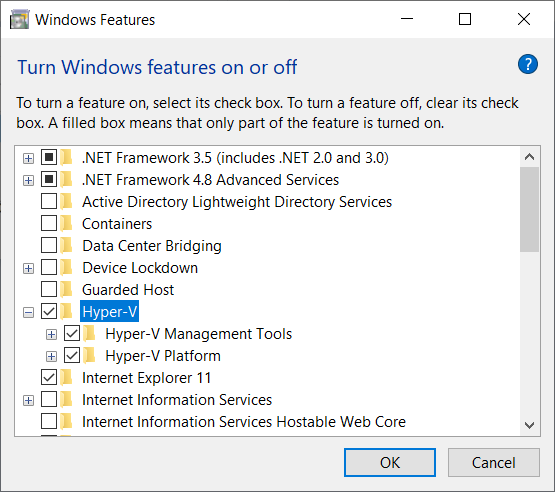
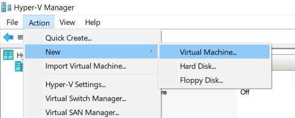
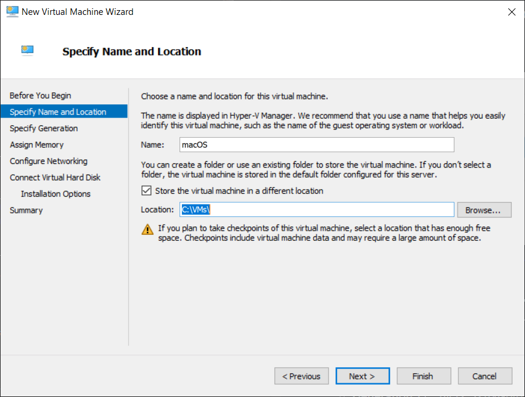
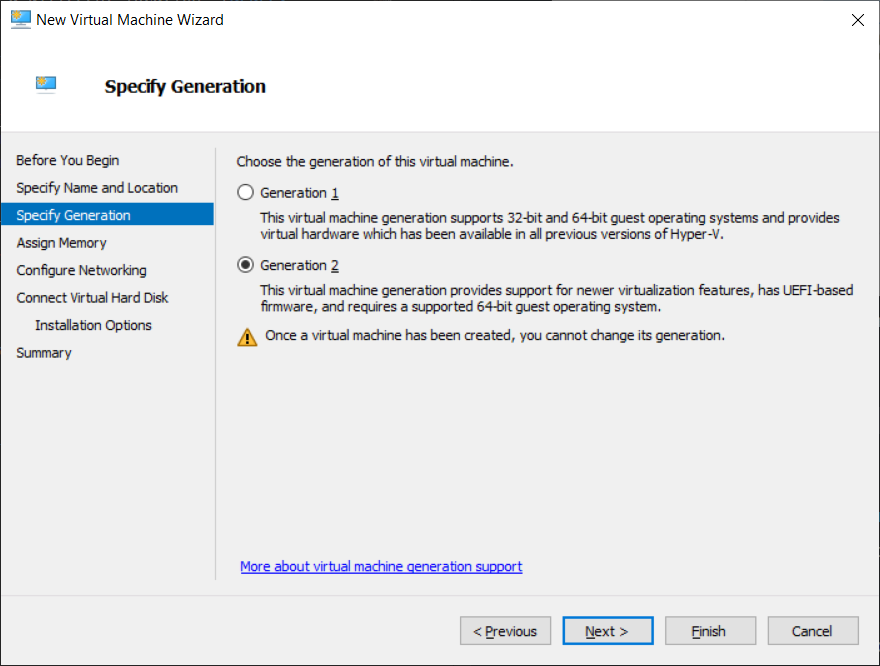
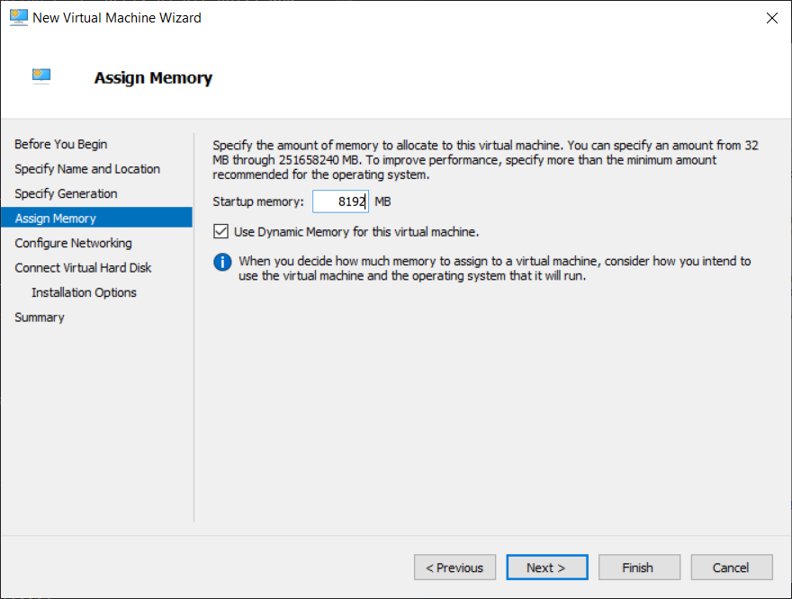
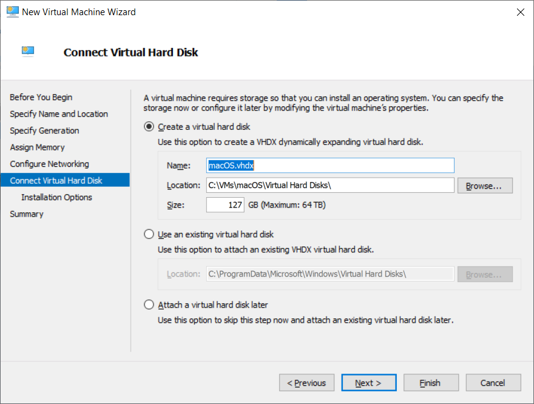
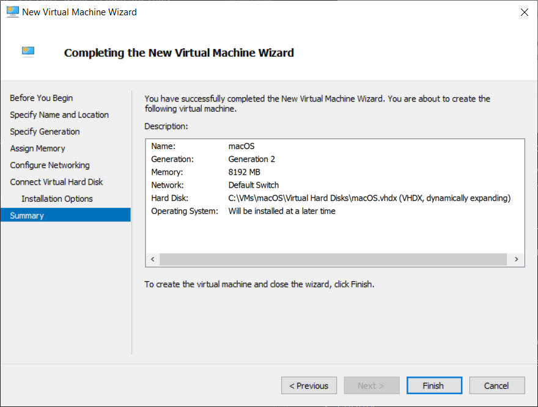
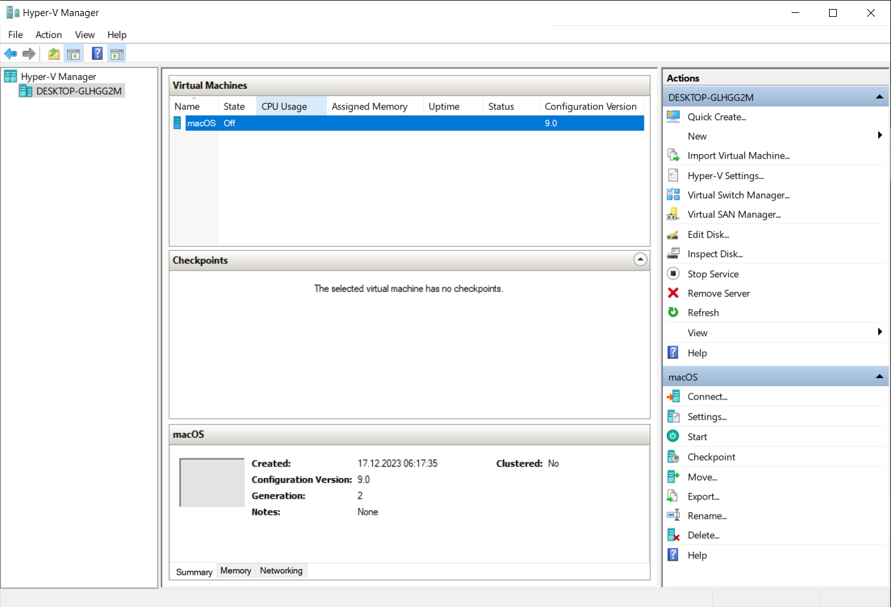

# Virtualization
This section covers running macOS in a virtual machine in different fashions.

## Virtualizing macOS in Windows with Hyper-V

### System Requirements
- **CPU**: 64-bit Intel CPU with support for [virtualization technology](https://www.intel.com/content/www/us/en/support/articles/000005486/processors.html)
- **Mainboard** with UEFI support
- **RAM**: 16 GB or more (minimum requirement for current macOS versions is 8 GB; plus whatever is needed to run Windows)
- **OS**: Windows 10 *Professional* or newer (mandatory since non-pro versions don't support Hyper-V) or Windows Server 2016+
- Harddisk (preferably SSD) with enough space!

> [!NOTE]
> 
> Virtualizing macOS with AMD systems is currently not supported [more details](https://github.com/balopez83/macOS_On_Hyper-V#what-doesnt-work)

### Enabling Hyper-V
- In UEFI, enable Virtualization (VT-D or whatever your mainboard supports)
- Under Windows, type "features" into Cortana search and select "Turn Windows Features on or off" (alternatively, type `appwiz.cpl` and hit <kbd>Enter</kbd> to open "Programs and Features")
- Scroll down to `Hyper`-V and enable it:   
- Click "OK"
- The system has to reboot to install and enable the Hyper-Visor layer

### Creating a Virtual Machine (VM) for macOS
- Once Windows has rebooted, Launch "Hyper-V Manager" via Cortana Search.
- Under **Action** &rarr; Select "New…" &rarr; "Virtual Machine…": 

- The **"New Virtual Machine Wizard"** starts
- Click "Next"
- **"Specify Name and Location"**. Enter a name and a location to store the VM in. In this example, I chose "macOS" as name and `C:\VMs\` as location:  
  💡 Tick "Store the virtual machine in a different location" (&rarr;creates sub-folders for *each* VM for better organization)
- Click "Next"
- **Specify Generation**: select `Generation 2` (= UEFI, 64-bit only) and click "Next":   
- **Assign Memory**: 
  - **Startup memory**: 8192 MB (Minimum for current macOS)
  - 💡Untick "Use Dynamic memory for the virtual machine" if you run into RAM-related issues.
- Click "Next" 
- **Configure Networking**: select "Default Switch" and click "Next"
- **Connect Virtual Hard Disk**:   
  - 💡 "Name" and "Location" should already be present
  - 💡 "Size": adjust or leave as is (the virtual disk grows/shrinks dynamically). If this causes issues, you can change it to a fixed value in the VM's settings later.
  - Click "Next"
- **Installation Options**: Select "Install an Operating System later" and click "Next"
- **Summary**: Check if all settings are correct and click "Finish". 
- The Hyper-V Manager now contains the entry "macOS" under "Virtual Machines": 

### Preparing the macOS VM
Next, we need to add another virtual hard disk containing the EFI partition to boot macOS as well as the recovery partition to download and install the actual OS. Finally we have to adjust some settings in the VM to make it all work.

To be continued…